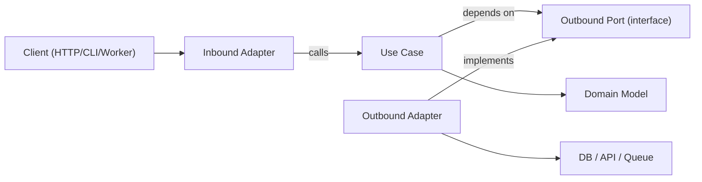

# Hexagonal Architecture

Hexagonal architecture (Ports & Adapters) keeps business logic independent of
frameworks, transport, and persistence details. The core application depends
only on abstract ports; adapters implement those ports at the edges.

## When to Use

- Building new features where long-term maintainability and testability matter.
- Refactoring layered, framework-heavy code where domain logic is mixed with I/O concerns.
- Supporting multiple interfaces for the same use case (HTTP, CLI, queue workers, cron jobs).
- Replacing infrastructure (database, external APIs, message bus) without rewriting business rules.
- Teams adopting DDD principles without requiring full ubiquitous language / bounded contexts.

Use this skill when the request involves architectural boundaries,
domain-centric design, refactoring tightly coupled services, or decoupling
application logic from specific libraries.

## Core Concepts

- **Domain model**: business rules as entities/value objects. No framework imports.
- **Use cases (application layer)**: orchestrate domain behavior across workflow steps.
- **Inbound ports (driving/primary ports)**: contracts describing what the
  application can do (commands/queries/use-case interfaces).
- **Outbound ports (driven/secondary ports)**: contracts for dependencies the
  application needs (repositories, gateways, event publishers, clock, UUID
  generation, etc.).
- **Inbound adapters**: translate a real transport (HTTP controller, CLI,
  queue consumer) into a call on an inbound port.
- **Outbound adapters**: implement an outbound port against real
  infrastructure (JPA/ORM, HTTP client, SDK).
- **Composition root**: the one place that wires concrete adapters into use
  cases. Framework DI containers (Spring, etc.) can *be* the composition
  root — the point is that wiring is centralized and explicit, not scattered.

Dependency direction is always inward: adapters depend on
application/domain, never the reverse. Domain depends on nothing external —
not even the ports (ports are an application-layer concept that describes
what the domain's use cases need).

## How It Works

### Step 1: Model the use case boundary

Define a single use case with a clear input/output shape (DTO, record,
plain object). Keep transport details (Express `req`, GraphQL `context`,
Spring `@RequestBody`, job payload wrappers) outside this boundary.

### Step 2: Define outbound ports first

Identify the side-effecting dependencies:

- persistence (`UserRepositoryPort`)
- external calls (`BillingGatewayPort`)
- cross-cutting (`LoggerPort`, `ClockPort`)

Ports should model **capabilities**, not technologies. Avoid over-porting:
don't create a port for a dependency that has, and will realistically never
have, a second implementation — a port earns its place by decoupling the
domain from something that actually varies or needs faking in tests.

### Step 3: Implement the use case as pure orchestration

The use case class/function receives ports via constructor/arguments,
validates application-level invariants, coordinates domain rules, and
returns plain data structures. No framework types leak in or out.

### Step 4: Build adapters at the edge

- Inbound adapter converts protocol input into use-case input.
- Outbound adapter maps application contracts to concrete APIs/ORM/query builders.
- Mapping logic stays in adapters, never inside use cases.

### Step 5: Wire everything in the composition root

Instantiate adapters, then inject them into use cases. Keep wiring
centralized to avoid hidden service-locator behavior. In Spring, constructor
injection driven by component scanning satisfies this as long as the wiring
graph stays legible from the class declarations — no runtime lookups.

### Step 6: Test per boundary

- Unit test use cases against fake/in-memory ports.
- Integration test adapters against real infrastructure dependencies.
- E2E test user-facing flows through inbound adapters.

## Architecture Diagram



## Example Package Layout (feature-first)

```text
src/
  domain/
    order/
      Order.ts
      OrderPolicy.ts
  application/
    port/
      in/
        order/
          CreateOrderUseCase.ts
      out/
        order/
          OrderRepositoryPort.ts
          PaymentGatewayPort.ts
    usecase/
      order/
        CreateOrderUseCase.ts
  adapter/
    in/
      web/
        order/
          createOrderRoute.ts
    out/
      persistence/
        order/
          PostgresOrderRepository.ts
      stripe/
        StripePaymentGateway.ts
  composition/
    ordersContainer.ts
```

## TypeScript Example

### Port definitions

```typescript
export interface OrderRepositoryPort {
  save(order: Order): Promise<void>;
  findById(orderId: string): Promise<Order | null>;
}

export interface PaymentGatewayPort {
  authorize(input: { orderId: string; amountCents: number }): Promise<{ authorizationId: string }>;
}
```

### Use case

```typescript
type CreateOrderInput = {
  orderId: string;
  amountCents: number;
};

type CreateOrderOutput = {
  orderId: string;
  authorizationId: string;
};

export class CreateOrderUseCase {
  constructor(
    private readonly orderRepository: OrderRepositoryPort,
    private readonly paymentGateway: PaymentGatewayPort
  ) {}

  async execute(input: CreateOrderInput): Promise<CreateOrderOutput> {
    const order = Order.create({ id: input.orderId, amountCents: input.amountCents });

    const auth = await this.paymentGateway.authorize({
      orderId: order.id,
      amountCents: order.amountCents,
    });

    // markAuthorized returns a new Order instance; it does not mutate in place.
    const authorizedOrder = order.markAuthorized(auth.authorizationId);
    await this.orderRepository.save(authorizedOrder);

    return {
      orderId: order.id,
      authorizationId: auth.authorizationId,
    };
  }
}
```

### Outbound adapter

```typescript
export class PostgresOrderRepository implements OrderRepositoryPort {
  constructor(private readonly db: SqlClient) {}

  async save(order: Order): Promise<void> {
    await this.db.query(
      "insert into orders (id, amount_cents, status, authorization_id) values ($1, $2, $3, $4)",
      [order.id, order.amountCents, order.status, order.authorizationId]
    );
  }

  async findById(orderId: string): Promise<Order | null> {
    const row = await this.db.oneOrNone("select * from orders where id = $1", [orderId]);
    return row ? Order.rehydrate(row) : null;
  }
}
```

### Composition root

```typescript
const db: SqlClient = createSqlClient();
const stripe: StripeClient = createStripeClient();

const orderRepository = new PostgresOrderRepository(db);
const paymentGateway = new StripePaymentGateway(stripe);

export const createOrderUseCase = new CreateOrderUseCase(orderRepository, paymentGateway);
```

## Java Example

This layout is validated in production against a real Spring Boot
codebase (Notaire's `backend-api` payment/budget slice — see
`docs/200-architecture/202-ADR/ADR-021-hexagonal-architecture-pilot.md`).

### Package layout

```text
com.example.app/
  domain/
    payment/
      PaymentDetails.java          # plain record/class, no framework imports
      PaymentStatus.java
      BudgetCharges.java
  application/
    port/
      in/
        payment/
          ProcessPaymentUseCase.java     # inbound port interface
          ProcessPaymentCommand.java     # plain input record
          GetBudgetSummaryUseCase.java
      out/
        payment/
          PaymentRepositoryPort.java     # outbound port interface
          BudgetLookupPort.java
          NewPayment.java                # plain data the use case hands the port
    usecase/
      payment/
        ProcessPaymentService.java       # implements ProcessPaymentUseCase
        BudgetSummaryService.java
  adapter/
    in/
      web/
        payment/
          PaymentController.java         # @RestController, thin: maps HTTP <-> port
          PaymentWebMapper.java
    out/
      persistence/
        payment/
          PaymentPersistenceAdapter.java # implements PaymentRepositoryPort via JPA
          BudgetLookupAdapter.java       # implements BudgetLookupPort via JPA
```

### Conventions

- **Ports**: interfaces in `application.port.in.<slice>` and
  `application.port.out.<slice>`. Package by feature/slice (`payment`,
  `deed`, `order`), not by technical layer alone — `application.port.out`
  with dozens of unrelated ports side by side does not scale.
- **Use cases**: plain classes implementing the inbound port interface,
  annotated `@Service` only for Spring wiring convenience — the annotation
  is not what makes it a use case. Constructor injection of outbound ports
  only; no direct repository/entity access, no HTTP types.
- **Inbound adapters** (`adapter.in.web.<slice>`): the `@RestController`
  stays at the same URL/verb/status-code contract as before the refactor.
  It converts `@RequestBody`/`@PathVariable` into the use case's input type,
  calls the use case, and maps the output (or a domain exception) back to
  an HTTP response. No business logic here.
- **Outbound adapters** (`adapter.out.persistence.<slice>`): implement the
  outbound port using the existing Spring Data JPA repository and
  `@Entity` classes. This is where JPA entity <-> plain domain/application
  data mapping happens. If an `@Entity` class is shared with code outside
  the slice being migrated, keep the entity as-is and map to/from it in the
  adapter rather than forcing an entity rewrite — don't let one slice's
  migration force changes onto modules out of scope.
- **Domain layer**: only introduce `domain.<slice>` types for real business
  rules that are worth expressing independent of persistence (e.g. "how is
  pending balance computed", "what does a numbering gap require"). If a
  slice's entity is a thin data holder with no independent business rule,
  it is fine for the outbound adapter to work with the JPA entity directly
  and skip a redundant plain-domain mirror — don't manufacture a domain
  type that adds no rule of its own.
- **Composition**: Spring's component scan + constructor injection acts as
  the composition root. Do not add a second, hand-rolled wiring mechanism
  on top of it.

## Multi-Language Mapping

Use the same boundary rules across ecosystems; only syntax and wiring style change.

- **TypeScript/JavaScript**
  - Ports: `application/port/{in,out}/<slice>/*` as interfaces/types.
  - Use cases: classes/functions with constructor/argument injection.
  - Adapters: `adapter/in/*`, `adapter/out/*`.
  - Composition: explicit factory/container module (no hidden globals).

- **Java**
  - Packages: `domain.<slice>`, `application.port.in.<slice>`,
    `application.port.out.<slice>`, `application.usecase.<slice>`,
    `adapter.in.<channel>.<slice>`, `adapter.out.<technology>.<slice>`.
  - Ports: interfaces in `application.port.*`.
  - Use cases: plain classes (Spring `@Service` optional, not required).
  - Composition: framework DI (e.g. Spring constructor injection) acting as
    the composition root; keep wiring out of domain/use-case classes.

- **Kotlin**
  - Modules/packages mirror the Java split (`domain`, `application.port`, `application.usecase`, `adapter`).
  - Ports: Kotlin interfaces.
  - Use cases: classes with constructor injection (Koin/Dagger/Spring/manual).
  - Composition: dedicated composition functions; avoid service locator patterns.

- **Go**
  - Packages: `internal/<feature>/domain`, `application`, `ports`, `adapters/inbound`, `adapters/outbound`.
  - Ports: small interfaces owned by the consuming application package.
  - Use cases: structs with interface fields plus explicit `New...` constructors.
  - Composition: wire in `cmd/<app>/main.go` (or a dedicated wiring package), keep constructors explicit.

## Anti-Patterns to Avoid

- **Leaky persistence models**: domain entities importing ORM models, web framework types, or SDK clients.
- **Transport leakage**: use cases directly touching `req`/`res`, queue message envelopes, or HTTP status codes.
- **Adapter-to-adapter calls**: one adapter invoking another adapter directly instead of going back through a use case.
- **Over-porting**: wrapping every dependency in a port even when it will never have a second implementation or need a test fake — this adds indirection without decoupling value.
- **Anemic use cases that just forward to a repository**: if a "use case" does nothing but call one port method with no orchestration or validation, question whether the port itself should be the public contract instead of adding a pass-through layer.
- **Silent behavior drift during a slice migration**: forgetting that a legacy component keyed on package/class name (e.g. an AOP pointcut, a serialization allowlist, a reflection-based scanner) will stop matching once code moves packages. Grep for the old fully-qualified name across the codebase before deleting/moving it, not just for compiler errors — some breakage (an audit pointcut silently no longer matching, a security filter that stops applying) will not fail the build.

## Migration Playbook (Refactoring Existing Systems)

1. Pick one vertical slice (one use case / one REST endpoint / one job) with real business value or high churn.
2. Define the use-case input/output shape.
3. Extract outbound ports for the slice's infrastructure calls.
4. Move orchestration logic out of controllers/services and into the use case.
5. Keep the old adapter's public contract (URL, status codes, DTO shape) unchanged; it now delegates to the new use case.
6. Add tests around the new boundary (use-case unit tests with fakes, adapter integration tests).
7. Repeat slice-by-slice; avoid full rewrites.

- **Strangler approach**: keep current endpoints, route one use case at a time through new ports/adapters.
- **No big-bang rewrites**: migrate per feature slice, preserving behavior with characterization tests written *before* the refactor starts.
- **Facade first**: wrap legacy services behind outbound ports before replacing their internals.
- **Composition freeze**: centralize wiring early so new dependencies do not leak into domain/use-case layers.
- **Slice selection rule**: prioritize high-value or high-churn, low-blast-radius flows first; defer slices that share heavily-reused entities with modules not yet migrated.
- **Scope discipline**: one slice is one Issue/branch/PR. Finishing a slice is a natural stopping point — resist continuing into a second slice under the same issue/branch; file a new Issue for it instead, so each PR stays reviewable and revertible independently.
- **Rollback path**: keep a reversible toggle or route switch per migrated slice until production behavior is verified, when the risk profile warrants it.

## Testing Guidance (Same Hexagonal Boundaries)

- **Domain tests**: test entities/value objects for pure business rules (no mocks, no framework setup).
- **Use-case unit tests**: test orchestration with fakes/stubs for outbound ports; assert both business outcomes and port interactions.
- **Outbound adapter contract tests**: define a shared contract test suite at the port level and run it against each adapter implementation.
- **Inbound adapter tests**: verify protocol mapping (HTTP/CLI/queue payload -> use-case input, use-case output/error -> protocol response).
- **Adapter integration tests**: run against real infrastructure (DB/API/queue) to cover serialization, schema/query behavior, retries, timeouts.
- **End-to-end tests**: exercise the full stack through the real inbound adapter, unchanged by the internal refactor.

Principles:

- Use cases return values/entities without mutating shared state.
- Errors are translated across boundaries (infra errors -> application/domain errors), not leaked raw into inbound adapters.
- The composition root is explicit and easy to audit.
- Use cases are testable with simple in-memory fakes for ports — no framework context required.
- Refactoring starts with one vertical slice under behavior-preserving tests.
- Language/framework specifics stay in adapters, never in domain rules.
- Prefer at least two adapters per port where practical (real implementation + in-memory fake) to validate the port design is implementation-agnostic.
- Keep adapters dumb: mapping and I/O are their job, business logic is not.

## Trade-offs: When Not to Use

Hexagonal architecture introduces initial complexity and code overhead. It
may feel excessive for small projects or simple CRUD applications.

**Avoid hexagonal architecture when:**

- Building prototypes or proof-of-concepts where speed matters more than maintainability.
- Working on simple scripts or one-off utilities.
- The team lacks experience and the project timeline cannot accommodate the learning curve.
- The application has no external dependencies beyond a single database and no planned interface variations.

**Expected challenges:**

- Initial learning curve for teams adapting to ports, adapters, and dependency inversion concepts.
- Perceived code overhead from creating multiple layers for simple features.
- Risk of over-engineering — ports created for a dependency with only one real (and unlikely to change) implementation.
