# PlantUML diagram types: syntax skeletons

Every PlantUML diagram is plain text wrapped in a `@start<kind>` / `@end<kind>`
pair (almost all of them use `@startuml`/`@enduml` — a handful of special
diagrams get their own delimiter, noted below). All skeletons on this page
were rendered successfully against the toolchain `scripts/render.sh` uses, so
they're safe starting points, not aspirational syntax.

Jump to: [Class](#class-diagram) · [Object](#object-diagram) · [Sequence](#sequence-diagram) ·
[Use case](#use-case-diagram) · [Activity](#activity-diagram) · [State](#state-diagram) ·
[Component](#component-diagram) · [Deployment](#deployment-diagram) · [ER / data model](#entity-relationship-diagram) ·
[C4 model](#c4-model-contextcontainercomponent) · [Timing](#timing-diagram) · [Mindmap](#mindmap) ·
[WBS](#work-breakdown-structure) · [Gantt](#gantt-chart) · [Network](#network-diagram) ·
[Archimate](#archimate) · [JSON / YAML](#json--yaml) · [Wireframe (salt)](#wireframe-salt)

## Picking the right type for a software project

A "diagram the architecture" request is underspecified — figure out which
question the diagram needs to answer before picking a type:

| The user is really asking...                                   | Use              |
|------------------------------------------------------------------|------------------|
| "What are the systems/services and how do they talk?"           | C4 Context or Container |
| "What's inside this one service/module?"                        | C4 Component, or Component diagram |
| "What are the classes/entities and their relationships?"        | Class diagram |
| "What does the database schema look like?"                      | ER diagram (or class diagram styled as ER) |
| "What happens step by step when X calls Y?"                     | Sequence diagram |
| "What are the valid states of this entity and its transitions?" | State diagram |
| "What's the business process / user workflow?"                  | Activity diagram |
| "Who (actors) can do what?"                                     | Use case diagram |
| "How is this deployed — servers, containers, networks?"         | Deployment diagram |
| "How is the project/roadmap timed out?"                         | Gantt chart |
| "Let's brainstorm/break down a feature or topic"                | Mindmap or WBS |

For a real system, don't force everything into one diagram — a C4 Context +
Container pair, a class diagram per bounded context, a sequence diagram per
critical flow, and an ER diagram for the schema will serve a team far better
than one overloaded picture. See `SKILL.md` for how to organize a multi-diagram
set.

---

## Class diagram

Models classes/interfaces, their members, and the relationships between them
(inheritance, composition, association...). The default choice for domain
models, entity relationships expressed as code (e.g. JPA `@Entity` classes),
and API/DTO shapes.

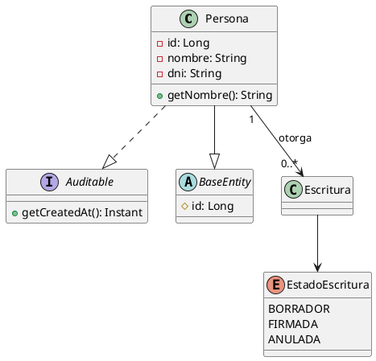

Relationship arrows (memorize these, they're the whole language):

| Syntax | Meaning |
|---|---|
| `--|>` | inheritance / extends |
| `..|>` | interface implementation |
| `-->`  | association / directed |
| `--`   | plain association |
| `o--`  | aggregation (hollow diamond) |
| `*--`  | composition (filled diamond) |
| `..>`  | dependency |
| `+`, `-`, `#`, `~` | public / private / protected / package visibility |

Add multiplicities as quoted labels on either end: `"1" --> "0..*"`.
Use `hide empty members` to keep large domain models readable when you only
care about relationships, not every field.

## Object diagram

Same visual language as class diagrams but for a specific instance snapshot —
useful for illustrating one concrete example of a data structure.

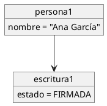

## Sequence diagram

The workhorse for "what happens when" — REST call flows, message exchanges,
async event chains. Participants appear in the order first mentioned unless
declared explicitly up top.

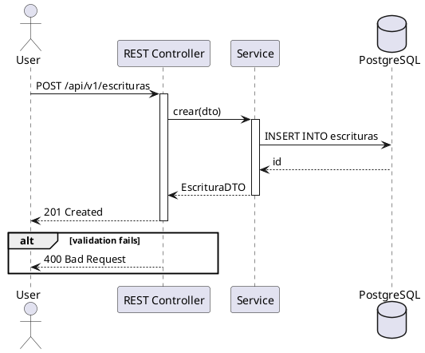

Key elements:
- `->` synchronous call, `-->` return/response, `->>` async
- `activate`/`deactivate` for lifelines (or `autoactivate on` to infer them)
- `alt`/`else`/`end`, `opt`, `loop`, `par`, `critical`, `break` for control flow
- `note left of X`, `note right of X`, `note over X, Y` for annotations
- `autonumber` before the first message numbers every step automatically
- `participant`, `actor`, `boundary`, `control`, `entity`, `database`,
  `collections`, `queue` all change the lifeline's icon — pick the one that
  matches the component's role (a `database` for a datastore reads far
  better than a generic box)

## Use case diagram

Actors and the capabilities they have against a system — good for a
requirements-level overview before diving into implementation diagrams.

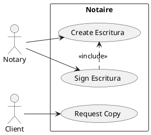

## Activity diagram

Business processes / workflows with decisions, forks, and swimlanes. Use the
modern (post-2013) syntax below, not the old `(*)`/arrow syntax.

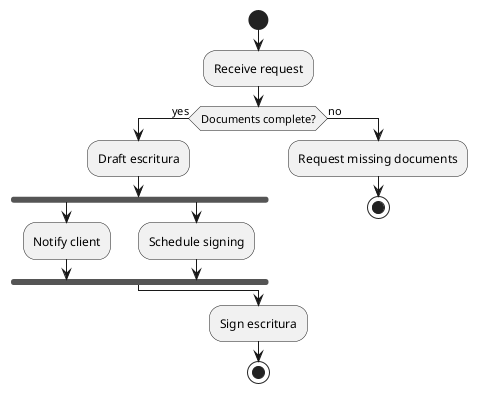

Swimlanes: prefix steps with `|Lane Name|`.

## State diagram

An entity's lifecycle — states and the transitions/events between them.
Excellent for anything with a status field (order, document, workflow step).

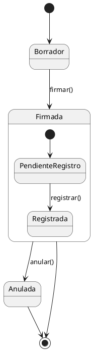

## Component diagram

Modules/packages and their dependencies — the right level for "how is this
codebase organized" (Maven modules, microservices, layers).

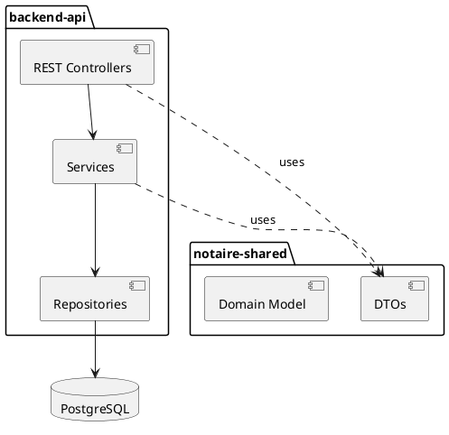

`[Name]` is shorthand for `component`; use `interface` (`()  Name` or the
`interface` keyword) to show explicit contracts between components.

## Deployment diagram

Physical/infrastructure view — nodes, containers, artifacts, networks. Use
this for "how do we deploy this" conversations (Docker Compose topology,
cloud infra, on-prem servers).

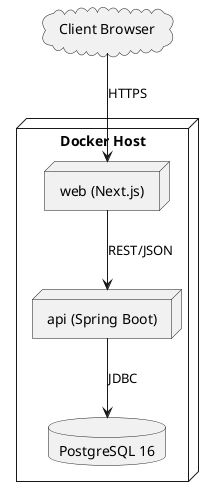

`node`, `cloud`, `database`, `folder`, `frame`, `storage`, `artifact` all
have distinct icons — use `<<device>>`/other stereotypes or the awslib/azure
stdlib (see `stdlib-and-icons.md`) for recognizable cloud-provider shapes.

## Entity-relationship diagram

PlantUML doesn't have a dedicated ER diagram type — the idiomatic way is a
class diagram using the `entity` keyword and crow's-foot-flavored relationship
arrows. This directly mirrors a relational schema (PK/FK, cardinality).

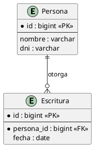

Cardinality tokens combine on each side: `|` (exactly one), `o` (zero or
one), `{` / `}` (many). So `||--o{` reads "exactly one ... zero or more".

## C4 model (Context/Container/Component)

The standard way to layer an architecture from a 30,000-ft business view down
to code. Bundled offline in the toolchain this skill uses via `<C4/...>` —
see `stdlib-and-icons.md` for the include paths and full element catalog
(`Person`, `System`, `Container`, `Component`, `Rel`, boundaries, etc.).

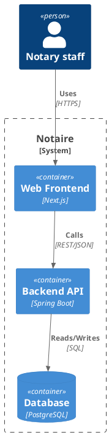

Levels, and which file to `!include`:
- `C4_Context` — systems and external actors, no internals
- `C4_Container` — the deployable pieces of one system (web app, API, DB, queue...)
- `C4_Component` — the internal building blocks of one container
- `C4_Dynamic` — a specific interaction/flow across containers/components
- `C4_Deployment` — containers mapped onto infrastructure nodes

A good architecture doc has a Context diagram, a Container diagram, and one
Component diagram per non-trivial container — not one diagram trying to be
all four levels at once.

## Timing diagram

State/value of one or more signals over time — less common in typical CRUD
apps, but the right tool for protocol/hardware timing or for visualizing
concurrent request states.

```plantuml
@startuml
robust "Request" as R
R has idle, processing, done
@0
R is idle
@100
R is processing
@300
R is done
@enduml
```

## Mindmap

Freeform hierarchical brainstorming — feature breakdowns, decision trees,
option comparisons.

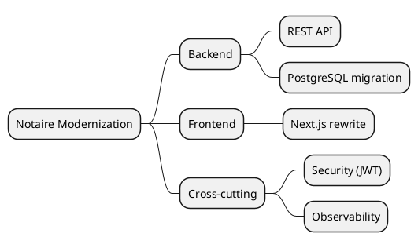

`*` nests to the right by default; use `left side` before an item to push
that branch to the left for a balanced tree.

## Work breakdown structure

Same engine as mindmap, different visual convention (boxes, not radial) —
good for project/task breakdowns.

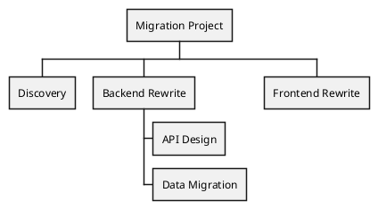

## Gantt chart

Project timelines with dependencies and durations.

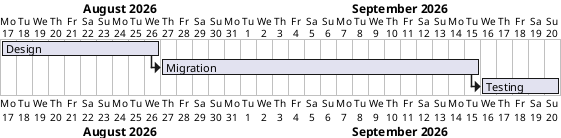

## Network diagram

Rack/network-topology-flavored diagrams (subnets, hosts, ports) — use the
`nwdiag` sub-language for this.

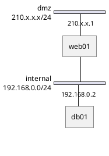

## Archimate

Enterprise-architecture notation (business/application/technology layers) —
reach for this only when the audience specifically works in ArchiMate;
otherwise C4 communicates the same ideas more accessibly to a dev audience.

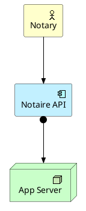

## JSON / YAML

Renders a JSON or YAML value as a readable nested-box diagram — handy for
documenting a config file, API payload shape, or DTO example.

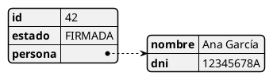

## Wireframe (salt)

Quick UI mockups in ASCII-art style — useful for sketching a screen before
building it, not a replacement for real design tools.

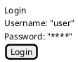