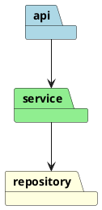

# Preprocessing: variables, conditionals, loops, and reusable macros

PlantUML has a full text-preprocessor, independent of the diagram language
itself — think of it as a small macro language that runs before the diagram
is parsed. Reach for it when a diagram needs to be *generated* rather than
hand-written: the same shape repeated for every microservice, a diagram that
looks different for two audiences, or a component library shared across many
`.puml` files in a project.

Don't reach for it by default — most diagrams are clearer as plain, static
PlantUML. Preprocessing earns its complexity only when there's real
repetition or parameterization to eliminate.

## Variables

```plantuml
!$serviceCount = 3
!$title = "Notaire Architecture"
!$config = {"env": "prod", "replicas": 3}
```

- `$name` prefix is the modern convention (older `!define NAME value` still
  works but doesn't support real values/expressions as cleanly).
- Three types: integer, string (quoted), and JSON (object/array literal).
- `!$x ?= value` assigns only if `$x` isn't already defined — useful for
  "default unless the includer overrides it" patterns.

## Conditionals

```plantuml
!$isProd = true
!if ($isProd == true)
  skinparam backgroundColor #FFEEEE
!elseif ($env == "staging")
  skinparam backgroundColor #FFFFCC
!else
  skinparam backgroundColor #EEFFEE
!endif
```

Supports `&&`, `||`, comparison operators, and parentheses for grouping.
`!ifdef NAME` / `!ifndef NAME` test whether a `!define`d name exists at all.

## Loops

```plantuml
!$i = 0
!while $i < 3
  class Service$i
  !$i = $i + 1
!endwhile
```

Use this to generate N similar elements (e.g. one box per module discovered
by scanning a project) without hand-writing each one.

## Procedures and functions

**Procedures** emit diagram content; **functions** compute and return a
value (no diagram output of their own).

```plantuml
!procedure $microservice($name, $tech="Java")
  component "$name" as $name <<$tech>>
!endprocedure

!function $shortName($fullName)
  !return %substr($fullName, 0, 3)
!endfunction

$microservice("backend-api")
$microservice("frontend-web", "TypeScript")
component "$shortName(\"backend-api\")"
```

Both support default parameter values (as above) and the `!unquoted`
modifier when you want to pass identifiers without forcing callers to quote
them. This is the right tool for a "component template" reused across many
diagrams in one project — define it once in a shared `.puml`, `!include` it
everywhere.

## File inclusion

```plantuml
!include shared/styles.puml
!include_many shared/legend.puml   " allows including the same file more than once
```

- `!include` only loads a given file once per render, even if referenced from
  multiple places — safe against duplicate-definition errors from diamond
  includes.
- `!startsub NAME` / `!endsub` mark a named section inside a file;
  `!includesub path!NAME` pulls in just that section, letting one file serve
  as a library of independently includable fragments.

## Builtin functions

50+ functions prefixed `%`, callable inside expressions: string ops
(`%strlen`, `%substr`, `%upper`), type conversion (`%intval`, `%string`),
color math (`%darken`, `%lighten`), and utilities (`%date()`, `%getenv()`).
Use these instead of hand-rolling string manipulation in `!function`s.

## A realistic use: generating one diagram per module from a shared template



For genuinely data-driven diagrams (e.g. "one box per table in this schema"),
it's usually simpler and more maintainable to generate the flat `.puml` text
directly from a script (Python/bash) than to lean on PlantUML's `!while` —
save the preprocessor for structural reuse (shared styling, a component
macro), not for injecting external data.