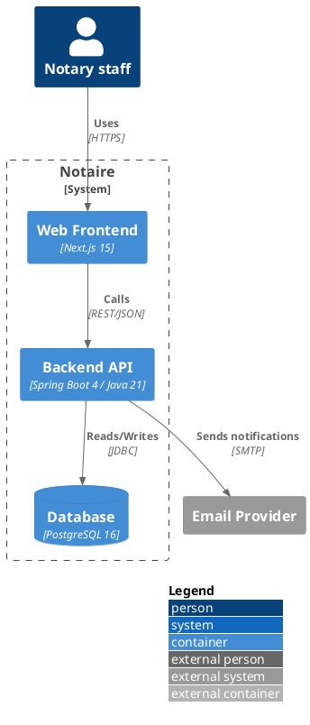

# Standard library and icon sets

PlantUML ships a "standard library" of reusable `.puml` include files —
C4 model macros, cloud-provider icon sets, ArchiMate, Kubernetes, and more —
following the same `!include <libname/path>` convention as a C header.

## Two ways to `!include`, and why it matters

```plantuml
!include <C4/C4_Container>            " bundled: resolved from the local install, works offline
!includeurl https://raw.githubusercontent.com/plantuml-stdlib/C4-PlantUML/master/C4_Container.puml   " fetched over the network every render
```

Prefer the **bundled** `<angle-bracket>` form whenever the library is
available locally (verified for this skill's toolchain — see below). It
resolves instantly, works with no network access, and can't break because a
GitHub raw-content URL changed or is unreachable — a very real risk in
sandboxed or firewalled environments. Reach for `!includeurl` only when a
project's docs specifically pin a newer stdlib version than the local install
ships, and network access to raw.githubusercontent.com is actually available
— check with a harmless `curl -sI` before relying on it, since plenty of
sandboxed environments block it outright.

To see exactly what's available in the current install:

```bash
plantuml -stdlib          # list bundled libraries
plantuml -extractstdlib   # dump full sources to a `stdlib/` folder for inspection
```

## C4 model (`<C4/...>`)

The most useful stdlib for software architecture work. Files: `C4_Context`,
`C4_Container`, `C4_Component`, `C4_Dynamic`, `C4_Deployment` (each one
`!include`s the level below it, so `C4_Container` also gives you the
`Context`-level macros).

Core macros (same shape at every level, prefixed to the granularity):

| Macro | Meaning |
|---|---|
| `Person(alias, label, ?descr)` | a human actor |
| `Person_Ext(...)` | an external/third-party actor |
| `System(alias, label, ?descr)` | a system, this or another |
| `System_Ext(...)` | an external system |
| `SystemDb(...)`, `SystemQueue(...)` | a system that's fundamentally a datastore/queue |
| `Container(alias, label, tech, ?descr)` | a deployable unit inside a system |
| `ContainerDb(...)`, `ContainerQueue(...)` | container variants for datastores/queues |
| `Component(alias, label, tech, ?descr)` | a building block inside a container |
| `Rel(from, to, label, ?tech)` | a relationship/arrow; `Rel_U`, `Rel_D`, `Rel_L`, `Rel_R` force direction |
| `System_Boundary(alias, label) { ... }` | visual grouping box |
| `Container_Boundary(alias, label) { ... }` | visual grouping box, one level down |



`LAYOUT_WITH_LEGEND()`, `LAYOUT_TOP_DOWN()`, `LAYOUT_LEFT_RIGHT()` are
optional helper macros for presentation. Add `SHOW_LEGEND()` if you want the
Person/System/Container color key explained on the diagram.

## Cloud and platform icon sets

Same `!include <libname/path>` pattern; check `plantuml -stdlib` locally to
confirm what's bundled before relying on one, since coverage varies by
PlantUML version:

| Library | Include prefix | Covers |
|---|---|---|
| AWS | `<awslib/...>` (modern) or `<aws/...>` (legacy, deprecated) | AWS service icons |
| Azure | `<azure/...>` | Azure service icons |
| Kubernetes | `<kubernetes/...>` | K8s resource icons |
| Archimate | `<archimate/Archimate>` | ArchiMate notation |
| Material Design | `<material/...>` (prefix icons with `ma_`) | General-purpose icons |
| Font Awesome / Devicons | `<tupadr3/...>` | General-purpose + dev tool icons |
| Logos | `<logos/...>` | Company/technology logos |

Example — AWS deployment sketch:

```plantuml
@startuml
!include <awslib/AWSCommon>
!include <awslib/Compute/AmazonEC2/AmazonEC2>
!include <awslib/Database/AmazonRDS/AmazonRDS>

AmazonEC2(api, "API server", "")
AmazonRDS(db, "PostgreSQL", "")
api --> db
@enduml
```

## When the bundled library is missing or out of date

If `!include <C4/C4_Container>` (or another stdlib path) fails to resolve,
it means the local PlantUML install predates or excludes that library. In
order of preference:

1. Update the local PlantUML install (a newer version bundles more).
2. If network access to raw.githubusercontent.com is confirmed working,
   `!includeurl` the specific file from the library's GitHub repo.
3. As a last resort, hand-roll the visual with plain `rectangle`/`package`/
   `database` elements and `<<stereotypes>>` — less polished, but always
   available.