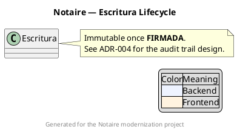

# Styling, layout, and annotation

A syntactically correct diagram that's visually unreadable has failed at its
one job. These are the levers worth reaching for, roughly in order of impact.

## Layout direction

```plantuml
left to right direction   " default for class diagrams is top-to-bottom; flip when a model is wide, not tall
top to bottom direction
```

For individual relationships, hint direction with `-up->`, `-down->`,
`-left->`, `-right->` (or the short forms `-u->`, `-d->`, `-l->`, `-r->`).
Use sparingly — over-constraining direction fights the auto-layouter and
often makes things worse; add hints only where the default layout is
genuinely confusing.

## Grouping and spacing

```plantuml
together {
  class A
  class B
}
```

`together` keeps a set of elements adjacent instead of letting the layouter
scatter them. For graph density, `skinparam nodesep 30` and `skinparam
ranksep 50` widen/narrow spacing between nodes and ranks (Graphviz-backed
diagrams only).

## skinparam: the general styling mechanism

```plantuml
skinparam backgroundColor #FFFFFF
skinparam classFontSize 12
skinparam class {
  BackgroundColor #EEF3FF
  BorderColor #4477AA
  ArrowColor #4477AA
}
skinparam shadowing false
skinparam linetype ortho
```

`skinparam` accepts either a flat `skinparam key value` or a scoped block
(`skinparam <element> { ... }`) for diagram-type-specific styling. Common
targets: `class`, `component`, `sequence`, `state`, `usecase`, `activity`,
`note`. `linetype ortho` (right-angle connectors) or `linetype polyline`
often reads cleaner than PlantUML's default curved lines for dense
architecture diagrams.

## Themes

```plantuml
!theme plain
```

PlantUML bundles a set of built-in themes (`plain`, `cerulean`, `sketchy`,
`spacelab`, `superhero`, etc. — the exact list depends on the installed
version; a diagram's `!theme name` line simply fails to resolve if the theme
isn't bundled, so verify with the installed docs rather than assuming). A
theme is a fast way to get a consistent, professional look across an entire
set of project diagrams without hand-tuning `skinparam` everywhere — set it
once per diagram, or centralize it in a shared `!include`d file (see
`preprocessing.md`).

## Notes, titles, legends, footers



- `note left of X` / `note right of X` / `note over X` (sequence diagrams) /
  floating `note "text" as N` all work; `hnote`/`rnote` give hexagonal/
  rectangular note shapes in sequence diagrams for emphasis.
- `title`, `header`, `footer`, `caption`, `legend` are diagram-wide, not tied
  to one element — use them for the "how to read this diagram" context a
  standalone image needs when it's shared outside the codebase.

## Sprites and custom icons

```plantuml
sprite $mySprite [16x16/16] {
FFFFFFFFFFFFFFFF
...
}
```

Hand-authoring sprite bitmaps is rarely worth it — pull a matching icon from
a bundled stdlib instead (see `stdlib-and-icons.md`) unless the project has
a genuinely custom icon it needs represented.

## When a diagram is too big

Signs a diagram needs to be split rather than styled harder: node count in
the dozens, crossing lines that can't be untangled with `together`/direction
hints, or a viewer needing to zoom to read labels. Split by:
- **Abstraction level** — a C4 Context/Container pair instead of one diagram
  mixing systems and classes.
- **Bounded context** — one class diagram per module/domain instead of the
  whole codebase.
- **Concern** — a deployment diagram separate from a component diagram, even
  though they describe the same system.

A set of five focused diagrams beats one exhaustive one, both for
readability and because each stays cheap to regenerate as the design
changes.