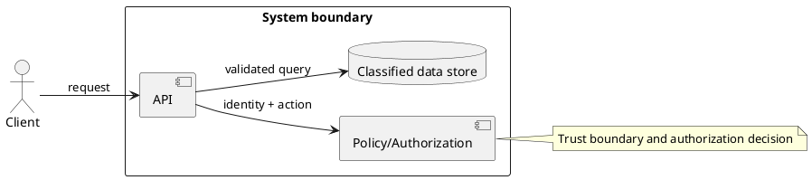

# Secure Threat Modeling

Turn architecture and data flows into prioritized risks and testable mitigations. Threat modeling is not a one-time checklist and does not replace code review, vulnerability scanning, incident response or an authorized penetration test.

## Workflow

1. Establish scope, assets, actors, trust boundaries, entry points, data classification, deployment context, assumptions and legal constraints.
2. Inspect existing C4/SAD/API/schema diagrams and create the smallest useful model. For non-trivial systems, separate context, container/data-flow and critical-flow diagrams.
3. Enumerate threats using STRIDE for security properties and LINDDUN or a privacy framework where personal data is involved. Add abuse cases and misuse of business rules.
4. Record likelihood, impact, affected asset, evidence, owner, mitigation, verification method, residual risk and status. Avoid unsupported precision.
5. Convert accepted mitigations into uniquely identified security requirements (`SR-*`) and security tests.
6. Review with engineering, QA, operations, product and privacy/security owners. Revisit after material architecture or threat changes.

## PlantUML data-flow starter



Use explicit trust-boundary notes and data classifications. Do not put real secrets or personal data in diagrams.

## Threat register template

```markdown
| ID | Asset/data | Boundary | Threat/abuse case | Method | Impact | Likelihood | Mitigation | Verification | Owner | Residual risk |
|---|---|---|---|---|---|---|---|---|---|---|
```

## Controls to distinguish

Validation is not authorization; output encoding is not input validation; CSP is defense-in-depth, not a complete XSS solution; TLS, DNSSEC and DoH address different concerns; RASP is runtime detection/prevention, not a testing methodology. Prefer parameterized queries, least privilege, secure session handling, secrets management, logging with redaction, dependency controls and resilient limits.

## Authorized testing boundary

For any active test, record written authorization, scope, target/environment, timing, rate limits, credentials/data rules, stop conditions, notification path and evidence retention. Never provide or execute instructions for unauthorized access, credential theft, data extraction or disruption.

Read `references/threat-methods.md` when classifying threats or privacy risks. Use `evals/evals.json` for threat-model and rules-of-engagement scenarios.

## References

- OWASP Threat Modeling Cheat Sheet
- OWASP Application Security Verification Standard (ASVS)
- OWASP SAMM
- Microsoft Threat Modeling guidance
- STRIDE and LINDDUN methods
- NIST SP 800-60/800-61/800-218 as applicable
