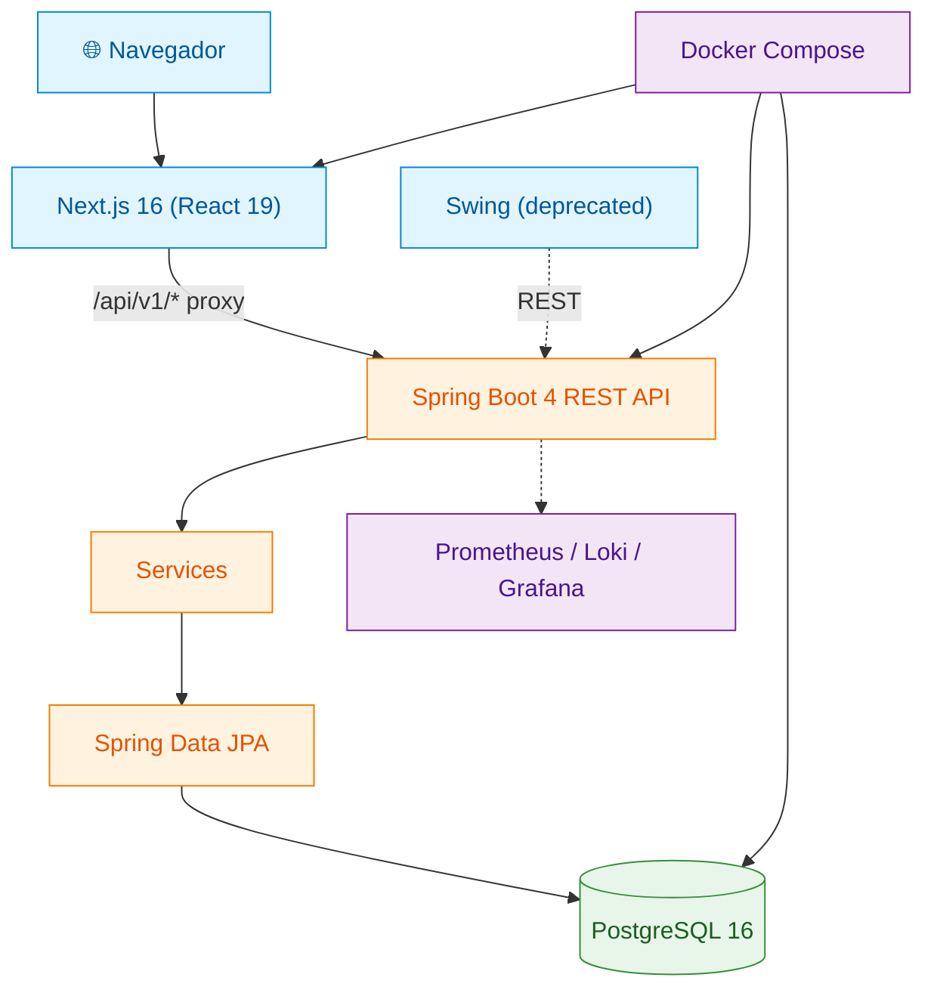

# 📜 Notaire — Modernización de Sistema de Gestión para Escribanía

<div align="center">

[](https://openjdk.org/projects/jdk/21/)
[](https://spring.io/projects/spring-boot)
[](https://nextjs.org/)
[](https://react.dev/)
[](https://www.postgresql.org/)
[](https://www.docker.com/)
[](https://www.typescriptlang.org/)
[](https://tailwindcss.com/)

[](https://github.com/matiaspakua/notaire/actions/workflows/ci.yml)
[](https://github.com/matiaspakua/notaire/actions/workflows/cd.yml)
[](https://github.com/matiaspakua/notaire/actions/workflows/pr-validation.yml)
[](https://github.com/matiaspakua/notaire/actions/workflows/frontend-ci.yml)
[](https://github.com/matiaspakua/notaire/actions/workflows/playwright-e2e.yml)
[](https://trivy.dev/)
[](LICENSE)

Migración de un monolito Java 1.6 / Swing a una arquitectura moderna de
API REST (Spring Boot 4) + frontend web (Next.js 16), con CI/CD y
observabilidad de nivel producción.

</div>

## Tabla de contenidos

- [Visión del proyecto](#-visión-del-proyecto)
- [Arquitectura](#️-arquitectura)
- [Estructura del repositorio](#-estructura-del-repositorio)
- [Stack tecnológico](#-stack-tecnológico)
- [Inicio rápido](#-inicio-rápido)
- [Testing y calidad](#-testing-y-calidad)
- [Observabilidad y seguridad](#-observabilidad-y-seguridad)
- [Documentación](#-documentación)
- [Contribuir](#-contribuir)
- [Licencia](#-licencia)

---

## 🎯 Visión del proyecto

El sistema original era un **monolito Java 1.6 con Swing**: lógica de negocio,
acceso a datos e interfaz gráfica fuertemente acoplados, base de datos MySQL 5
sin control de versiones, contraseñas con MD5, sin contenedores y sin tests
automatizados.

**Notaire** es el resultado de migrarlo hacia:

- **Backend**: API REST con **Spring Boot 4.1.0** y **Java 21**.
- **Frontend**: **Next.js 16** + **React 19** + **TypeScript** + **Tailwind CSS 4**, con un sistema de diseño propio inspirado en Apple.
- **Cliente transicional**: el Swing original, refactorizado como cliente REST puro (deprecado, ver [`deprecated-frontend-swing/README.md`](deprecated-frontend-swing/README.md)).
- **Base de datos**: **PostgreSQL 16** con **Flyway** como única fuente de verdad del esquema.
- **Infraestructura**: Docker Compose multi-stage, 11 workflows de GitHub Actions, observabilidad Prometheus/Grafana/Loki.

## 🏗️ Arquitectura



Diagrama completo (Building Block View, Runtime View, Deployment View) en el
**[SAD (arc42)](docs/200-architecture/201-SAD/sad.md)**.

## 📁 Estructura del repositorio

```
notaire/
├── backend-api/          # Spring Boot 4 REST API (Java 21)
├── frontend/              # Next.js 16 web app
├── notaire-shared/        # DTOs y contratos compartidos
├── deprecated-frontend-swing/  # Cliente Swing legacy (deprecado, no tocar)
├── docs/                  # Documentación (ver docs/README.md)
│   ├── 100-business/      # Requisitos, casos de uso, modelo de datos
│   ├── 200-architecture/  # SAD, ADRs, diseño, diagramas, seguridad, deploy
│   ├── 300-development/   # Setup, estándares, testing
│   └── 000-archive/       # Documentación histórica/superada
├── infra/                 # Stack de observabilidad (Prometheus, Grafana, Loki)
├── github-page/           # Sitio informativo/portfolio (Next.js, deploy a GitHub Pages)
├── openspec/               # Especificaciones SDLC (schema notaire-sdlc)
├── docker-compose.yml
├── CONSTITUTION.md         # Autoridad máxima del proceso de desarrollo
└── CLAUDE.md / AGENTS.md   # Guía para agentes de IA
```

## 🧰 Stack tecnológico

| Capa | Tecnologías |
|:-----|:------------|
| **Backend** | Java 21, Spring Boot 4.1.0 (Web, Data JPA, Security, Actuator), SpringDoc OpenAPI |
| **Persistencia** | PostgreSQL 16, Flyway, HikariCP, JasperReports |
| **Frontend** | Next.js 16, React 19, TypeScript 5.7, Tailwind CSS 4, TanStack Query, shadcn/ui, Zustand |
| **Testing** | JUnit 5 + Mockito + Testcontainers (backend), Vitest + Playwright (frontend), Bruno (API) |
| **Calidad** | JaCoCo, Checkstyle, SpotBugs, Trivy |
| **Observabilidad** | Micrometer, Prometheus, Loki + Promtail, Grafana |
| **CI/CD** | GitHub Actions (11 workflows), Docker multi-stage |

Detalle completo y justificación de cada elección: [ADRs](docs/200-architecture/202-ADR/).

## 🚀 Inicio rápido

### Prerrequisitos

```bash
# Backend
Java 21+ / Maven 3.9+ / Docker + Compose

# Frontend (desarrollo local sin Docker)
Node.js 22+ / npm 10+
```

### Con Docker (recomendado)

```bash
git clone https://github.com/matiaspakua/notaire.git
cd notaire
cp .env.example .env
bash scripts/start.sh          # levanta PostgreSQL + backend
bash scripts/health.sh         # verifica que todo esté arriba
```

### En desarrollo (sin Docker para app/frontend)

```bash
cd backend-api && mvn spring-boot:run -Dspring-boot.run.profiles=dev
cd frontend && npm run dev
# PostgreSQL 16 debe estar corriendo en :5432
```

### Servicios disponibles

| Servicio | URL |
|:---------|:----|
| Backend API | http://localhost:8080 |
| Swagger UI | http://localhost:8080/swagger-ui.html |
| Health check | http://localhost:8080/actuator/health |
| Frontend | http://localhost:3000 |
| pgAdmin | http://localhost:5050 |

Stack completo (Prometheus, Grafana, SonarQube, Homer): `bash scripts/start-all.sh` — ver [`infra/README.md`](infra/README.md).

## 🧪 Testing y calidad

```bash
mvn test -pl backend-api                 # unit + integration backend
cd frontend && npm run test:e2e          # Playwright E2E
bash scripts/preflight.sh --full         # réplica local de todos los gates de CI
```

Cobertura actual: ~84% líneas / ~74% branches (piso obligatorio: 70%/25%,
objetivo: 80%/80% — ver [`code-quality.md`](.claude/rules/code-quality.md)).

Estrategia completa de testing (unitario, integración, API, E2E, matriz
CU↔API): [`docs/300-development/303-testing/`](docs/300-development/303-testing/).
Mapeo local ↔ CI de cada gate: [`docs/300-development/CI-PREFLIGHT.md`](docs/300-development/CI-PREFLIGHT.md).

## 🔍 Observabilidad y seguridad

- **Observabilidad**: métricas (Prometheus), logs estructurados JSON (Loki),
  dashboards (Grafana) — ver [`docs/200-architecture/207-monitoring/`](docs/200-architecture/207-monitoring/).
- **Seguridad**: BCrypt, Spring Security, CORS, validación de inputs, escaneo
  Trivy — ver [`docs/200-architecture/206-security/`](docs/200-architecture/206-security/).
- **DevSecOps / despliegue**: [`docs/200-architecture/208-devsecops/`](docs/200-architecture/208-devsecops/) y [`docs/200-architecture/209-deployment/`](docs/200-architecture/209-deployment/).

## 📚 Documentación

Toda la documentación vive bajo [`docs/`](docs/README.md), organizada en tres
áreas (negocio, arquitectura, desarrollo) más un archivo histórico:

| Área | Ubicación | Contenido |
|:-----|:----------|:----------|
| Negocio | `docs/100-business/` | 121 requisitos (RF/RNF), 87 casos de uso, modelo de datos |
| Arquitectura | `docs/200-architecture/` | SAD (arc42), 20 ADRs, diseño de API/frontend, diagramas, seguridad, monitoreo, deploy |
| Desarrollo | `docs/300-development/` | Setup, estándares de código, estrategia de testing |
| Archivo | `docs/000-archive/` | Documentación histórica o superada |

Punto de entrada recomendado: [`docs/README.md`](docs/README.md).

## 🤝 Contribuir

Todo cambio sigue el proceso obligatorio definido en
**[`CONSTITUTION.md`](CONSTITUTION.md)** y
**[`.claude/rules/ai-agent-workflow.md`](.claude/rules/ai-agent-workflow.md)**:
Issue + Caso de Uso → branch (`<type>/<issue>_<descripción>`) → TDD → tests →
commit (Conventional Commits, `Closes #<issue>`) → `scripts/preflight.sh` → PR.

- **Commits**: [Conventional Commits](https://www.conventionalcommits.org/)
- **Branches**: `<type>/<issue-number>_<description>`
- **Java**: Google Style, Checkstyle, SpotBugs
- **TypeScript**: strict mode
- **PRs**: revisados (humano + AI code review)

## 📄 Licencia

Distribuido bajo **MIT License**. Ver [LICENSE](LICENSE).

---

<div align="center">

**Desarrollado por [Matías Miguez](https://github.com/matiaspakua)**

</div>
