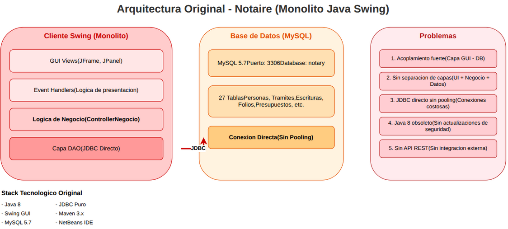
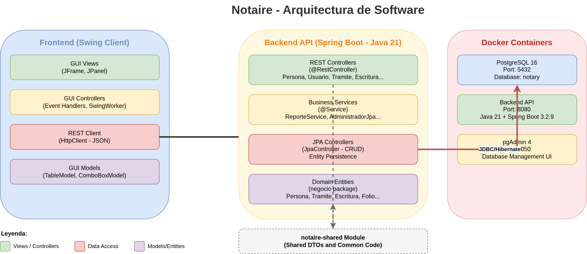
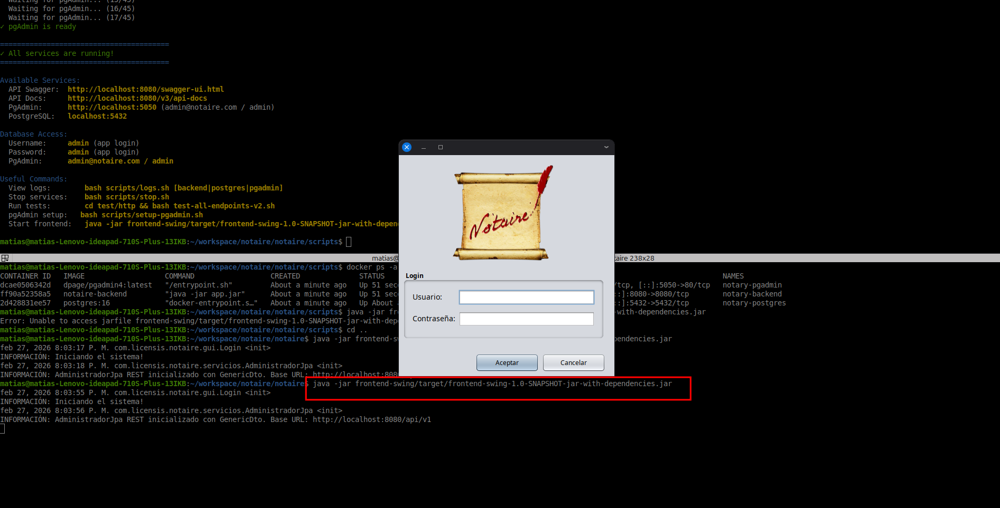
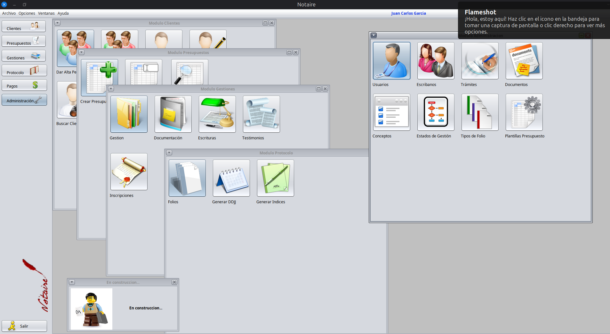

# Notaire - Sistema de Administración de Escribanía


> Sistema de gestión para escribanía, refactorizado desde un monolito Java Swing a una arquitectura moderna de microservicios con REST API.

---

## Tabla de Contenidos

1. [Resumen del Proyecto](#1-resumen-del-proyecto)
2. [Stack Tecnológico](#2-stack-tecnológico)
3. [Arquitectura del Sistema](#3-arquitectura-del-sistema)
4. [Cómo Ejecutar el Proyecto](#4-cómo-ejecutar-el-proyecto)
5. [Herramientas de IA Utilizadas](#5-herramientas-de-ia-utilizadas)
6. [Configuración de OpenCode y Skills](#6-configuración-de-opencode-y-skills)
7. [Documentación del Proyecto](#7-documentación-del-proyecto)
8. [Cronología de la Migración](#8-cronología-de-la-migración)
9. [Tareas Pendientes](#9-tareas-pendientes)

---

## CI/CD Pipeline

[](https://github.com/matiaspakua/notaire/actions/workflows/ci.yml)
[](https://github.com/matiaspakua/notaire/actions/workflows/cd.yml)
[](https://github.com/matiaspakua/notaire/actions/workflows/pr-validation.yml)

### Workflows Disponibles

| Workflow | Descripción | Trigger |
|----------|-------------|---------|
| **CI** | Build, test, coverage, security scan | Push a main/develop/feature/** |
| **CD** | Build & publish Docker image | Push a tags v* o main |
| **PR Validation** | Validación de PR | Pull requests |
| **OpenCode** | Integración con OpenCode AI | Comandos /oc en comentarios |

### Features del CI

- **Build**: Compilación Maven con Java 21
- **Unit Tests**: Tests unitarios con JUnit 5
- **Integration Tests**: Tests de integración
- **Code Coverage**: JaCoCo (80% mínimo requerido)
- **Security Scan**: Trivy para vulnerabilidades
- **Docker Build**: Construcción de imagen
- **Code Quality**: SpotBugs y Checkstyle

### Configuración de Secrets

Para GitHub Actions, configurar en Settings > Secrets:

| Secret | Descripción |
|--------|-------------|
| DOCKERHUB_USERNAME | Usuario de Docker Hub (opcional) |
| DOCKERHUB_TOKEN | Token de Docker Hub (opcional) |

### Uso de GitHub Container Registry

La imagen se publica automáticamente en:
```
ghcr.io/matiaspakua/notaire/backend:latest
```

---

## 1. Resumen del Proyecto

**Notaire** es un sistema de administración para la gestión de escribanía, originalmente desarrollado hace más de 14 años (durante la universidad) como una aplicación monolítica con Java y con UI usando  Swing (de java, ahora ya casi en desuso) con conexión directa a MySQL.

El proyecto en si, tenia una arquitectura de capas sencillo, pero robusto para ser un monolito. El siguiente diagrama es un ejemplo de la arquitectura original:

### Arquitectura Original (Monolito)



| Componente            | Descripción                                  |
| --------------------- | -------------------------------------------- |
| **GUI Swing**         | Interfaz gráfica con JFrame y JPanel         |
| **Event Handlers**    | Manejadores de eventos con lógica de negocio |
| **ControllerNegocio** | Clase central con toda la lógica de negocio  |
| **JDBC Directo**      | Conexiones SQL directas sin pooling          |
| **MySQL 5.7**         | Base de datos relacional (27 tablas)         |

El diagrama fue generado con OpenCode y el conector MCP a drawio local.


### Problemas del Código Original

| Problema | Descripción |
|----------|-------------|
| **Acoplamiento fuerte** | GUI Swing directamente conectada a MySQL mediante JDBC |
| **Sin separación de responsabilidades** | Lógica de negocio, presentación y acceso a datos entremezclados |
| **Tecnología obsoleta** | Java 6/8 sin actualizaciones de seguridad, MySQL 5.7 |
| **Sin integración externa** | No existía forma de comunicar la aplicación con otros sistemas |
| **Dificultad de mantenimiento** | Cualquier cambio requería modificar código de la interfaz gráfica |

### Visión del Proyecto Modernizado

```
Monolito Java Swing + MySQL    →    API REST + PostgreSQL + Docker
        (10+ años)                          (2026)
```

---

## 2. Stack Tecnológico

### Comparación: Original vs Actual

| Componente | Original | Actual |
|------------|----------|--------|
| **Java** | 8 | 21 LTS |
| **Framework** | N/A | Spring Boot 3.2.9 |
| **Base de Datos** | MySQL 5.7 | PostgreSQL 16 |
| **GUI** | Swing (Monolito) | Swing + REST Client |
| **API** | No existe | REST API |
| **Contenedores** | No | Docker + Docker Compose |
| **Pool de Conexiones** | No | HikariCP |
| **Documentación API** | No | Swagger/OpenAPI |


### IMPORTANTE

Respecto al ambiente de instalación, es decir:

- Java
- Git
- Maven
- Docker
- Python
- VSCode u otros IDE's
- etc.

Se asume que todas las herramientas ya se encuentran instaladas en el ambiente de desarrollo. 

Para más instrucciones, dirigirse a las paginas oficiales de cada proyecto e instalar las herramientas, según sea neccesario en cada ambiente.


### Estructura de Módulos Maven

```
notaire/
├── backend-api/          # API REST con Spring Boot
├── frontend-swing/       # Cliente GUI Swing
├── notary-shared/        # DTOs y código común
├── init-db/              # Scripts de PostgreSQL
└── scripts/              # Scripts de automatización
```

---

## 3. Arquitectura del Sistema


### Arquitectura Actual (Refactorizada)



| Capa | Componente | Descripción |
|------|------------|-------------|
| **Frontend** | GUI Views | Formularios Swing (JFrame, JPanel) |
| | GUI Controllers | Event Handlers con SwingWorker |
| | REST Client | HttpClient para consumo de API |
| | GUI Models | TableModel, ComboBoxModel |
| **Backend** | REST Controllers | Endpoints con @RestController |
| | Business Services | Lógica de negocio con @Service |
| | JPA Controllers | Persistencia con Hibernate |
| | Domain Entities | Objetos del dominio |
| **Datos** | PostgreSQL 16 | Base de datos en Docker |
| | HikariCP | Pool de conexiones |
| **Shared** | notary-shared | DTOs y código común |

---

## 4. Cómo Ejecutar el Proyecto

### Prerrequisitos

| Herramienta | Versión Mínima |
|-------------|----------------|
| Java | 21 LTS |
| Maven | 3.8+ |
| Docker | 24+ |
| Docker Compose | 2.0+ |

### Iniciar la Aplicación

#### Opción 1: Backend + Frontend completo

```bash
# 1. Iniciar servicios con Docker Compose (PostgreSQL)
bash scripts/start.sh

# 2. Compilar el proyecto completo
mvn clean install

# 3. Ejecutar el Backend (API REST)
cd backend-api && mvn spring-boot:run

# 4. Ejecutar el Frontend (en otra terminal)
cd frontend-swing && mvn exec:java -Dexec.mainClass="com.licensis.notaire.gui.Login"
```

#### Opción 2: Solo Frontend (con backend ya corriendo)

```bash
# El frontend requiere que la API esté corriendo en http://localhost:8080
cd frontend-swing && mvn exec:java -Dexec.mainClass="com.licensis.notaire.gui.Login"
```

#### Opción 3: Generar JAR ejecutable

```bash
# Generar JAR con todas las dependencias
cd frontend-swing && mvn clean package

# Ejecutar el JAR
java -jar frontend-swing/target/frontend-swing-jar-with-dependencies.jar
```

### Comandos de Build

```bash
# Compilar todo el proyecto
mvn clean install

# Compilar un módulo específico
mvn clean install -pl backend-api

# Package para despliegue
mvn clean package

# Skip tests durante build
mvn clean install -DskipTests
```

### Comandos de Testing

```bash
# Ejecutar todos los tests
mvn test

# Ejecutar tests de un módulo
mvn test -pl backend-api

# Ejecutar una clase de test
mvn test -Dtest=DocumentServiceTest

# Ejecutar un método de test
mvn test -Dtest=DocumentServiceTest#shouldCreateDocument

# Ejecutar tests que coincidan con un patrón
mvn test -Dtest="*ServiceTest"

# Tests de integración HTTP
bash scripts/test.sh

# Run tests with coverage
mvn test -pl backend-api

# Generate HTML report
mvn jacoco:report -pl backend-api

# View report
open backend-api/target/site/jacoco/index.html
```

### Acceder a la Aplicación

| Servicio | URL |
|----------|-----|
| **Swagger UI** | http://localhost:8080/swagger-ui.html |
| **Health Check** | http://localhost:8080/actuator/health |
| **pgAdmin** | http://localhost:5050 |
| **API Base** | http://localhost:8080/api/v1 |

### Detener la Aplicación

```bash
# Detener servicios
bash scripts/stop.sh

# Ver logs
bash scripts/logs.sh
```

---

## 5. Herramientas de IA Utilizadas

El proceso de migración fue asistido por diferentes herramientas de IA que evolucionaron con las necesidades del proyecto.

### Evolución de Herramientas

| Herramienta            | Período | Uso Principal                                                 |
|------------------------|---------|---------------------------------------------------------------|
| **Google Antigravity** | Inicio | Búsqueda de patrones, entender código existente               |
| **VS Code + Copilot**  | Medio | Autocompletado, refactoring inline, tests                     |
| **Cursor**             | Medio-Avanzado | Edit multi-archivo, búsqueda semántica, reglas personalizadas |
| **OpenCode**           | Actual | Herramientas nativas, MCPs, control total                     |
| **Claude Code**        | Actual | Como complemento a OpenCode                                   |

### ¿Por qué OpenCode?

1. **Gratuito y open source** - No requiere suscripción
2. **Arquitectura extensible** - MCPs permiten conectar cualquier herramienta
3. **Herramientas nativas** - bash, archivos, git integrados
4. **Comunidad activa** - Desarrollo constante de nuevas features
5. **Perfecto para DevOps** - Ejecutar Docker, compilar, testear desde el chat

---

## 6. Configuración de OpenCode y Skills

### Skills Configurados

El proyecto cuenta con **7 skills** especializados en `.agents/skills/`:

| Skill | Descripción |
|-------|-------------|
| **java** | Desarrollo Java profesional JDK 17+ |
| **Java** | Reglas críticas para evitar bugs comunes |
| **senior-backend** | APIs REST, PostgreSQL, seguridad backend |
| **test-master** | Testing y QA (unit, integration, E2E) |
| **senior-devops** | CI/CD, Docker, Kubernetes |
| **agile-product-owner** | Gestión de sprints y backlog |
| **software-functional-analyst** | Análisis funcional y modelado de datos |

### AGENTS.md

Archivo principal de configuración del agente.

**Ubicación**: `.agents/AGENTS.md`

Contiene:
- Comandos de build y ejecución
- Convenciones de código Java
- Arquitectura backend y frontend
- Reglas de calidad de código
- Patrones prohibidos

### Documentación de Desarrollo

Ver la Wiki del proyecto: https://github.com/matiaspakua/notaire/wiki

Documentación disponible en la wiki:
- **Development Setup** — Configuración del ambiente
- **Refactoring Plan** — Plan de migración arquitectónica
- **Plan de Acción** — Decisiones y roadmap actual
- **Plan Técnico JPA** — Detalles de migración a Spring Data
- **DevSecOps Pipeline** — CI/CD y seguridad
- **Contributing** — Guía de contribución
- **Security Policy** — Políticas de seguridad

Mejores prácticas de programación definidas en [[CLAUDE.md|.claude/rules/]]:
- `programming.md` — Convenciones y patrones Java
- `code-quality.md` — Herramientas de calidad (JaCoCo, Checkstyle, SpotBugs)

### Configuración de MCPs

| MCP Server | Propósito |
|-------------|-----------|
| **Filesystem** | Acceso al sistema de archivos |
| **Draw.io** | Diagramas de arquitectura |
| **Git** | Control de versiones |
| **Web Fetch** | Consultar documentación |

#### Instalar servidor MCP drawio

```bash
$ sudo npm install -g @drawio/mcp
```


### Instalación y configuración de Github

```bash
(type -p wget >/dev/null || (sudo apt update && sudo apt install wget -y)) \
	&& sudo mkdir -p -m 755 /etc/apt/keyrings \
	&& out=$(mktemp) && wget -nv -O$out https://cli.github.com/packages/githubcli-archive-keyring.gpg \
	&& cat $out | sudo tee /etc/apt/keyrings/githubcli-archive-keyring.gpg > /dev/null \
	&& sudo chmod go+r /etc/apt/keyrings/githubcli-archive-keyring.gpg \
	&& sudo mkdir -p -m 755 /etc/apt/sources.list.d \
	&& echo "deb [arch=$(dpkg --print-architecture) signed-by=/etc/apt/keyrings/githubcli-archive-keyring.gpg] https://cli.github.com/packages stable main" | sudo tee /etc/apt/sources.list.d/github-cli.list > /dev/null \
	&& sudo apt update \
	&& sudo apt install gh -y
```


Referencia:
https://github.com/cli/cli/blob/trunk/docs/install_linux.md

Luego de la instalación, hace falta conectar el CLI de Github con la cuenta personal y luego, utilizar OpenCode (o claude) para que pueda usar el CLI de github y crear PR, ISSUES y otras acciones necesarias en el repositorio.

El siguiente comando inicia el proceso para autorizar con github:

```bash
$ gh auth login
```


### Hooks de OpenCode (simil Claude Code)

https://dev.to/einarcesar/does-opencode-support-hooks-a-complete-guide-to-extensibility-k3p

Para agregar controles custom antes y despues de cada acción a ejecutar por los modelos.


### Sub-Agentes

https://opencode.ai/docs/agents/


---

## 7. Documentación del Proyecto

### Estructura de Documentación

```
notaire/
├── AGENTS.md                    # Configuración del agente IA
├── .agents/skills/              # Skills de OpenCode
│   ├── java/
│   ├── backend/
│   ├── testing/
│   ├── devops/
│   ├── product-owner/
│   └── analyst/
├── docs/
│   ├── business/                # Documentación de negocio
│   ├── development/             # Guías de desarrollo
│   └── ...
├── init-db/
│   ├── 01-schema.sql           # Esquema PostgreSQL
│   └── 02-data.sql             # Datos iniciales
└── scripts/
    ├── start.sh                # Iniciar aplicación
    ├── stop.sh                 # Detener aplicación
    └── test.sh                 # Tests de integración
```

### Migración de Base de Datos

| Etapa | Estado |
|-------|--------|
| Export desde MySQL 5.7 | ✅ Completado |
| Conversión de tipos | ✅ Completado |
| Creación de schema | ✅ Completado |
| Carga de datos | ✅ Completado |
| Validación | ✅ Completado |

---

## 8. Cronología de la Migración

### Fase 1: Orígenes (2014-2018)

| Fecha | Descripción |
|-------|-------------|
| 2014-03 | Primer commit, log4j, iconos |
| 2014-03 | Primer TestCase con JUnit |
| 2014-04 | JOB en Jenkins |
| 2016-04 | CI para GitLab |
| 2018-07 | CI con MySQL para testing |

### Fase 2: Inicio del Refactoring (Diciembre 2025)

| Fecha | Descripción |
|-------|-------------|
| 2025-12-20 | Separación inicial en módulos Maven |
| 2025-12-20 | Upgrade Java 8 → 21, Spring Boot 2.7 → 3.2.9 |
| 2025-12-20 | Migración javax → jakarta |
| 2025-12-22 | Limpieza general del proyecto |

### Fase 3: Refactoring Principal (Enero-Febrero 2026)

| Fecha | Descripción |
|-------|-------------|
| 2026-01-31 | Refactorización general del código |
| 2026-02-05 | Separación de capas (Controller/Service/Repository) |
| 2026-02-19 | Creación formal del plan de migración |
| 2026-02-20 | Migración de formularios por lotes |
| 2026-02-21 | Batch migration - Clientes |
| 2026-02-24 | Mejoras en AGENTS.md |

### Estado Actual (Febrero 2026)

| Componente | Estado | Detalle |
|------------|--------|---------|
| **Backend API** | ✅ | Endpoints críticos listos |
| **Swing Forms** | 🔄 | ~30 formularios en migración |
| **Reportes PDF** | ✅ | 10 endpoints JasperReports |
| **Docker Compose** | ✅ | postgres + backend + pgadmin |
| **Tests E2E** | 🔄 | Shell tests, JUnit domain tests |

---

## 9. Tareas Pendientes

Todas las tareas pendientes han sido trasladadas a **GitHub Issues** para mejor seguimiento y colaboración. Consulta el proyecto de GitHub para ver el estado actual:

**[Ver todas las tareas en GitHub Issues →](https://github.com/matiaspakua/notaire/issues?q=is%3Aissue+is%3Aopen+label%3ATAREA)**

### Resumen de Tareas Creadas

| Prioridad | Cantidad | Issues |
|-----------|----------|--------|
| **Alta** | 8 | #240-247 |
| **Media** | 5 | #248-252 |
| **Baja** | 9 | #253-261 |
| **Total** | **22** | Ver listado completo arriba |

### Categorías por Área

**Validación Funcional & Frontend** (5 issues)
- #240: Completar migración de formularios
- #241: Validar formularios con API REST
- #242: Probar flujos de negocio E2E
- #243: Verificar generación de reportes PDF
- #244: Testing de casos edge

**Backend & API** (3 issues)
- #245: Implementar JWT/OAuth2
- #246: Completar APIs pendientes
- #247: Agregar paginación

**Testing & Calidad** (2 issues)
- #248: Tests E2E automatizados
- #251: Tests unitarios con tags de requerimientos

**DevOps & Monitoreo** (6 issues)
- #249: Logs en formato Prometheus
- #250: Dashboard Grafana
- #253: Kubernetes
- #254: HTTPS/TLS
- #255: Monitoreo producción
- #256: Backups PostgreSQL

**Base de Datos** (1 issue)
- #252: Flyway para migraciones

**Documentación** (5 issues)
- #257: Swagger/OpenAPI completo
- #258: Migrar a Markdown
- #259: Guía de instalación producción
- #260: Documentar arquitectura
- #261: Manual de usuario

### Filtrar por Prioridad

- [Alta](https://github.com/matiaspakua/notaire/issues?q=is%3Aissue+is%3Aopen+label%3A"priority%3Ahigh"+label%3ATAREA)
- [Media](https://github.com/matiaspakua/notaire/issues?q=is%3Aissue+is%3Aopen+label%3A"priority%3Amedium"+label%3ATAREA)
- [Baja](https://github.com/matiaspakua/notaire/issues?q=is%3Aissue+is%3Aopen+label%3A"priority%3Alow"+label%3ATAREA)

---

## Screenshots

### Login



### Principal



---

## CI/CD - Pipeline de Integración y Entrega Continua

### Visión General

El proyecto Notaire utiliza GitHub Actions para implementar CI/CD con las siguientes características:

```
┌─────────────┐    ┌──────────────┐    ┌─────────────┐    ┌─────────────┐
│   Commit    │ -> │     CI      │ -> │     CD     │ -> │  Production │
│             │    │ Build/Test  │    │   Docker   │    │   Deploy   │
└─────────────┘    └──────────────┘    └─────────────┘    └─────────────┘
```

### Workflows Implementados

#### 1. CI - Build, Test & Security (`ci.yml`)

Ejecuta en cada push y PR:

| Job | Descripción | Tiempo estimado |
|-----|-------------|-----------------|
| `build` | Compilación Maven | ~2 min |
| `unit-tests` | Tests unitarios | ~3 min |
| `integration-tests` | Tests de integración | ~5 min |
| `coverage` | JaCoCo coverage report | ~3 min |
| `security` | Trivy vulnerability scan | ~2 min |
| `docker-build` | Build imagen Docker | ~5 min |
| `quality` | SpotBugs checkstyle | ~2 min |

#### 2. CD - Build & Publish Docker (`cd.yml`)

Publica imagen Docker cuando:
- Se hace push a `main`
- Se crea un tag `v*`

Ubicación: `ghcr.io/matiaspakua/notaire/backend`

#### 3. PR Validation (`pr-validation.yml`)

Valida pull requests:
- Título y descripción semántica
- Compilación rápida
- Análisis de dependencias
- Lint con Checkstyle
- Auto-comentario en PR

### Configuración de Tests

```bash
# Ejecutar tests unitarios
mvn test -pl backend-api -Dtest="**/unit/*"

# Ejecutar tests de integración  
mvn test -pl backend-api -Dtest="**/integration/*"

# Coverage con JaCoCo
mvn test -pl backend-api
mvn jacoco:report -pl backend-api

# Ver reporte
# backend-api/target/site/jacoco/index.html
```

### Cobertura de Código

- **Target**: 80% mínimo
- **Method**: 80% mínimo
- **Branch**: 80% mínimo

El reporte se publica automáticamente en PRs con comentarios de cobertura.

### Seguridad

#### Escaneo de Vulnerabilidades

| Herramienta | Qué escanea |
|-------------|-------------|
| Trivy | Contenedores y dependencias |
| SpotBugs | Bytecode Java |
| Dependabot | Actualizaciones de dependencias |
| GitHub Code Scanning | SAST integrado |

#### Imágenes Docker Seguras

- Base: `eclipse-temurin:21-jre-alpine` (~180MB)
- Usuario no-root
- Health checks integrados
- Scaneo con Trivy en CI

### Dependabot

Configurado para:
- Actualizaciones semanales de Maven
- Actualizaciones de GitHub Actions
- Grupos de dependencias

### GitHub Packages

La imagen Docker se publica en:
- **ghcr.io** (GitHub Container Registry)

```bash
# Pull de la imagen
docker pull ghcr.io/matiaspakua/notaire/backend:latest
```

### Variables de Entorno para CI

```yaml
JAVA_VERSION: '21'
MAVEN_OPTS: -Xmx1024m -XX:MaxMetaspaceSize=512m
REGISTRY: ghcr.io
```

---

## Cómo Editar la Wiki

La wiki del proyecto está alojada en el repositorio separado del proyecto principal. Para editar o agregar contenido:

### Método 1: Clonar el repositorio de wiki

```bash
# Clonar el repositorio de wiki
git clone https://github.com/matiaspakua/notaire.wiki.git

# Agregar o editar archivos markdown
cdmaire.wiki

# Los archivos .md se convierten en páginas de wiki
# Ejemplo: Home.md -> página "Home"

# Commit y push
git add .
git commit -m "Agregar nueva página"
git push
```

### Método 2: Desde la interfaz de GitHub

1. Ir a https://github.com/matiaspakua/notaire/wiki
2. Click en "New Page" o editar una página existente
3. Escribir el contenido en Markdown
4. Guardar la página

### Estructura de archivos en `docs/wiki/`

Los archivos Markdown en esta carpeta son el espejo de la wiki. La wiki es la fuente de verdad. Cambios en `docs/wiki/` se sincronizan manualmente a la wiki:

#### Documentación del Negocio (en wiki)
| Archivo | Página en Wiki | Descripción |
|---------|----------------|-------------|
| `Business-Documentation.md` | Documentación de Negocio | Índice general de todas las secciones |
| (08 secciones en subdirs) | 00-09 Sectores SDLC | Cronograma, Requerimientos, Actores, Casos, Datos, Progreso, Manuales, EA, App, Templates |

#### Documentación del Desarrollo (migrada a wiki)
| Archivo | Página en Wiki | Descripción |
|---------|----------------|-------------|
| `Home.md` | Home | Página principal y descripción del proyecto |
| `Development-Setup.md` | Development Setup | Configuración del ambiente de desarrollo |
| `Refactoring-Plan.md` | Refactoring Plan | Plan de migración a microservicios |
| `PLAN.md` | Plan de Acción | Acciones pendientes (Marzo 2026) |
| `PLANO_REFACTORING.md` | Plan Técnico JPA | Detalles de migración JpaControllers → Spring Data |
| `DevSecOps-Pipeline.md` | DevSecOps Pipeline | CI/CD, seguridad, workflows |
| `SECURITY.md` | Security Policy | Políticas de seguridad |
| `CONTRIBUTING.md` | Contributing | Guía de contribución |
| (Agent-Sessions.md) | Agent Sessions | Logs de sesiones de IA (links a repo principal) |

### Estructura de la Wiki Actualizada (Marzo 2026)

**Estado:** Wiki completamente migrada desde `docs/` (vea issue #228)
- ✅ 9 documentos de desarrollo (Home, Setup, Plans, Security, Contributing)
- ✅ 10 secciones de documentación de negocio (Cronograma, Requerimientos, Actores, Casos, Datos, Progreso, Manuales, EA, App, Templates)
- ✅ 68 casos de uso individuales
- ✅ 29 imágenes y diagramas
- ✅ 5 archivos de tracking de progreso (CSV)

**Notas importantes:**
- La **wiki es la fuente de verdad** para documentación
- Ediciones se hacen directamente en el repositorio wiki (`matiaspakua/notaire.wiki`)
- Los archivos en `docs/wiki/` del repo principal son un espejo para referencia local
- Para cambios significativos, usar GitHub web UI o clonar `notaire.wiki.git`

---

## Recursos

| Recurso | URL |
|---------|-----|
| Documentación OpenCode | https://docs.opencode.ai |
| MCP Protocol | https://modelcontextprotocol.io |
| Spring Boot | https://spring.io/projects/spring-boot |
| Java 21 | https://docs.oracle.com/en/java/javase/21/ |
| PostgreSQL | https://www.postgresql.org/ |

---

*Documento generado como parte del proceso de modernización del proyecto Notaire - Febrero 2026*
