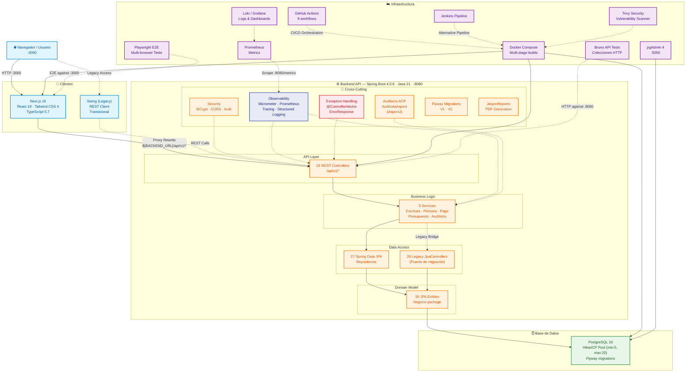
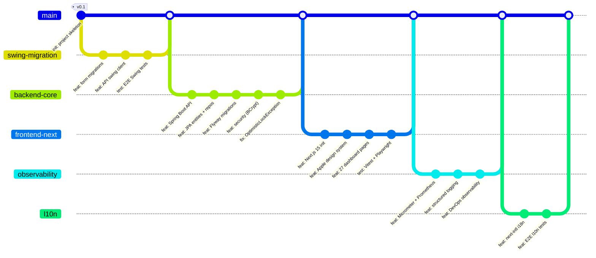

# 📜 Notaire — Modernización de Sistema de Gestión para Escribanía

<div align="center">

[](https://openjdk.org/projects/jdk/21/)
[](https://spring.io/projects/spring-boot)
[](https://nextjs.org/)
[](https://react.dev/)
[](https://www.postgresql.org/)
[](https://www.docker.com/)
[](https://www.typescriptlang.org/)
[](https://tailwindcss.com/)

[](https://github.com/matiaspakua/notaire/actions/workflows/ci.yml)
[](https://github.com/matiaspakua/notaire/actions/workflows/cd.yml)
[](https://github.com/matiaspakua/notaire/actions/workflows/pr-validation.yml)
[](https://github.com/matiaspakua/notaire/actions/workflows/frontend-ci.yml)
[](https://github.com/matiaspakua/notaire/actions/workflows/playwright-e2e.yml)
[](https://trivy.dev/)
[](https://github.com/matiaspakua/notaire/actions/workflows/ci.yml)
[](LICENSE)

> **De un monolito Java 1.6 Swing a microservicios modernos con Spring Boot 4, Next.js 16 y Postgres 16.**
>
> Una migración completa con trazabilidad total, CI/CD automatizado, y un ecosistema multi-cliente.

</div>

---

## 📋 Tabla de Contenidos

- [📜 Notaire — Modernización de Sistema de Gestión para Escribanía](#-notaire--modernización-de-sistema-de-gestión-para-escribanía)
  - [📋 Tabla de Contenidos](#-tabla-de-contenidos)
  - [🎯 Visión del Proyecto](#-visión-del-proyecto)
    - [El Problema Original](#el-problema-original)
    - [La Solución](#la-solución)
    - [Estado Actual](#estado-actual)
  - [🏗️ Arquitectura del Sistema](#️-arquitectura-del-sistema)
    - [Diagrama de Alto Nivel](#diagrama-de-alto-nivel)
    - [Estructura del Repositorio](#estructura-del-repositorio)
    - [Stack Tecnológico Completo](#stack-tecnológico-completo)
  - [🚀 Inicio Rápido](#-inicio-rápido)
    - [Prerrequisitos](#prerrequisitos)
    - [Ejecución con Docker (Recomendado)](#ejecución-con-docker-recomendado)
    - [Ejecución en Desarrollo](#ejecución-en-desarrollo)
    - [Servicios Disponibles](#servicios-disponibles)
  - [📊 Métricas del Proyecto](#-métricas-del-proyecto)
    - [Líneas de Código](#líneas-de-código)
    - [Cobertura de Código](#cobertura-de-código)
    - [Ciclo de Vida del Proyecto](#ciclo-de-vida-del-proyecto)
  - [🧪 Estrategia de Testing](#-estrategia-de-testing)
    - [Pirámide de Testing](#pirámide-de-testing)
    - [Ejecutar Tests](#ejecutar-tests)
  - [🚦 CI/CD y Calidad](#-cicd-y-calidad)
    - [Workflows de GitHub Actions](#workflows-de-github-actions)
    - [Puertas de Calidad](#puertas-de-calidad)
  - [🔍 Observabilidad y Monitoreo](#-observabilidad-y-monitoreo)
    - [Stack de Observabilidad](#stack-de-observabilidad)
    - [Métricas Expuestas](#métricas-expuestas)
  - [🛡️ Seguridad](#️-seguridad)
    - [Medidas Implementadas](#medidas-implementadas)
  - [🎨 Frontend Moderno (Next.js 16)](#-frontend-moderno-nextjs-16)
    - [Sistema de Diseño Apple-Inspired](#sistema-de-diseño-apple-inspired)
    - [Páginas Implementadas](#páginas-implementadas)
  - [🤖 Ecosistema de Agentes AI](#-ecosistema-de-agentes-ai)
    - [Agentes Configurados](#agentes-configurados)
    - [Skills Especializados](#skills-especializados)
  - [📘 Lecciones Aprendidas y Problemas Resueltos](#-lecciones-aprendidas-y-problemas-resueltos)
    - [🔴 Críticos](#-críticos)
    - [🟡 Arquitectura y Diseño](#-arquitectura-y-diseño)
    - [🔵 DevOps y CI/CD](#-devops-y-cicd)
    - [🟣 Frontend](#-frontend)
    - [⚪ Testing](#-testing)
    - [🟠 Dependencias y Herramientas](#-dependencias-y-herramientas)
  - [📚 Documentación](#-documentación)
    - [Estructura de Documentación](#estructura-de-documentación)
  - [🛣️ Roadmap](#️-roadmap)
  - [🤝 Contribuir](#-contribuir)
  - [📄 Licencia](#-licencia)

---

## 🎯 Visión del Proyecto

### El Problema Original

El sistema original era un **monolito Java 1.6 con Swing** que había servido fielmente durante más de una década en una escribanía. Con el tiempo, acumuló deuda técnica crítica:

- **🔗 Acoplamiento extremo** entre lógica de negocio, acceso a datos e interfaz gráfica
- **🐘 Base de datos MySQL 5** sin control de versiones ni migraciones
- **🔒 Password hashing con MD5** — vulnerable y sin posibilidad de migración gradual
- **📦 Sin contenedores** — deployment manual, sin reproducibilidad
- **🧪 Cero tests automatizados** — cada cambio era un riesgo
- **🖥️ Solo desktop** — sin acceso remoto ni web

### La Solución

**Notaire** es el resultado de una migración completa hacia una arquitectura moderna:

- **Backend**: API REST con **Spring Boot 4.0.6** y **Java 21**
- **Frontend Moderno**: **Next.js 16** con **React 19**, **TypeScript** y **Tailwind CSS 4**
- **Cliente Transicional**: Swing refactorizado como REST client (coexistencia durante la migración)
- **Base de Datos**: **PostgreSQL 16** con **Flyway** para migraciones versionadas
- **Infraestructura**: Contenedores Docker con multi-stage builds optimizados
- **Observabilidad**: **Micrometer** + **Prometheus** + **Loki/Grafana**
- **CI/CD**: 9 workflows de GitHub Actions + Jenkins

> **Filosofía**: Cada línea de código nuevo está testeada. Cada migración está documentada en un ADR. Cada cambio tiene trazabilidad completa desde el caso de uso hasta el commit.

### Estado Actual

| Fase | Estado | Detalle |
|:-----|:-------|:--------|
| 🏗️ **Backend API** | ✅ Completo | 26 controllers REST, 27 repositorios Spring Data JPA, 30 entidades |
| 🖥️ **Cliente Swing Transicional** | ✅ Completo | Swing refactorizado como REST client |
| 📱 **Frontend Next.js** | ✅ Completo | 27 páginas, 20 hooks personalizados, Apple Design System |
| 🗄️ **Base de Datos** | ✅ Completo | PostgreSQL 16, Flyway versionado (init-db archivado) |
| 🧪 **Testing** | ✅ Completo | Unitarios + Integración + E2E Playwright + Swing E2E |
| 📊 **Observabilidad** | ✅ Completo | Prometheus + Loki + Grafana + structured logging |
| 🌐 **Internacionalización** | ✅ En progreso | i18n con next-intl, multi-idioma |
| 🔄 **CI/CD** | ✅ Completo | 9 workflows, quality gates, Docker publish |

---

## 🏗️ Arquitectura del Sistema

### Diagrama de Alto Nivel



### Estructura del Repositorio

```
notaire/
│
├── 📦 backend-api/                   # Spring Boot 4 REST API
│   ├── src/main/java/.../            #
│   │   ├── api/                      # 26 REST Controllers (/api/v1/*)
│   │   ├── service/                  # 5 Business Services
│   │   ├── repository/               # 27 Spring Data JPA Repositories
│   │   ├── negocio/                  # 30 JPA Entities (mapeo legacy)
│   │   ├── jpa/                      # 26 Legacy JPA Controllers (puente)
│   │   ├── config/                   # 7 Spring Config Classes
│   │   ├── security/                 # PasswordEncoder, Auth
│   │   ├── audit/                    # AOP Auditoría transversal
│   │   ├── observability/           # Health indicators, metrics
│   │   └── exception/               # Global error handling
│   ├── src/main/resources/
│   │   ├── db/migration/             # Flyway SQL migrations
│   │   └── reportes/                 # JasperReports (.jasper/.jrxml)
│   └── pom.xml
│
├── 🖥️ frontend-swing/                # Swing REST Client (transicional)
│   └── src/main/java/.../
│       └── gui/api/client/           # REST client para la legacy UI
│
├── 📱 frontend/                      # Next.js 16 Modern Web App
│   ├── src/
│   │   ├── app/                      # 27 Páginas (App Router)
│   │   │   ├── login/                # Autenticación
│   │   │   └── dashboard/            # 25+ páginas de gestión
│   │   ├── components/               # UI Components
│   │   │   ├── ui/                   # shadcn/ui + Radix primitives
│   │   │   ├── layout/              # AppShell, Sidebar, Header
│   │   │   └── shared/              # DataTable, ConfirmDialog
│   │   ├── hooks/                    # 20 Custom React Hooks
│   │   ├── theme/                    # Apple Design System Tokens
│   │   ├── store/                    # Zustand State Management
│   │   ├── lib/                      # API Client, utilities
│   │   └── tests/                    # Vitest Unit Tests
│   ├── tests/e2e/                    # Playwright E2E Tests
│   ├── vitest.config.ts
│   └── playwright.config.ts
│
├── 🔗 notaire-shared/                # DTOs y contratos compartidos
│
├── 🗄️ docs/archive/init-db/          # Scripts PostgreSQL históricos (archivados)
│   ├── 01-schema.sql                 # DDL completo
│   └── 02-data.sql                   # Datos iniciales
│
├── 🐳 docker-compose.yml             # Orquestación multi-servicio
├── 🐳 Dockerfile.backend             # Multi-stage build
├── 📱 frontend/Dockerfile            # Next.js standalone build
│
├── 📚 docs/                          # Documentación completa
│   ├── 01-business/                  # Requisitos, Casos de Uso (73 CUs)
│   ├── 02-architecture/              # 11 ADRs, SAD, SARs
│   ├── 03-development/              # Guías de setup y testing
│   ├── 04-operations/               # CI/CD, Seguridad
│   ├── 05-api/                      # OpenAPI specs
│   └── 06-learning/                 # Onboarding
│
├── .github/workflows/                # 9 GitHub Actions workflows
├── infra/                            # Terraform/Ansible (planeado)
├── scripts/                          # Bash scripts de utilidad
│
├── .claude/                          # AI Agent configuration
│   ├── rules/                        # Workflow y reglas de código
│   └── skills/                       # Skills especializados
│
├── opencode.json                     # OpenCode AI config
├── CLAUDE.md                         # Claude Code instructions
├── AGENTS.md                         # AI agent coding guidelines
└── checkstyle.xml                    # Code style rules
```

### Stack Tecnológico Completo

| Capa | Tecnología | Versión | Propósito |
|:-----|:-----------|:--------|:----------|
| **Runtime** | Java | 21 LTS | Plataforma principal del backend |
| **Framework Backend** | Spring Boot | 4.0.6 | IoC, REST, Data JPA, Security, Actuator |
| **API Documentation** | SpringDoc OpenAPI | 3.0.3 | Swagger UI interactiva |
| **ORM** | Spring Data JPA / Hibernate | — | Persistencia y acceso a datos |
| **Base de Datos** | PostgreSQL | 16 | Base de datos relacional principal |
| **Migration DB** | Flyway | — | Migraciones versionadas de schema |
| **Connection Pool** | HikariCP | — | Pool de conexiones JDBC |
| **JSON** | Jackson | — | Serialización JSON |
| **PDF** | JasperReports | 3.5.3 | Generación de reportes PDF |
| **Testing Backend** | JUnit 5 + Mockito | — | Tests unitarios y de integración |
| **Testing Containers** | Testcontainers | 2.0.5 | PostgreSQL en contenedor para tests |
| **Coverage** | JaCoCo | 0.8.14 | Análisis de cobertura (80% min.) |
| **Static Analysis** | SpotBugs | 4.9.8 | Detección de bugs estáticos |
| **Code Style** | Checkstyle | — | Estilo de código Google |
| **Observing** | Micrometer + Prometheus | — | Métricas y monitoreo |
| **Tracing** | Micrometer Tracing (Brave) | — | Distributed tracing (W3C) |
| **Logging** | Logstash Logback Encoder | 9.0 | Logging estructurado JSON |
| **Security** | Spring Security + BCrypt | — | Autenticación y encriptación |
| **Vulnerability** | Trivy | — | Escaneo de vulnerabilidades |
| | | | |
| **Frontend Runtime** | Node.js | 22 | Runtime del frontend |
| **Frontend Framework** | Next.js | 16 | React metaframework (App Router) |
| **UI Library** | React | 19 | Componentes de interfaz |
| **Language** | TypeScript | 5.7 | Tipado estático |
| **CSS** | Tailwind CSS | 4.0 | Utility-first CSS |
| **State Management** | Zustand | 5.0 | Estado global liviano |
| **Server State** | TanStack React Query | 5.62 | Cache y fetching de datos |
| **Component Library** | shadcn/ui + Radix | — | Primitivas accesibles |
| **Icons** | Lucide React | 0.468 | Iconografía SVG |
| **Notifications** | Sonner | 1.7 | Toast notifications |
| **Testing Frontend** | Vitest | 4.1 | Tests unitarios React |
| **E2E Testing** | Playwright | 1.49 | Tests end-to-end multi-browser |
| **Testing Library** | @testing-library/react | 16 | Testing de componentes |
| **Design Tokens** | Theme System (custom) | — | Sistema de diseño Apple |
| **i18n** | next-intl | — | Internacionalización |
| | | | |
| **Container Engine** | Docker | — | Contenedores |
| **Orquestación** | Docker Compose | — | Multi-servicio local |
| **CI/CD** | GitHub Actions | — | 9 workflows automatizados |
| **CI/CD** | Jenkins | — | Pipeline alternativo |
| **Registry** | GitHub Container Registry | — | Docker images |
| | | | |
| **AI Agent (OpenCode)** | OpenCode | — | Desarrollo asistido por IA |
| **AI Agent (Claude)** | Claude Code | — | Code review + desarrollo |
| **API Testing** | Bruno | — | Colecciones de tests HTTP |
| **E2E Swing** | Robot Framework | — | Tests de UI legacy |

---

## 🚀 Inicio Rápido

### Prerrequisitos

```bash
# Backend
Java 21+          # Temurin o OpenJDK recomendado
Maven 3.9+
Docker + Compose # Para ejecución containerizada

# Frontend (desarrollo local)
Node.js 22+
npm 10+
```

### Ejecución con Docker (Recomendado)

```bash
# 1. Clonar
git clone https://github.com/matiaspakua/notaire.git
cd notaire

# 2. Variables de entorno
cp .env.example .env
# Editar según sea necesario

# 3. Iniciar todo (PostgreSQL + Backend + Frontend + pgAdmin)
bash scripts/start.sh

# 4. Verificar estado
bash scripts/health.sh
```

### Ejecución en Desarrollo

```bash
# Terminal 1: Backend
cd backend-api && mvn spring-boot:run -Dspring-boot.run.profiles=dev

# Terminal 2: Frontend
cd frontend && npm run dev

# Terminal 3: Base de datos (si no usás Docker Compose)
# Asegurate de tener PostgreSQL 16 corriendo en :5432
```

### Servicios Disponibles

| Servicio | URL | Propósito |
|:---------|:----|:----------|
| 🌐 **Backend API** | http://localhost:8080 | API REST |
| 📖 **Swagger UI** | http://localhost:8080/swagger-ui.html | Documentación interactiva |
| 💚 **Health Check** | http://localhost:8080/actuator/health | Health + Liveness + Readiness |
| 📊 **Prometheus** | http://localhost:8080/actuator/metrics | Métricas de aplicación |
| 🖥️ **Frontend** | http://localhost:3000 | Web App Next.js |
| 🗄️ **pgAdmin** | http://localhost:5050 | Admin DB (admin@notaire.com / admin) |

---

## 📊 Métricas del Proyecto

| Métrica | Valor | Detalle |
|:--------|:------|:--------|
| **Commits totales** | 339+ | Desde febrero 2026 |
| **Contribuidores** | 3 | 2 desarrolladores + Dependabot |
| **Controllers REST** | 26 | Endpoints `/api/v1/*` |
| **Spring Data Repos** | 27 | Interfaces JpaRepository |
| **Entidades JPA** | 30 | Modelo de dominio |
| **Servicios** | 5 | Lógica de negocio |
| **Clases de Config** | 7 | Security, JPA, OpenAPI, etc. |
| **Páginas Frontend** | 27 | Dashboard + Login |
| **React Hooks** | 20 | Custom hooks por módulo |
| **DTOs Compartidos** | 54+ | Contrato entre módulos |
| **Casos de Uso** | 73 | Trazabilidad completa |
| **ADR** | 11 | Architecture Decision Records |
| **Workflows CI/CD** | 9 | GitHub Actions |
| **Módulos Maven** | 3 | backend-api, frontend-swing, notaire-shared |

### Líneas de Código

```
Lenguaje        Archivos  Líneas
─────────────────────────────────
Java (backend)     210+    ~18,000
TypeScript (front)  180+   ~15,000
SQL (migrations)    20+    ~2,500
XML/YAML config     30+    ~1,500
Total               440+   ~37,000+
```

### Cobertura de Código

| Módulo | Cobertura Líneas | Cobertura Branches | Estado |
|:-------|:----------------|:-------------------|:-------|
| backend-api | ~29% (objetivo 80%) | ~15% (objetivo 80%) | ⚙️ Piso mínimo aplicado por JaCoCo (`mvn verify`), con ratchet ascendente |

### Ciclo de Vida del Proyecto



---

## 🧪 Estrategia de Testing

### Pirámide de Testing

```
                    ╱╲
                   ╱  ╲
                  ╱ E2E ╲           ← Playwright (Chrome + multi-browser)
                 ╱  27 tests ╲         Swing Robot Framework (89 tests)
                ╱──────────────╲
               ╱                ╲
              ╱  Integration     ╲    ← Spring Boot Test + Testcontainers
             ╱  20+ tests         ╲     H2 (offline) + PostgreSQL (Docker)
            ╱──────────────────────╲
           ╱                        ╲
          ╱      Unit Tests           ╲ ← JUnit 5 + Mockito (backend)
         ╱      80+ tests              ╲   Vitest + Testing Library (frontend)
        ╱────────────────────────────────╲
       ╱                                  ╲
      ╱   Static Analysis + Quality Gates   ╲ ← JaCoCo (80%), SpotBugs,
     ╱     Checkstyle, Trivy Security         ╲   PR Validation
    ╱────────────────────────────────────────────╲
```

### Ejecutar Tests

```bash
# ────── BACKEND ──────

# Todos los tests backend
mvn test -pl backend-api

# Tests unitarios
mvn test -pl backend-api -Dtest="**/unit/*"

# Tests de integración
mvn test -pl backend-api -Dtest="**/integration/*"

# Cobertura
mvn test -pl backend-api && mvn jacoco:report -pl backend-api
# Reporte HTML: backend-api/target/site/jacoco/index.html

# Test específico
mvn test -pl backend-api -Dtest=PresupuestoServiceTest

# ────── FRONTEND ──────

# Tests unitarios (Vitest)
cd frontend && npm test

# Tests con cobertura
cd frontend && npm run test:coverage

# Tests E2E (Playwright)
cd frontend && npm run test:e2e

# ────── API TESTS ──────

# Tests HTTP con Bruno (requiere API corriendo)
bash integration-test/scripts/test.sh

# ────── TODO ──────

# Verificación completa
mvn verify -pl backend-api
```

---

## 🚦 CI/CD y Calidad

### Workflows de GitHub Actions

| Workflow | Evento | Propósito |
|:---------|:-------|:----------|
| **CI - Build & Test** | push / PR a `main` | Compila, tests unitarios, integración, cobertura, seguridad, Docker |
| **CD - Docker** | push a `main` | Build + push de imagen Docker a GitHub Container Registry |
| **PR Validation** | PR a `main` | Valida Conventional Commits, estilo, tests |
| **Frontend CI** | push / PR | Build Next.js, lint, tests Vitest |
| **Playwright E2E** | push a `main` | Suite completa E2E multi-browser |
| **E2E Swing** | push / PR | Tests de UI legacy con Robot Framework |
| **Claude Code** | PR | Code review automático con IA |
| **OpenCode** | — | Configuración del agente de desarrollo |

### Puertas de Calidad

| Gate | Threshold | Herramienta |
|:-----|:----------|:------------|
| ✅ Tests unitarios | 100% passing | JUnit 5 + Surefire |
| ✅ Tests integración | 100% passing | Spring Boot Test |
| ⚙️ Cobertura de línea | piso ~28% (objetivo 80%) | JaCoCo (ratchet) |
| ⚙️ Cobertura de branches | piso ~14% (objetivo 80%) | JaCoCo (ratchet) |
| ✅ Vulnerabilidades críticas | 0 | Trivy |
| ✅ Code style | Sin violaciones | Checkstyle (Google Style) |
| ✅ Bug detection | Sin errores | SpotBugs (Max effort) |
| ✅ Commits convencionales | Formato válido | semantic-pull-request |
| ✅ Build Docker | Exitoso | Docker Buildx |

---

## 🔍 Observabilidad y Monitoreo

### Stack de Observabilidad

| Componente | Tecnología | Propósito |
|:-----------|:-----------|:----------|
| 📊 **Métricas** | Micrometer + Prometheus | Métricas JVM, HTTP, personalizadas |
| 🔗 **Tracing** | Micrometer Tracing (Brave) + Zipkin | Distributed tracing (W3C propagation) |
| 📝 **Logging** | Logstash Logback Encoder | Logging estructurado en JSON |
| 📈 **Dashboards** | Grafana + Loki (planeado) | Visualización de métricas y logs |
| 💚 **Health** | Spring Boot Actuator | Liveness + Readiness + Health probes |

### Métricas Expuestas

```bash
# Endpoints de Actuator disponibles:
/actuator/health            # Health check (liveness + readiness)
/actuator/metrics           # Todas las métricas
/actuator/prometheus        # Formato Prometheus
/actuator/info              # Información de build
/actuator/threaddump        # Thread dump
/actuator/heapdump          # Heap dump
/actuator/env               # Environment properties
/actuator/loggers           # Log levels configurables

# Principales métricas expuestas:
# - jvm.memory.*            # Uso de memoria heap y no-heap
# - jvm.gc.*                # Garbage collection stats
# - jvm.threads.*           # Estados de threads
# - http.server.requests    # HTTP request metrics (percentiles: 10ms-2s)
# - process.*               # CPU, uptime
# - logback.*               # Log events por nivel
```

---

## 🛡️ Seguridad

### Medidas Implementadas

| Medida | Estado | Detalle |
|:-------|:-------|:--------|
| 🔐 **Password Hashing** | ✅ BCrypt (strength=12) | Migrado desde MD5 legacy |
| 🚫 **CORS** | ✅ Configurado | Orígenes permitidos: localhost:3000, :8080, :9090 |
| 🛡️ **Spring Security** | ✅ Activo | Protección de endpoints de Actuator |
| 🔍 **Trivy Scanning** | ✅ CI pipeline | Escaneo de vulnerabilidades en cada build |
| 📝 **Input Validation** | ✅ Spring Validation | `@Valid`, `@NotNull`, `@Size`, etc. |
| ⚠️ **Error Handling** | ✅ Global | `@ControllerAdvice` con `ErrorResponse` estandarizado |
| 🐳 **Non-root container** | ✅ Docker | Usuario `notary` sin privilegios |
| 🔒 **JVM flags** | ✅ Optimizados | `UseContainerSupport`, `MaxRAMPercentage=70%` |

---

## 🎨 Frontend Moderno (Next.js 16)

### Sistema de Diseño Apple-Inspired

El frontend implementa un sistema de diseño completo inspirado en **macOS Sequoia / iOS 18**, con tokens de diseño centralizados:

```typescript
// frontend/src/theme/tokens.ts — Fuente única de verdad

// Paleta de colores Apple: San Francisco
colors.neutral[900]   // #1D1D1F — Casi negro (texto)
colors.primary[600]   // #0071E3 — Apple Blue
colors.success[500]   // #34C759 — Apple Green
colors.warning[500]   // #FF9500 — Apple Orange
colors.error[500]     // #FF453A — Apple Red

// Tipografía: SF Pro
typography.fontFamily.display  // "SF Pro Display", —system-ui, sans-serif
typography.fontFamily.body     // "SF Pro Text", —system-ui, sans-serif

// Sombras multi-capa Apple-style
shadows.md: "0 0 0 1px rgba(0,0,0,0.06), 0 4px 8px rgba(0,0,0,0.06), 0 16px 32px rgba(0,0,0,0.08)"

// Bordes redondeados
sizes.card.borderRadius  // 28px (2xl) — Apple cards
sizes.input.borderRadius // 12px (md)
```

**Componentes UI**: shadcn/ui sobre Radix Primitives — `@radix-ui/react-dialog`, `@radix-ui/react-select`, `@radix-ui/react-tabs`, `@radix-ui/react-dropdown-menu`, `@radix-ui/react-tooltip` y más. Patrones de formulario reutilizables en `src/theme/form-patterns.tsx`.

**Estado**: Zustand para UI state + TanStack React Query para server state.

### Páginas Implementadas

| Módulo | Páginas | Hooks |
|:-------|:--------|:------|
| 🔑 **Auth** | Login | — |
| 📊 **Dashboard** | Main dashboard | — |
| 👥 **Personas** | List, CRUD | `usePersonas` |
| 📄 **Documentos** | List, CRUD, tipos | `useDocumentos`, `useDocumentosPresentados` |
| ✍️ **Escrituras** | List, CRUD | `useEscrituras` |
| 📋 **Gestiones** | List, CRUD, estados | `useGestiones`, `useEstadosGestion` |
| 💰 **Presupuestos** | List, CRUD, conceptos | `usePresupuestos`, `useConceptos` |
| 🏢 **Inmuebles** | List, CRUD | `useInmuebles` |
| 📑 **Protocolo** | List, CRUD | — |
| 📒 **Folios** | List, CRUD, tipos | `useFolios` |
| 🔄 **Copias** | List, CRUD, testimonios | `useCopias` |
| 💳 **Pagos** | List, CRUD | `usePagos` |
| 👤 **Suplencias** | List, CRUD | `useSuplencias` |
| 📊 **Reportes** | PDF generation | `useReportes` |
| 📈 **Auditoría** | Logs, historial | `useAuditoria`, `useHistorial` |
| ⚙️ **Admin** | Usuarios, trámites, items, plantillas, conceptos | `useUsuarios`, `useTiposTramite`, `useItems`, `usePlantillas` |

---

## 🤖 Ecosistema de Agentes AI

Notaire implementa un ecosistema completo de desarrollo asistido por inteligencia artificial, con agentes y herramientas configurados para maximizar la productividad:

### Agentes Configurados

| Agente | Plataforma | Rol |
|:-------|:-----------|:----|
| 🧠 **OpenCode** | Local (opencode.json) | Agente principal de desarrollo |
| 🤖 **Claude Code** | CLI + GitHub Actions | Code review automático en PRs |
| 👁️ **Code Reviewer** | Subagente OpenCode | Revisión de seguridad y performance |
| 🔒 **Security Auditor** | Subagente OpenCode | Auditoría de vulnerabilidades |

### Skills Especializados

El proyecto incluye **skills especializados** para cada aspecto del desarrollo:

| Skill | Propósito |
|:------|:----------|
| 🏗️ **ai-agent-workflow** | Workflow mandatorio: Issue → Branch → PR |
| 🧪 **testing** | Estrategia completa de testing (unit, integration, E2E, security) |
| 🔄 **maven-build** | Build y test de módulos Maven |
| 🎨 **frontend-design** | Sistema de diseño Apple para componentes |
| 📊 **drawio** | Generación de diagramas de arquitectura |
| 🚀 **devops** | CI/CD pipelines, Docker, infraestructura |
| 📋 **product-owner** | User stories, sprint planning, milestones |
| 📐 **software-functional-analyst** | Análisis funcional, casos de uso |
| ☕ **java** | Best practices Java moderno (records, sealed, pattern matching) |
| 🛣️ **flyway** | Migraciones de base de datos versionadas |
| 📡 **api-rest** | Colecciones Bruno de tests API |

---

## 📘 Lecciones Aprendidas y Problemas Resueltos

> Esta sección documenta los problemas, decisiones y aprendizajes más significativos durante el desarrollo del proyecto.

### 🔴 Críticos

| Problema | Síntoma | Solución | Commit |
|:---------|:--------|:---------|:-------|
| **MD5 Password Hashing** | Contraseñas almacenadas con hash MD5 (vulnerable) | Migración a BCrypt con strength=12, encoder configurable | `c7a2132` |
| **OptimisticLockException** | Error en actualizaciones concurrentes de PlantillaPresupuesto | Revisión de estrategia de locking y versionado JPA | `4c289ee` |
| **API 500 en POST** | Error 500 al crear presupuestos, personas, documentos | Serialización incorrecta de JPA entities con lazy loading | `863417e` |
| **White-label Error Pages** | Errores HTTP sin formato JSON | Implementación de `@ControllerAdvice` global con `ErrorResponse` | `8bed1b5` |
| **Lazy Loading en Tests** | Tests de integración fallando por lazy-loading pollution | `@Sql` cleanup y configuración `open-in-view=false` | `c55a23f` |

### 🟡 Arquitectura y Diseño

| Problema | Contexto | Decisión | ADR |
|:---------|:---------|:---------|:----|
| **Monolito vs Microservicios** | Aplicación Swing con todo acoplado | Migración progresiva: REST API primero, frontend moderno después | ADR-001 |
| **PostgreSQL vs MySQL** | Base legacy MySQL 5 | Migrar a PostgreSQL 16 con Flyway para versionado | ADR-002 |
| **Spring Data JPA vs JpaControllers** | Legacy bridge existente | Coexistencia: nuevos features usan Spring Data, legacy migra progresivamente | ADR-007 |
| **Next.js vs SPA** | Necesidad de frontend moderno | Next.js 16 App Router por SSR, SEO, y server components | ADR-005 |
| **Cliente Swing Legacy** | UI desktop existente | Refactorizar como REST client (no descartar, migrar gradualmente) | ADR-003 |
| **Testcontainers v1→v2** | Breaking changes en API | Migración a BOM v2.0.5 con artifact IDs actualizados | `209bf38` |

### 🔵 DevOps y CI/CD

| Problema | Contexto | Solución |
|:---------|:---------|:---------|
| **GitHub Actions flaky** | Tests E2E fallando intermitentemente | `continue-on-error` en jobs no críticos, retry logic | `bb7afe4` |
| **Multi-stage Docker** | Imagen muy grande (400MB+) | Build en dos etapas: Maven builder + JRE alpine slim (~180MB) | `Dockerfile.backend` |
| **Cobertura en CI** | JaCoCo check rompía el build | Report en CI, check no bloqueante, PR comment con madrapps | `ci.yml` |
| **TestContainers en CI** | Dependencia de Docker en CI | GitHub Actions con Docker preinstalado, test via Testcontainers | `027d151` |
| **PR Validation** | Commits sin formato conventional | `amannn/action-semantic-pull-request` + linter | `a9f654f` |

### 🟣 Frontend

| Problema | Contexto | Solución |
|:---------|:---------|:---------|
| **Iconos rotos en Docker** | PNGs de la app Swing no se renderizaban en Next.js | Copiar assets al build standalone + `unoptimized: true` | `1b58935` |
| **TypeScript errors** | Tipos incorrectos después de migración | Strict mode, `tsconfig.json` paths, tipos en hooks | `035136c` |
| **Auth cookie vacía** | Página en blanco al hacer logout | Clear cookie + redirect explícito | `9d9d364` |
| **Proxy routing** | Frontend en Docker no llegaba al backend | `next.config.ts` rewrites proxy `/api/v1/*` | `bfea289` |
| **Sistema de diseño** | Inconsistencia visual entre páginas | Theme tokens centralizados Apple-inspired + form patterns | `c2cb737` |

### ⚪ Testing

| Problema | Contexto | Solución |
|:---------|:---------|:---------|
| **Sin tests legacy** | Código original sin cobertura | E2E tests con Robot Framework (89 tests para Swing) | `35f0317` |
| **Gap analysis** | CUs sin tests de API | Matriz CU-API gap con cobertura por use case | `2bcce57` |
| **Bruno syntax errors** | Tests HTTP con formato incorrecto | Corrección de sintaxis Bruno + CHAI assertions robustas | `34f4fef` |
| **H2 vs PostgreSQL** | Tests offline vs real DB | Tests de integración con Testcontainers, unitarios con H2 | `0fc0895` |

### 🟠 Dependencias y Herramientas

| Problema | Versión | Acción |
|:---------|:--------|:-------|
| **Spring Boot 3→4** | 4.0.6 | Migración de Jakarta EE, Sleuth → Micrometer Tracing |
| **Testcontainers** | 2.0.5 | Breaking changes en API de contenedores |
| **SpotBugs + Java 21** | 4.9.8 | Skip por defecto local, habilitado en CI |
| **JaCoCo + Java 21** | 0.8.14 | Configuración de excludes para clases legacy |
| **Dependabot** | — | ~30 PRs de actualización automática procesados |
| **Logstash Encoder** | 9.0 | Logging estructurado JSON para Loki |

---

## 📚 Documentación

El proyecto cuenta con documentación completa y estructurada siguiendo el ciclo de vida del software (SDLC). Cada decisión, cada caso de uso y cada componente está documentado.

### Estructura de Documentación

```
docs/
├── README.md                         # Índice general y navegación
│
├── 01-business/                      # 📋 REQUISITOS Y NEGOCIO
│   ├── 01-requirements/              # Historias de usuario (INVEST)
│   ├── 02-usecases/                  # 73 Casos de uso (Given-When-Then)
│   ├── 03-data-model/               # Modelo de datos (ERD)
│   └── 04-manuals/                   # Manuales de usuario
│
├── 02-architecture/                  # 🏛️ ARQUITECTURA
│   ├── 01-adr/                       # 11 ADRs (registros de decisión)
│   ├── 02-overview/                  # SAD + diagramas C4
│   └── 03-sar/                       # Solution Architecture Reports
│
├── 03-development/                   # 🛠️ DESARROLLO
│   ├── 01-setup/                     # Setup de entorno
│   ├── 02-build/                     # Guías de build
│   └── 03-testing/                   # Estrategia de testing
│
├── 04-operations/                    # ⚙️ OPERACIONES
│   ├── 01-cicd/                      # Pipelines CI/CD
│   ├── 02-deployment/               # Despliegue
│   └── 03-security/                  # Seguridad
│
├── 05-api/                           # 📡 API REST
│   └── openapi/                      # Especificaciones OpenAPI
│
└── 06-learning/                      # 📚 APRENDIZAJE
    └── onboarding/                   # Guías para nuevos desarrolladores
```

---

## 🛣️ Roadmap

| Hito | Fecha | Estado |
|:-----|:------|:-------|
| ✅ Backend REST API completo | Q1 2026 | ✅ |
| ✅ Base de datos PostgreSQL + Flyway | Q1 2026 | ✅ |
| ✅ Cliente Swing transicional | Q1 2026 | ✅ |
| ✅ Frontend Next.js + Apple Design | Q2 2026 | ✅ |
| ✅ Observabilidad + Monitoreo | Q2 2026 | ✅ |
| ✅ CI/CD Completo + Automatización | Q2 2026 | ✅ |
| 🔄 Internacionalización (i18n) | Q2 2026 | 🔄 En progreso |
| 📱 Temas oscuro | Q3 2026 | 📋 Planificado |
| 🔔 Notificaciones en tiempo real | Q3 2026 | 📋 Planificado |
| 📱 Modo offline / PWA | Q3 2026 | 📋 Planificado |
| 🚢 Kubernetes + Helm Charts | Q4 2026 | 📋 Planificado |
| 🔄 Migración completa de JpaControllers | Q4 2026 | 📋 Planificado |

---

## 🤝 Contribuir

```bash
# 1. Fork → Clone → Branch
git checkout -b feat/<issue-id>_descripcion_breve

# 2. Implementar + Testear
mvn test -pl backend-api
mvn jacoco:check -pl backend-api

# 3. Commit (Conventional Commits)
git commit -m "feat(scope): descripción

Closes #<issue-id>"

# 4. Push + PR
git push -u origin feat/<issue-id>_descripcion
gh pr create --title "feat: descripción" --body "Fixes #<issue-id>"
```

### Convenciones del Proyecto

- **Commits**: [Conventional Commits](https://www.conventionalcommits.org/) estrictamente
- **Branches**: `<type>/<issue-number>_<description>` (ej: `feat/253_jwt_auth`)
- **Java**: Google Style + Checkstyle + SpotBugs
- **TypeScript**: Strict mode + tipos explícitos
- **Cobertura**: Mínimo 80% (líneas + branches)
- **PRs**: Todos revisados (humano + AI Code Review)

---

## 📄 Licencia

Distribuido bajo **MIT License**. Ver [LICENSE](LICENSE) para más detalles.

---

<div align="center">

**Desarrollado con ☕, 🎵 y mucha paciencia por [Matías Miguez](https://github.com/matiaspakua)**

*Modernizando la escribanía del futuro, un commit a la vez.*

**339+ commits · 73 casos de uso · 11 ADRs · 9 workflows · 3 módulos · 1 objetivo**

</div>
