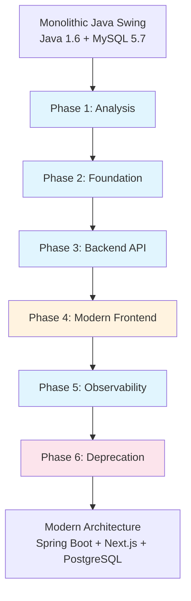

# Notaire Migration Dashboard

> **Live Status Dashboard** | Last Updated: 2026-09-01 | [View Issues](https://github.com/matiaspakua/notaire/issues)

## 📊 Executive Summary

**Project Status:** Phase 4/6 (Modern Frontend) in Progress  
**Overall Progress:** 75% Complete  
**Next Milestone:** Complete all 73 Use Cases in Next.js Frontend  

```mermaid
gantt
    title Notaire Migration Roadmap
    dateFormat  YYYY-MM
    axisFormat %Y-%m
    
    section Migration Phases
    Phase 1: Analysis         :done, p1, 2024-03, 3M
    Phase 2: Foundation       :done, p2, 2024-06, 3M
    Phase 3: Backend API      :done, p3, 2024-09, 4M
    Phase 4: Modern Frontend  :active, p4, 2025-01, 8M
    Phase 5: Observability    :done, p5, 2025-09, 2M
    Phase 6: Deprecation      :crit, p6, 2026-01, 6M
```

---

## 🎯 Migration Strategy Overview

The Notaire project follows a **strangler fig pattern** migrating from a monolithic Java Swing application to a modern three-tier architecture:



---

## 📈 Phase Status Dashboard

### Phase 1: Analysis ✅ **COMPLETE**
**Status:** 100% Complete | **Duration:** 3 months  
**Description:** Legacy system documented, 73 use cases cataloged

**Artifacts:**
- ✅ Legacy documented in `deprecated-frontend-swing/`
- ✅ 73 use cases cataloged in `docs/100-business/102-use-cases/`
- ✅ Complete documentation of original system

### Phase 2: Foundation ✅ **COMPLETE**
**Status:** 100% Complete | **Duration:** 3 months  
**Description:** Core infrastructure established

**Components:**
- ✅ `notaire-shared` module for DTOs
- ✅ Maven multi-module structure
- ✅ Docker Compose setup
- ✅ PostgreSQL 16 migration from MySQL

### Phase 3: Backend API ✅ **COMPLETE**
**Status:** 100% Complete | **Duration:** 4 months  
**Description:** Complete REST API with all business logic

**Statistics:**
- ✅ 31 REST Controllers
- ✅ 31 Spring Data JPA Repositories  
- ✅ 32 Domain Entities
- ✅ Flyway migrations V1→V14
- ✅ JWT Authentication & Spring Security
- ✅ Complete audit trail implementation

### Phase 4: Modern Frontend 🔄 **IN PROGRESS**
**Status:** ~60% Complete | **Duration:** 8 months (estimated)  
**Description:** Next.js 16 frontend replacing Swing client

**Current Implementation:**
- ✅ Authentication flow (login/logout)
- ✅ Dashboard layout with Apple-inspired design system
- ✅ Personas management
- ✅ Gestiones management
- ✅ Audit trail viewer
- 🔄 Escrituras module (partial)
- 🔄 Presupuestos module (partial)
- 🔄 Workflow visualizer (partial)

**Remaining Work:**
- Complete implementation of all 73 use cases
- Full workflow engine UI integration
- Report generation interface
- Advanced search and filtering

**Key Issues Tracking Progress:**
- [#829](https://github.com/matiaspakua/notaire/issues/829) - Persona validation mismatch (blocking)
- [#841](https://github.com/matiaspakua/notaire/issues/841) - Workflow engine limitation
- [#821](https://github.com/matiaspakua/notaire/issues/821) - Pagos parciales implementation
- Multiple frontend-specific issues

### Phase 5: Observability ✅ **COMPLETE**
**Status:** 100% Complete | **Duration:** 2 months  
**Description:** Full observability stack deployed

**Stack Components:**
- ✅ Prometheus metrics collection
- ✅ Grafana dashboards
- ✅ Loki structured logging
- ✅ SonarQube code quality
- ✅ Homer dashboard for service discovery

### Phase 6: Deprecation ⏳ **PLANNED**
**Status:** 0% Complete | **Duration:** 6 months (estimated)  
**Description:** Remove legacy components

**Planned Work:**
- ⏳ Remove `deprecated-frontend-swing` module
- ⏳ Replace `jpa` package with modern `repository` pattern
- ⏳ Extract `ControllerNegocio` God class
- ⏳ Remove legacy dependencies

---

## 📋 Backlog & Priority Issues

### Critical Issues (Blocking Progress)
| Issue | Title | Phase | Priority | Status |
|-------|-------|-------|----------|--------|
| [#829](https://github.com/matiaspakua/notaire/issues/829) | Persona create/update rejects request — numeroIdentificacion required by backend but never sent by frontend | Phase 4 | 🔴 High | Open |
| [#880](https://github.com/matiaspakua/notaire/issues/880) | Inmueble update throws NPE on tramiteList | Phase 4 | 🔴 High | Open |
| [#835](https://github.com/matiaspakua/notaire/issues/835) | Validar cliente/persona duplicada al dar de alta | Phase 4 | 🔴 High | Open |

### High Priority Features
| Issue | Title | Phase | Priority | Status |
|-------|-------|-------|----------|--------|
| [#841](https://github.com/matiaspakua/notaire/issues/841) | Workflow engine cannot represent reingreso loop | Phase 4 | 🟠 Medium | Open |
| [#821](https://github.com/matiaspakua/notaire/issues/821) | Pagos parciales / en cuotas con seguimiento de plan | Phase 4 | 🟠 Medium | Open |
| [#839](https://github.com/matiaspakua/notaire/issues/839) | Bloque de protocolo notarial sin desarrollo | Phase 4 | 🟠 Medium | Open |

### Technical Debt & Refactoring
| Issue | Title | Phase | Priority | Status |
|-------|-------|-------|----------|--------|
| [#655](https://github.com/matiaspakua/notaire/issues/655) | Roll out Jakarta Bean Validation to remaining controllers | Phase 6 | 🟡 Low | Open |
| ControllerNegocio refactoring | Extract 5,337-line God class | Phase 6 | 🟠 Medium | Not tracked |
| JPA package migration | Replace 26 legacy JPA controllers | Phase 6 | 🟠 Medium | Not tracked |

---

## 🔧 Current Sprint Focus

### Active Development Areas
1. **Frontend Completion** - Implementing remaining Next.js pages
2. **Data Validation** - Resolving frontend-backend contract mismatches
3. **Workflow Integration** - Connecting workflow engine to UI
4. **Payment System** - Implementing partial payments and financial tracking

### Recent Accomplishments (Last 30 Days)
- ✅ Implemented CU43 - Reingresar documentación
- ✅ Fixed Presupuesto-Tramite cardinality contradiction
- ✅ Added comprehensive login authentication test suite
- ✅ Deployed GitHub Pages with real metrics
- ✅ Created mandatory pre-PR pipeline gate

---

## 📊 Metrics & KPIs

### Code Quality Metrics
| Metric | Target | Current | Status |
|--------|--------|---------|--------|
| Backend Coverage | ≥ 80% | ~84% | ✅ **On Target** |
| Frontend Coverage | ≥ 75% | ~70% | ⚠️ **Needs Improvement** |
| Critical Bugs | 0 | 3 | ⚠️ **Attention Required** |
| Security Issues | 0 | 0 | ✅ **Clean** |

### Migration Progress Metrics
| Area | Target | Current | Progress |
|------|--------|---------|----------|
| Use Cases Implemented | 73 | ~44 | 60% |
| Backend Endpoints | 100% | 100% | ✅ Complete |
| Frontend Pages | 100% | ~60% | 🔄 In Progress |
| Legacy Components Removed | 100% | 0% | ⏳ Planned |

### DevOps Metrics
| Metric | Status |
|--------|--------|
| CI/CD Pipeline | ✅ Fully Automated |
| Test Automation | ✅ Comprehensive Suite |
| Observability | ✅ Full Stack Deployed |
| Containerization | ✅ Docker Compose |

---

## 🚀 Next Steps & Timeline

### Immediate Priorities (Next 30 Days)
1. **Resolve critical validation issues** (#829, #880)
2. **Complete core frontend modules** (Escrituras, Presupuestos)
3. **Implement workflow visualization**
4. **Address security debt** (#712, #711, #710)

### Short Term Goals (Next 90 Days)
1. Complete 80% of frontend use cases
2. Implement remaining business logic modules
3. Begin Phase 6 preparation (technical debt reduction)
4. Enhance developer experience tooling

### Medium Term Goals (Next 6 Months)
1. Complete all 73 use cases in modern frontend
2. Begin legacy component removal
3. Optimize performance and scalability
4. Prepare for production deployment

---

## 🔗 Related Resources

- **[CONSTITUTION.md](CONSTITUTION.md)** - Engineering process
- **[SAD Document](docs/200-architecture/201-SAD/sad.md)** - Architecture documentation  
- **[CHANGELOG.md](CHANGELOG.md)** - Version history
- **[GitHub Issues](https://github.com/matiaspakua/notaire/issues)** - Full backlog
- **[GitHub Actions](https://github.com/matiaspakua/notaire/actions)** - CI/CD Pipeline

---

## 📝 How to Use This Dashboard

### For Developers
1. Check **Current Sprint Focus** for immediate priorities
2. Review **Critical Issues** for blocking items
3. Reference **Phase Status** for architectural context
4. Use **Metrics & KPIs** to track progress

### For Stakeholders
1. Review **Executive Summary** for high-level status
2. Check **Migration Progress Metrics** for completion percentages
3. Monitor **Next Steps & Timeline** for upcoming work
4. Reference **Phase Status Dashboard** for detailed progress

### For Contributors
1. Start with issues marked "good first issue"
2. Follow [CONSTITUTION.md](CONSTITUTION.md) development process
3. Ensure all changes include tests and documentation
4. Update this dashboard when significant progress is made

---

*This dashboard is auto-generated and manually updated. Last verified against GitHub Issues on 2026-09-01.*
