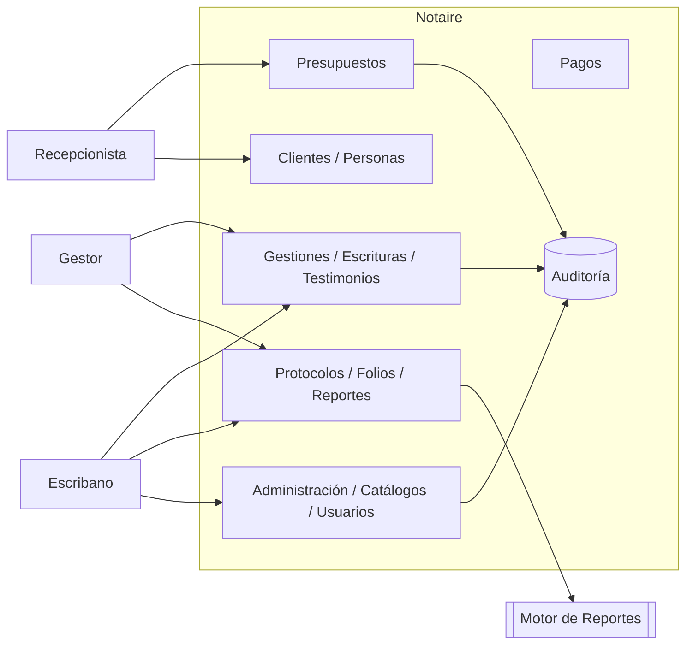
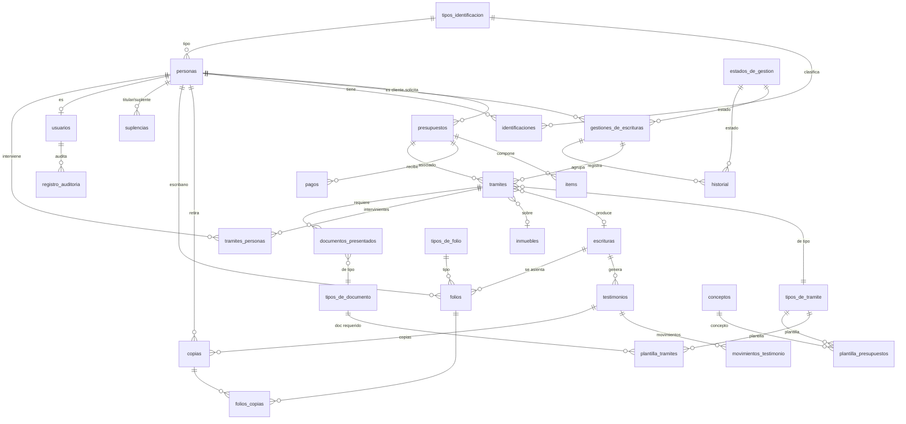

# Notaire — Whole-System Functional Baseline

A consolidated, cross-cutting functional view of the Notaire system: the **actor
map**, the **use-case inventory with implementation status**, and the **core data
model (ERD)**. It links the detailed artifacts under `docs/01-business/` and reflects
the *actual* implementation state verified on 2026-05-29 (full Docker stack + backend
`mvn verify` + Playwright E2E), not just documented intent.

> **Scope note.** The use-case catalog (`03_CU - Casos de Uso`) marks all 68 CUs as
> *Terminado* (documentation status). This baseline reconciles that against measured
> reality: backend endpoints are essentially complete; several **frontend interaction
> flows remain stubbed**, most notably the Gestiones document/testimonio lifecycle.

## 1. System Overview

Notaire is a notary-office (escribanía) management system, refactored from a Java
Swing monolith into a three-tier architecture:

- **backend-api** — Spring Boot 4 REST API (`/api/v1/**`), PostgreSQL 16, Hibernate.
- **frontend** — Next.js 16 / React 19 web client (the active client; ES/EN i18n).
- **frontend-swing** — legacy Swing client (REST client only).

Functional domains (modules): **Presupuestos**, **Gestiones**, **Pagos**,
**Clientes/Personas**, **Protocolos** (folios/reportes), **Administración** (catálogos,
usuarios, plantillas), and **Auditoría**.

## 2. Actor Map

Source: `docs/01-business/03-actors` (`Lista de actores.md`).

| Actor | Type | Responsibility |
|-------|------|----------------|
| **Recepcionista** | Human (primary) | Information & budgets (presupuestos); basic ABM of personas/clientes. |
| **Gestor** | Human (primary) | Initiates and controls trámites (gestiones). |
| **Escribano** | Human (primary) | Authors and signs escrituras/actas; administers folios. |
| **Cliente** | Human (subject) | Person who requests/performs trámites; full data record. |
| **Persona** | Human (subject) | Walk-in contact; minimal data; may become a Cliente. |
| **Usuario (autenticado)** | System role | Any logged-in operator; actions recorded in Auditoría. |
| **Motor de Reportes** | External system | JasperReports engine (libro de índices, DDJJ, presupuesto PDF). |
| **Subsistema de Auditoría** | Internal system | Records create/update/delete operations per user. |

## 3. Use-Case Inventory & Implementation Status

68 use cases (CU01–CU68), GitHub issues **#154–#221**. Sources:
`docs/01-business/02-use-cases` and `docs/testing/CU-API-MATRIX.csv`.

**Legend**
- **Grado**: Esencial (E) · Necesario (N) · Estaría Bueno (B)
- **API**: ✅ endpoint verified 200 (2026-05-29) · ⚠️ exists, no contract test
- **UI**: ✅ realized & E2E-passing · ⚠️ page exists, interaction flow stubbed (E2E `test.skip`) · ❌ no UI flow

> Backend column reflects live probes after this baseline's session, which fixed the
> previously-500 reads (CU07/08 testimonio, CU10/12/44 movimiento-testimonio,
> CU36/40/58/68 tipo-folio, items). UI column reflects which Gherkin E2E flows are
> active vs `skip`-ped.

### Presupuestos
| CU | Name | Grado | API | UI |
|----|------|:----:|:--:|:--:|
| CU01 | Preparar Presupuesto | E | ✅ | ⚠️ create flow |
| CU45 | Modificar presupuesto | E | ✅ | ✅ |
| CU60 | Buscar Presupuesto | N | ✅ | ✅ |

### Gestiones (incl. Escrituras / Testimonios)
| CU | Name | Grado | API | UI |
|----|------|:----:|:--:|:--:|
| CU02 | Iniciar Gestión | E | ✅ | ⚠️ create/detail |
| CU03 | Listar documentos y certificados necesarios | E | ✅ | ❌ pending |
| CU04 | Registrar documentación cliente | E | ✅ | ❌ pending |
| CU05 | Preparar escritura | E | ✅ | ✅ |
| CU06 | Firmar escritura | E | ✅ | ⚠️ firmar flow |
| CU07 | Generar testimonio | E | ✅ *(fixed)* | ❌ pending |
| CU08 | Verificar Testimonio | N | ✅ *(fixed)* | ❌ pending |
| CU09 | Registrar deudas documentos de Cliente | E | ✅ | ⚠️ |
| CU10 | Registrar movimientos doc. entidades externas | E | ✅ *(fixed)* | ⚠️ |
| CU11 | Ingresar para inscripción | E | ✅ | ❌ pending |
| CU12 | Retirar testimonio | N | ✅ *(fixed)* | ❌ pending |
| CU13 | Ver historial de gestión | B | ✅ | ⚠️ filter |
| CU14 | Consultar estado gestión | N | ✅ | ⚠️ (merged into Ver Detalle) |
| CU16 | Archivar Gestión | N | ✅ | ⚠️ archivar flow |
| CU42 | Informar próximos vencimientos | N | ✅ | ⚠️ dashboard alert |
| CU43 | Reingresar documentación | E | ✅ | ⚠️ |
| CU44 | Reingresar testimonio | E | ✅ *(fixed)* | ⚠️ |
| CU52 | Modificar Escritura | E | ✅ | ⚠️ edit flow |
| CU53 | Modificar Gestión | E | ✅ | ✅ |
| CU56 | Registrar inscripción | E | ✅ | ⚠️ |
| CU62 | Buscar Escritura | N | ✅ | ⚠️ search |

### Pagos
| CU | Name | Grado | API | UI |
|----|------|:----:|:--:|:--:|
| CU15 | Procesar pago | B | ✅ | ⚠️ create/detail (business logic noted incomplete) |
| CU47 | Consultar Pago | B | ✅ | ⚠️ filter |

### Clientes / Personas
| CU | Name | Grado | API | UI |
|----|------|:----:|:--:|:--:|
| CU17 | Dar Alta persona | E | ✅ | ✅ |
| CU18 | Dar Alta Cliente | E | ✅ | ⚠️ alta-cliente flow |
| CU19 | Buscar gestiones de un Cliente | N | ✅ | ✅ |
| CU41 | Modificar Cliente | E | ✅ | ✅ |
| CU46 | Ver detalle cliente | E | ✅ | ✅ |
| CU54 | Modificar Persona | E | ✅ | ✅ |
| CU61 | Buscar persona o cliente | N | ✅ | ✅ |

### Protocolos (Folios / Reportes)
| CU | Name | Grado | API | UI |
|----|------|:----:|:--:|:--:|
| CU24 | Generar libro de índices | B | ⚠️ no test | ⚠️ |
| CU25 | Generar Declaración Jurada del mes | B | ⚠️ no test | ⚠️ |
| CU28 | Ingresar nuevos folios | E | ✅ | ✅ |
| CU33 | Modificar folio | E | ✅ | ✅ |
| CU50 | Generar Declaración Jurada de Rentas | B | ⚠️ no test | ⚠️ |
| CU63 | Buscar Folios | N | ✅ | ⚠️ search |

### Administración (Catálogos / Usuarios / Plantillas / Escribanos)
| CU | Name | Grado | API | UI |
|----|------|:----:|:--:|:--:|
| CU20 | Dar alta usuario | E | ✅ | ✅ |
| CU21 | Modificar Usuario | E | ✅ | ⚠️ edit modal |
| CU22 | Registrar Suplencia | E | ✅ | ✅ |
| CU26 | Ingresar nuevo tipo de trámite | E | ✅ | ✅ |
| CU27 | Ingresar nuevo tipo de documento | E | ✅ | ✅ |
| CU29 | Ingresar nuevo concepto | E | ✅ | ✅ |
| CU30 | Ingresar nuevo estado de Gestión | E | ✅ | ✅ |
| CU31 | Modificar tipo de trámite | E | ✅ | ✅ |
| CU32 | Modificar tipo de documento | E | ✅ | ✅ |
| CU34 | Modificar concepto | E | ✅ | ✅ |
| CU35 | Modificar estado de Gestión | E | ✅ | ✅ |
| CU36 | Ingresar tipos de folio | E | ✅ *(fixed)* | ✅ |
| CU37 | Eliminar concepto | E | ✅ | ✅ |
| CU38 | Eliminar tipo de documento | E | ✅ | ✅ |
| CU39 | Crear Plantilla Presupuesto | E | ✅ | ⚠️ plantillas flow |
| CU40 | Modificar Tipo de folio | E | ✅ *(fixed)* | ✅ |
| CU48 | Dar alta escribano | E | ✅ | ⚠️ alta-escribano flow |
| CU49 | Eliminar Plantilla Presupuesto | E | ✅ | ✅ |
| CU51 | Modificar escribano | E | ✅ | ✅ |
| CU55 | Modificar Plantilla Presupuesto | E | ✅ | ✅ |
| CU57 | Eliminar tipo de trámite | E | ✅ | ✅ |
| CU58 | Eliminar Tipo de folio | E | ✅ *(fixed)* | ✅ |
| CU59 | Consultar Suplencias | N | ✅ | ⚠️ filter/detail |
| CU64 | Buscar Tipo de trámite | N | ✅ | ✅ |
| CU65 | Buscar Tipos de documentos | N | ✅ | ⚠️ search |
| CU66 | Buscar Conceptos | N | ✅ | ⚠️ search |
| CU67 | Buscar Estados de Gestión | N | ✅ | ✅ |
| CU68 | Buscar tipos de folios | N | ✅ *(fixed)* | ✅ |

### Workflow de Estados de Gestión
| CU | Name | Grado | API | UI |
|----|------|:----:|:--:|:--:|
| CU70 | Definir Workflow de Estados de Gestión | E | ✅ | ✅ |
| CU71 | Definir Transiciones entre Estados | E | ✅ | ✅ |
| CU72 | Validar Consistencia del Workflow | E | ✅ | ✅ |
| CU73 | Asignar Workflow a Tipo de Trámite | E | ✅ | ✅ |

### Auditoría
| CU | Name | Grado | API | UI |
|----|------|:----:|:--:|:--:|
| CU23 | Ver registro de actividades de usuario | N | ✅ | ⚠️ ver-actividades flow |

## 4. Gap Summary

- **Backend API: functionally complete.** All 68 CUs map to controllers/endpoints;
  every read endpoint probed returns 200 after this session's schema fixes. Remaining
  backend weaknesses are *contract-test gaps* (CU22 POST suplencia, CU24/25/50 report
  endpoints have no Bruno test) and noted incomplete business logic in **CU15 Procesar
  pago**.
- **Primary functional gap — Gestiones document/testimonio lifecycle (CU03, CU04,
  CU07, CU08, CU11, CU12):** backend ready, but **no frontend UI flow exists** (E2E
  explicitly `skip`-ped, "UI buttons/pages not implemented yet"). This is the highest-
  value next build: the testimonio/inscripción/retiro workflow is core notarial work.
- **Secondary gaps — stubbed interaction flows (⚠️):** several create/edit/detail/
  search modals are skipped in E2E although the list pages work. A per-screen UI audit
  should confirm which are genuinely missing vs merely untested.
- **Reports (CU24/25/50):** endpoints exist but lack tests and a confirmed UI entry.

## 5. Core Data Model (ERD)

28 tables (PostgreSQL `public`). Schema source of truth: Flyway migrations
(init-db archived at `docs/archive/init-db/`). Detailed attributes: `docs/01-business/04-data-model`.

**Aggregate roots / hubs.** `personas` (people: clientes, escribanos, intervinientes)
and `tramites` (the work unit linking gestión, presupuesto, escritura, inmueble) are
the most connected entities. The escritura → testimonio → movimiento/copia → folio
chain is the notarial-output core.

**Catalog (reference) tables.** `tipos_de_documento`, `tipos_de_tramite`,
`tipos_de_folio`, `tipos_identificacion`, `estados_de_gestion`, `conceptos`.

**Schema integrity note.** The Docker schema is now built by Flyway migrations
(init-db archived at `docs/archive/init-db/`). Entity↔schema drift is what
previously broke CU07/08 etc.; it is now guarded by
`FlywaySchemaValidationIntegrationTest` (`mvn test -Ppg-integration`).
See `.claude/rules/database-migrations.md`.

## 6. Traceability

| Artifact | Location |
|----------|----------|
| Actors | `docs/01-business/03-actors/` |
| Use cases (detail) | `docs/01-business/02-use-cases/` |
| Use-case progress | `docs/01-business/03_CU - Casos de Uso/Progreso Sistema - CASOS DE USO.csv` |
| CU ↔ API ↔ test matrix | `docs/testing/CU-API-MATRIX.csv` |
| Functional requirements | `docs/01-business/01-requirements/` (`requerimientos.csv`) |
| Data model (detail) | `docs/01-business/04-data-model/` |
| Schema source of truth | Flyway migrations (`docs/archive/init-db/` archived) |
| GitHub issue traceability | CU → #154–#221 |

## 7. Recommendations (functional)

1. **Build the Gestiones document/testimonio UI** (CU03/04/07/08/11/12) — backend is
   ready; this is the largest functional gap and core notarial value.
2. **Per-screen UI audit** to resolve ⚠️ flows into ✅ realized or ❌ missing, then
   convert the corresponding E2E `test.skip` into active assertions.
3. **Complete CU15 (Procesar pago) business logic** and add the missing contract tests
   (CU22 POST suplencia; CU24/25/50 report endpoints).
4. ~~Reconcile the dual schema source (init-db vs Flyway) to a single source of truth.~~ **DONE** — Flyway is now the sole schema source; init-db archived at `docs/archive/init-db/`.
5. **Refresh `CU-API-MATRIX.csv`** — its 500-ERROR rows for testimonio/movimiento/
   tipo-folio are now stale (resolved 2026-05-29).
