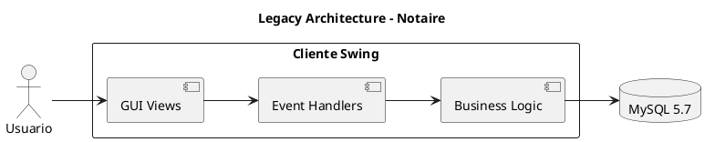
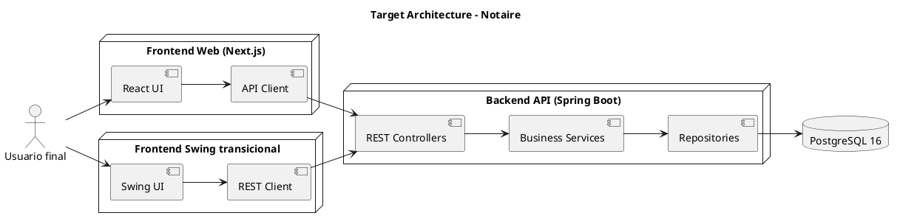
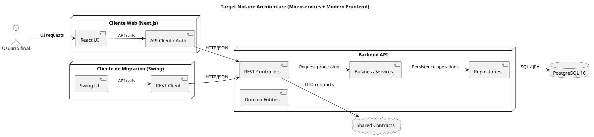

# Software Architecture Document (SAD)

## Tabla de Contenidos

1. [Propósito](#propósito)
2. [Alcance](#alcance)
3. [Referencias](#referencias)
4. [Arquitectura Legacy](#arquitectura-legacy)
   1. [Visión general](#visión-general)
   2. [Componentes](#componentes)
   3. [Problemas clave](#problemas-clave)
5. [Estrategia de migración](#estrategia-de-migración)
   1. [Objetivos](#objetivos)
   2. [Fases](#fases)
   3. [Estado actual de la migración](#estado-actual-de-la-migración)
6. [Arquitectura objetivo](#arquitectura-objetivo)
   1. [Contexto del sistema](#contexto-del-sistema)
   2. [Módulos y servicios](#módulos-y-servicios)
   3. [Flujo de datos](#flujo-de-datos)
   4. [Deployment y operación](#deployment-y-operación)
7. [Requisitos no funcionales](#requisitos-no-funcionales)
8. [Riesgos y mitigaciones](#riesgos-y-mitigaciones)
9. [Evolución y próximos pasos](#evolución-y-próximos-pasos)
10. [Glosario](#glosario)

## Propósito

Este documento describe la arquitectura del sistema Notaire antes y durante la migración, y define la arquitectura objetivo para la versión modernizada. El SAD está dirigido a:

- Arquitectos de software
- Ingenieros de backend y frontend
- Analistas de negocio
- DevOps / SRE

## Alcance

Incluye:

- La arquitectura original del sistema monolítico Java Swing con acceso directo a la base de datos
- El plan de migración a una arquitectura basada en servicios y contenedores
- El diseño de la arquitectura objetivo con backend REST, base de datos PostgreSQL y frontend desacoplado
- El estado actual del proyecto y los componentes existentes en el repositorio

No incluye diseño detallado de cada endpoint ni especificación completa de UI. Estos se documentan en `/docs/05-api/` y en los casos de uso del negocio.

## Referencias

- Archivo legacy: `src.old/main/java`
- ADR-001: `docs/02-architecture/01-adr/ADR-001-microservices-architecture.md`
- ADR-002: `docs/02-architecture/01-adr/ADR-002-module-structure.md`
- ADR-003: `docs/02-architecture/01-adr/ADR-003-rest-api-versioning.md`
- ADR-004: `docs/02-architecture/01-adr/ADR-004-database-migration.md`
- ADR-005: `docs/02-architecture/01-adr/ADR-005-modern-frontend-migration.md`
- ADR-006: `docs/02-architecture/01-adr/ADR-006-testing-strategy.md`
- Docker Compose: `docker-compose.yml`
- Módulos actuales: `backend-api/`, `frontend-swing/`, `notaire-shared/`, `init-db/`
- Diagramas existentes: `images/arquitectura-original.drawio`, `images/arquitectura-notaire.drawio`

## Arquitectura Legacy

### Visión general

El producto original era un sistema monolítico Java Swing que combinaba:

- Interfaz de usuario de escritorio (JFrame, JPanel, formularios `.form`)
- Lógica de presentación y negocio mezclada en la misma aplicación
- Acceso directo a la base de datos mediante JDBC
- Persistencia en MySQL 5.7
- DTOs propios y una capa de datos interna

### Componentes

- `src.old/main/java/com/licensis/notaire/gui`: vistas y formularios Swing
- `src.old/main/java/com/licensis/notaire/dto`: DTOs usados por la aplicación
- `src.old/main/java/com/licensis/notaire/BDDNotaire`: esquema y configuración de base de datos
- `src.old/main/resources`: propiedades, iconos y assets del cliente

### Problemas clave

- Acoplamiento entre UI y lógica de negocio
- Lógica de negocio replicada en eventos de GUI
- Dificultad para probar sin ejecutar Swing
- Mantenimiento costoso por alta complejidad y baja modularidad
- Imposibilidad de exponer la funcionalidad a otros clientes (web, móvil, API)
- Dependencia de tecnología antigua y de MySQL directo

> Ver diagrama legacy y original: `images/arquitectura-original.drawio` y `docs/02-architecture/02-overview/architecture-legacy.puml`

## Estrategia de migración

### Objetivos

1. Separar presentación, negocio y persistencia.
2. Migrar lógica a servicios desacoplados.
3. Modernizar la base de datos a PostgreSQL 16.
4. Crear un backend REST reusable para múltiples clientes.
5. Mantener el sistema operativo durante la migración.
6. Preservar el valor de los 73 casos de uso existentes.

### Fases

1. **Evaluación y análisis**: documentar arquitectura legacy, casos de uso y datos.
2. **Módulo compartido**: crear `notaire-shared` para DTOs y contratos comunes.
3. **Backend REST**: desarrollar `backend-api` con Spring Boot 4, JPA/Hibernate y PostgreSQL.
4. **Modernización del frontend**: desarrollar `frontend` con Next.js 15, TypeScript y Tailwind CSS.
5. **Migración de datos**: implementar `init-db` con scripts de inicialización y Flyway para versionado.
6. **Deprecación**: eliminar el código legacy y el frontend Swing transicional.

### Estado actual de la migración

Actualmente el repositorio contiene:

- `backend-api/`: API REST Spring Boot 4 con `api`, `service`, `repository`, `negocio`, `config` y soporte de Spring Data JPA.
- `frontend/`: aplicación web moderna en Next.js 15 que consume la API REST.
- `notaire-shared/`: módulo compartido con DTOs, excepciones y contratos comunes.
- `init-db/`: scripts de PostgreSQL para esquema y datos semilla, gestionados por Flyway.
- `docker-compose.yml`: orquesta `postgres`, backend, frontend y herramientas de soporte.

> Ver diagrama de migración: `docs/02-architecture/02-overview/arquitectura-migracion.drawio` y `docs/02-architecture/02-overview/migration-flow.puml`

## Arquitectura objetivo

### Resumen visual

Este sistema evoluciona desde una arquitectura legacy monolítica hacia un diseño distribuido.

- **Legacy**: Java Swing + lógica de negocio + JDBC en un solo ejecutable.
- **Estado de migración**: Swing refactorizado como cliente transicional que consume REST.
- **Arquitectura final**: frontend web moderno + backend REST + PostgreSQL.

Diagramas disponibles:

- `docs/02-architecture/02-overview/architecture-legacy.puml`
- `docs/02-architecture/02-overview/architecture-target.puml`
- `docs/02-architecture/02-overview/migration-flow.puml`
- `docs/02-architecture/02-overview/arquitectura-migracion.drawio`

### Contexto del sistema

El objetivo es una arquitectura de tres capas claramente separadas:

- **Frontend moderno**: cliente web basado en Next.js / React / TypeScript.
- **Backend API**: servicio REST centralizado en Spring Boot.
- **Base de datos**: PostgreSQL 16 con scripts de inicialización y esquema controlado.

El frontend actual Swing permanece como una fase intermedia durante la migración.

### Módulos y servicios

#### Backend API (`backend-api`)

- `com.licensis.notaire.api`: controladores REST expuestos bajo `/api/v1`
- `com.licensis.notaire.service`: lógica de negocio y casos de uso
- `com.licensis.notaire.repository`: persistencia con Spring Data JPA
- `com.licensis.notaire.negocio`: entidades de dominio
- `com.licensis.notaire.config`: configuración de Spring y seguridad
- `com.licensis.notaire.jpa`: componentes legacy de persistencia en transición

#### Frontend Swing transicional (`frontend-swing`)

- `com.licensis.notaire.gui`: interfaz de usuario Swing
- `com.licensis.notaire.api.client`: cliente HTTP para REST
- `com.licensis.notaire.negocio`: modelos plantilla reutilizados
- `com.licensis.notaire.logging`: logging local y errores
- `com.licensis.notaire.util`: utilidades de aplicación

#### Módulo compartido (`notaire-shared`)

- `com.licensis.notaire.dto`: contratos de datos entre frontend y backend
- `com.licensis.notaire.dto.exceptions`: validaciones compartidas
- `com.licensis.notaire.dto.interfaces`: contratos de DTO
- `com.licensis.notaire.jpa`: helpers de JPA reutilizables

#### Base de datos (`init-db`)

- `01-schema.sql`: esquema relacional inicial
- `02-data.sql`: datos semilla
- `migrate.load`: script de carga de datos

#### Orquestación

- `docker-compose.yml`: define servicios de `postgres`, `backend` y `pgadmin`
- `Dockerfile.backend`: imagen Docker del backend Spring Boot

### Flujo de datos

1. El usuario interactúa con el frontend.
2. El cliente envía solicitudes HTTP al backend REST en `/api/v1`.
3. El backend valida, aplica reglas de negocio y persiste con JPA.
4. PostgreSQL almacena datos y/o responde consultas.
5. El backend devuelve JSON al frontend.

### Deployment y operación

- El backend se ejecuta en un contenedor Docker construible con `Dockerfile.backend`.
- PostgreSQL se inicia con Docker Compose usando `init-db` para inicializar el esquema.
- El frontend Next.js se desplegará como otro contenedor o aplicación web independiente.
- pgAdmin se utiliza como herramienta de operación de base de datos.
- El puerto de la API es `8080` y el puerto de pgAdmin es `5050`.

## Requisitos no funcionales

- **Escalabilidad**: backend debe escalar horizontalmente en contenedores.
- **Disponibilidad**: orquestación con Docker Compose y healthchecks.
- **Seguridad**: control de acceso, autenticación JWT, validación de entrada.
- **Testabilidad**: pruebas unitarias, integración y E2E documentadas en `docs/03-development/03-testing/`.
- **Mantenibilidad**: separación de capas, módulo compartido y ADRs.
- **Performance**: reducir latencia mediante caché eventual y API eficiente.

## Riesgos y mitigaciones

- **Riesgo**: coexisten legacy y nuevo sistema.
  - **Mitigación**: mantener frontends paralelos, pruebas de regresión y despliegues controlados.

- **Riesgo**: la migración del frontend a Next.js puede atrasarse.
  - **Mitigación**: mantener `frontend-swing` como fallback y avanzar por módulos.

- **Riesgo**: incompatibilidades de datos entre MySQL y PostgreSQL.
  - **Mitigación**: usar scripts de migración en `init-db` y pruebas de integridad.

- **Riesgo**: versión de API incompatible para clientes.
  - **Mitigación**: adoptar versionado de API (`/api/v1`) según ADR-003.

## Evolución y próximos pasos

1. Completar la migración del frontend a `frontend-nextjs`.
2. Retirar `src.old` después de validar la nueva versión.
3. Actualizar el SAD con el diseño completo del frontend moderno.
4. Añadir ADRs específicos de seguridad y observabilidad.
5. Documentar el plan de rollback y la estrategia de despliegue continuo.

## Glosario

- **API REST**: Interfaz de comunicación HTTP/JSON entre frontend y backend.
- **DTO**: Data Transfer Object, contrato de datos usado entre capas.
- **JPA**: Java Persistence API.
- **MCP**: Modelo de Copiloto para generación de diagramas (Draw.io / PlantUML).
- **PG**: PostgreSQL.
- **Swing**: Framework Java para interfaces de escritorio.
- **Next.js**: Framework React para aplicaciones web modernas.
