# Software Architecture Document (SAD) — Notaire

> **arc42 Template v8.2** — based on [docs.arc42.org](https://docs.arc42.org/home/)
>
> **Version:** 3.0 | **Date:** 2026-08-18 | **Author:** Architecture Team

---

## Table of Contents

1. [Introduction and Goals](#1-introduction-and-goals)
2. [Constraints](#2-constraints)
3. [Context and Scope](#3-context-and-scope)
4. [Solution Strategy](#4-solution-strategy)
5. [Building Block View](#5-building-block-view)
6. [Runtime View](#6-runtime-view)
7. [Deployment View](#7-deployment-view)
8. [Cross-cutting Concepts](#8-cross-cutting-concepts)
9. [Architectural Decisions](#9-architectural-decisions)
10. [Quality Requirements](#10-quality-requirements)
11. [Risks and Technical Debt](#11-risks-and-technical-debt)
12. [Glossary](#12-glossary)

---

## 1. Introduction and Goals

### 1.1 Requirements Overview

**Notaire** is a notarial management system for Argentine escribanías (notary offices). It manages the complete lifecycle of notarial operations including:

- **Gestiones de Escritura** — Notarial deed management workflows
- **Personas** — People registry (individuals and legal entities involved in deeds)
- **Escrituras** — Deed registry with folios, copias, and testimonios
- **Presupuestos** — Budget/quote management with payment tracking
- **Trámites** — Procedure management linked to people and gestiones
- **Auditoría** — Complete audit trail for legal compliance

The system originated as a monolithic Java Swing desktop application with direct MySQL access. It is being modernized into a three-tier web architecture while preserving all 73 original use cases.

### 1.2 Quality Goals

| Priority | Quality Goal | Scenario |
|----------|-------------|----------|
| 1 | **Maintainability** | New features delivered in < 6 months; developers onboard in < 2 weeks |
| 2 | **Testability** | ≥ 80% code coverage; all changes validated by unit, integration, and E2E tests |
| 3 | **Security** | JWT authentication, coarse-grained authorization (authenticated-only; no per-role enforcement yet), full audit trail for legal compliance |
| 4 | **Scalability** | Backend scales horizontally via stateless containers |
| 5 | **Observability** | Real-time metrics, structured logs, and alerts via LPG stack |

### 1.3 Stakeholders

| Role | Expectations |
|------|-------------|
| **Escribano (Notary)** | Reliable system for daily operations; data integrity; legal compliance |
| **Gestor (Clerk)** | Efficient workflow for managing gestiones and trámites |
| **Architect / Lead Dev** | Clean architecture; testable; documented decisions (ADRs) |
| **DevOps / SRE** | Observable system; automated deployments; container orchestration |
| **Product Owner** | Feature velocity; migration from legacy without data loss |

---

## 2. Constraints

### 2.1 Technical Constraints

| Constraint | Description |
|-----------|-------------|
| Java 21 LTS | Backend runtime — mandated for long-term support |
| Spring Boot 4.1.0 | Backend framework — latest stable release |
| PostgreSQL 16 | Database — migrated from MySQL 5.7 |
| Next.js 16 / React 19 | Frontend framework with App Router |
| Docker / Docker Compose | Containerization for all services |
| Flyway | Database schema versioning — single source of truth |
| Maven 3.9+ | Build system for Java modules |

### 2.2 Organizational Constraints

| Constraint | Description |
|-----------|-------------|
| CONSTITUTION.md | Engineering process mandated for every change |
| OpenSpec SDLC | All changes require proposal → specs → design → tasks workflow |
| TDD | Failing tests written before implementation |
| Conventional Commits | Commit message format enforced by git hooks |
| ADR process | Architectural decisions documented before implementation |

### 2.3 Legal Constraints

| Constraint | Description |
|-----------|-------------|
| Audit trail | All CRUD operations must be recorded for legal compliance |
| Data retention | Notarial records must be preserved indefinitely |
| Access control | Authenticated access to sensitive notarial data (per-role enforcement not yet implemented) |

---

## 3. Context and Scope

### 3.1 Business Context

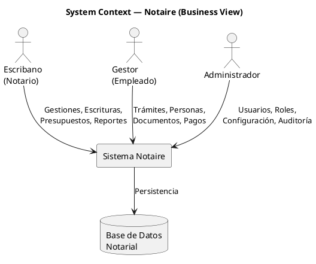

**External Interfaces:**

| Interface | Description |
|-----------|-------------|
| Web Browser | Next.js frontend served at `:3000` |
| REST API | Spring Boot backend at `:8080/api/v1` |
| pgAdmin | Database administration at `:5050` |
| Grafana | Monitoring dashboards at `:3001` |

### 3.2 Technical Context

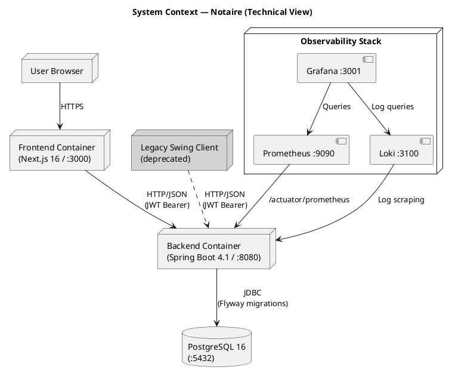

---

## 4. Solution Strategy

### 4.1 Technology Decisions

| Decision | Rationale | ADR |
|----------|-----------|-----|
| Spring Boot 4.1 + Java 21 | Modern LTS stack with strong ecosystem | ADR-001 |
| Maven multi-module | Separation of shared, backend, and frontend concerns | ADR-002 |
| URL-path API versioning (`/api/v1`) | Simple, explicit, cacheable | ADR-003 |
| PostgreSQL 16 (from MySQL 5.7) | Superior JSON support, CTEs, full-text search | ADR-004 |
| Next.js 16 + React 19 | Modern SSR/SSG, App Router, TypeScript | ADR-005 |
| TDD + JaCoCo ≥ 80% + Playwright | Quality assurance at all levels | ADR-006 |
| Flyway migrations | Versioned, reproducible schema evolution | ADR-007 |
| JWT + Spring Security | Stateless auth for multi-client support | ADR-008 |
| LPG observability stack | Lightweight, Kubernetes-ready monitoring | ADR-009 |
| `@ControllerAdvice` error handling | Uniform error responses across all endpoints | ADR-010 |
| Token-based design system | Consistent Apple-inspired UI across all forms | ADR-011 |

### 4.2 Migration Strategy

The modernization follows a **strangler fig pattern** — new features are built exclusively in the modern stack while legacy components are incrementally replaced.

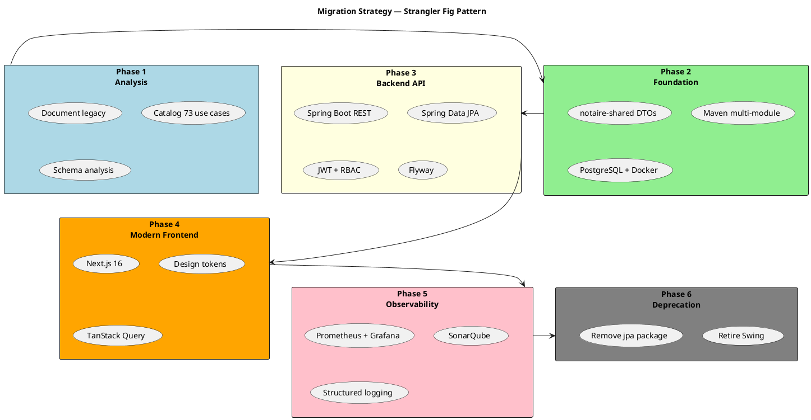

### 4.3 Current Migration Status

| Phase | Status | Details |
|-------|--------|---------|
| Phase 1: Analysis | ✅ Complete | Legacy documented in `deprecated-frontend-swing/`, 73 use cases cataloged in `docs/100-business/102-use-cases/` |
| Phase 2: Foundation | ✅ Complete | `notaire-shared`, Maven multi-module, Docker Compose |
| Phase 3: Backend API | ✅ Complete | 31 controllers, 31 repositories, 32 entities, Flyway V1→V14 |
| Phase 4: Frontend | 🔄 In Progress | Next.js 16 app with login, dashboard, auditoria pages |
| Phase 5: Observability | ✅ Complete | Full LPG stack + SonarQube + Homer dashboard |
| Phase 6: Deprecation | ⬜ Planned | `deprecated-frontend-swing` excluded from Maven build, `jpa` package targeted |

---

## 5. Building Block View

### 5.1 Level 1 — System Decomposition

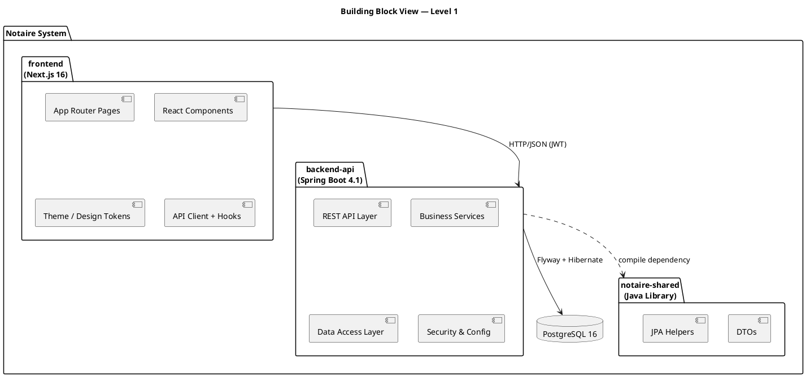

### 5.2 Level 2 — Backend API Internal Structure

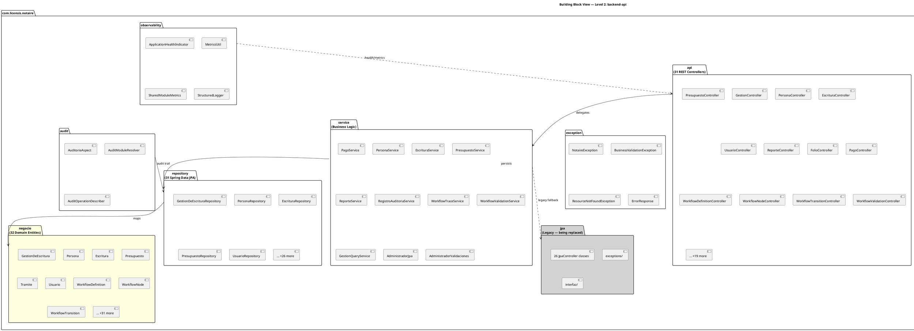

### 5.3 Level 2 — Frontend Internal Structure

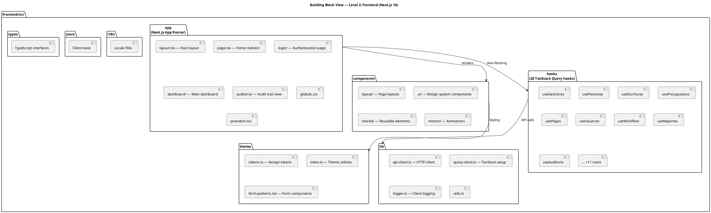

### 5.4 Level 2 — Shared Module

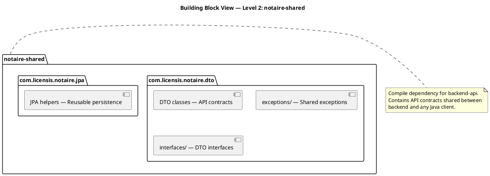

### 5.5 Core Domain Model

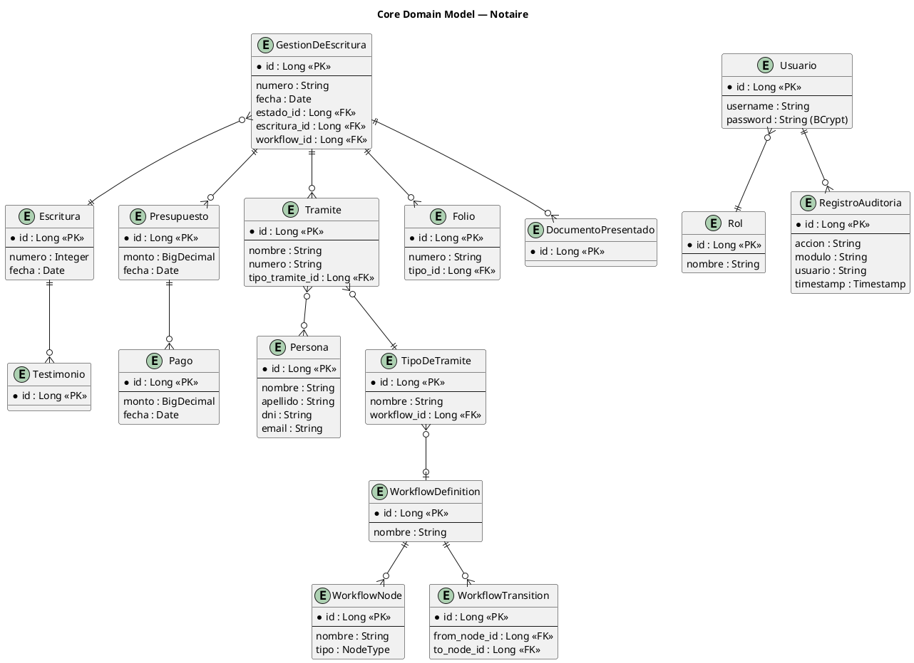

---

## 6. Runtime View

### 6.1 User Authentication Flow

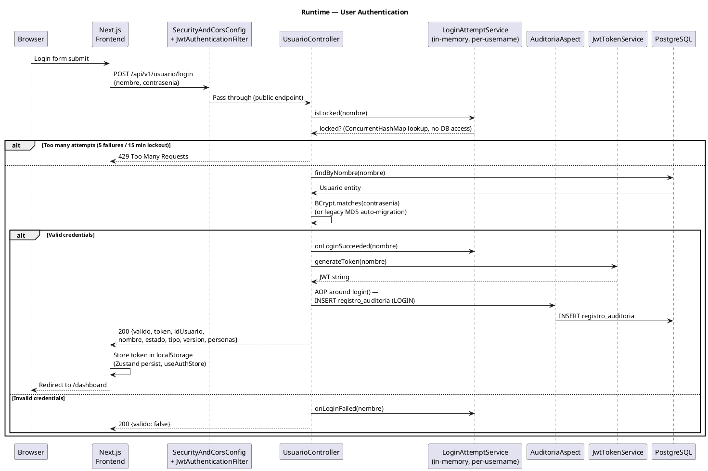

### 6.2 Create Gestión de Escritura

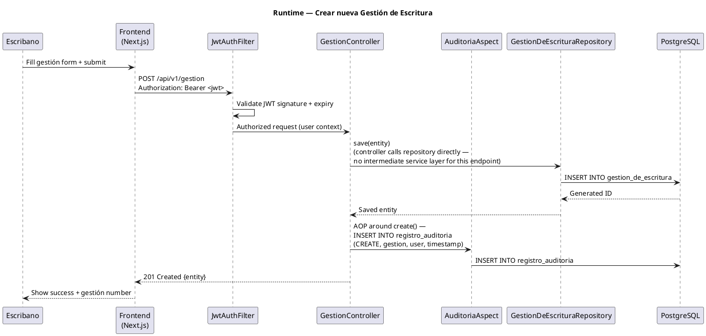

### 6.3 Report Generation

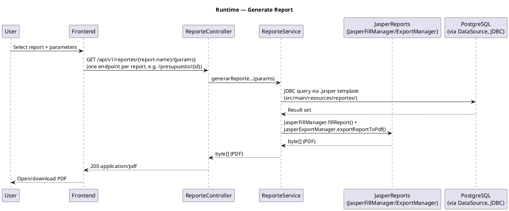

---

## 7. Deployment View

### 7.1 Development Environment

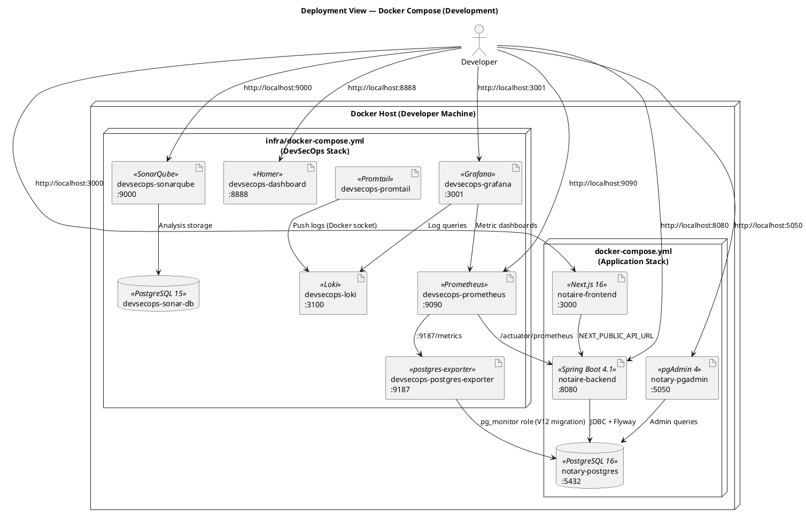

### 7.2 Network Configuration

| Network | Services | Purpose |
|---------|----------|---------|
| `notary-network` | postgres, backend, pgadmin, frontend | Application communication |
| `devsecops-network` | prometheus, grafana, loki, sonarqube | DevSecOps internal |
| `notaire_notary-network` (external) | Shared between app and infra stacks | Cross-stack monitoring |

### 7.3 Container Resource Limits

| Container | Memory Limit | Memory Reserved |
|-----------|-------------|----------------|
| `notaire-backend` | 512 MB | 256 MB |
| All others | Docker defaults | — |

### 7.4 Startup Dependencies

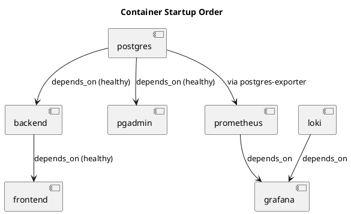

---

## 8. Cross-cutting Concepts

### 8.1 Security

**Authentication:**
- JWT tokens issued by `JwtTokenService` upon successful login.
- `JwtAuthenticationFilter` validates tokens on every request.
- Token storage: `localStorage` via Zustand `persist` middleware (`useAuthStore`,
  Next.js); a separate non-JWT `notaire-auth-status` cookie exists only so the
  Next.js middleware can route-guard pages. Swing client stores the token in-memory
  (`RestClient`, static field).
- `LoginAttemptService` locks out a username after repeated failed attempts
  (in-memory, single-instance — not a general API rate limiter).
- `ProductionCredentialsGuard` blocks startup if default passwords are used in production.

**Authorization:**
- Coarse-grained only: every `/api/**` request must be authenticated (valid JWT);
  there is no per-role authorization yet — no `@PreAuthorize` annotations exist in
  the codebase.
- The `Rol` entity/table exists for future RBAC; extending enforcement means
  replacing `.anyRequest().authenticated()` with per-route role checks in
  `SecurityAndCorsConfig` (see [API Authentication Guide](../206-security/API-AUTHENTICATION-GUIDE.md#extending-rbac)).

**API Security:**
- CORS configured in `SecurityAndCorsConfig`.
- All endpoints under `/api/v1/**` require JWT (except login).
- Actuator endpoints secured with separate credentials.

### 8.2 Error Handling

All errors follow a uniform response structure defined in `ErrorResponse`:

```json
{
  "timestamp": "2026-08-18T12:00:00Z",
  "status": 400,
  "error": "Bad Request",
  "message": "Validation failed",
  "path": "/api/v1/persona",
  "code": "VAL_001",
  "details": { "field": "dni", "message": "Must be numeric" }
}
```

**Exception Hierarchy:**
- `NotaireException` — Base exception
- `BusinessValidationException` — 400 Bad Request
- `ResourceNotFoundException` — 404 Not Found
- Global handling via `GlobalExceptionHandler` (`@ControllerAdvice`)

### 8.3 Audit Trail

- `AuditoriaAspect` (Spring AOP) intercepts annotated controller methods.
- `AuditModuleResolver` maps controllers to functional modules.
- `AuditOperationDescriber` generates human-readable operation descriptions.
- Records stored in `registro_auditoria` table.
- Queryable via `RegistroAuditoriaController` → `/api/v1/auditoria`.
- Frontend audit view at `/auditoria` page.

### 8.4 Database Schema Management

- **Flyway** is the single source of truth for database schema.
- Migrations located at `backend-api/src/main/resources/db/migration/`.
- Docker starts PostgreSQL **empty**; Flyway applies V1→V14 sequentially on backend startup.
- Historical `init-db/` scripts archived at `docs/archive/init-db/`.
- Repeatable migrations (`R__`) used for reversible operations.

**Current Migrations:**

| Version | Description |
|---------|------------|
| V1 | Initial schema (all tables) |
| V2 | Initial seed data |
| V3 | Add missing entity columns |
| V4 | Fix missing schema columns |
| V5 | Fix movimientos_testimonio schema |
| V6 | Make documentos_presentados tramite optional |
| V7 | Add workflow tables |
| V8 | Add workflow to tipo_tramite |
| V9 | Add roles and permissions |
| V10 | Seed workflow demo data |
| V11 | Align conceptos version with init-db |
| V12 | Create postgres_exporter role (pg_monitor) |
| V13 | Make tramites nombre/numero optional |
| V14 | Drop presupuestos FK to tramite |
| R14 | Restore presupuestos FK (repeatable) |

### 8.5 Observability

**Metrics (Prometheus):**
- Spring Boot Actuator exposes `/actuator/prometheus`.
- Custom metrics via `MetricsUtil` and `SharedModuleMetrics`.
- `ApplicationHealthIndicator` for custom health checks.
- `postgres-exporter` provides database-level metrics.

**Logging (Loki):**
- Structured JSON logging via `StructuredLogger`.
- Logback configuration with JSON appender.
- Promtail collects logs from Docker containers.
- Centralized viewing in Grafana.

**Dashboards (Grafana :3001):**
- Application metrics (JVM, HTTP, custom).
- Database metrics (connections, query time, table sizes).
- Log exploration and alerting.

**Code Quality (SonarQube :9000):**
- Static analysis on every build.
- Coverage: enforced ratchet floor via JaCoCo (raised as coverage improves; long-term
  target 80% line / 80% branch — see [Code Quality](../../300-development/303-testing/README.md)).

### 8.6 Design System (Frontend)

- **Single source of truth**: `frontend/src/theme/tokens.ts`.
- **Design language**: Apple-inspired (macOS Sequoia / iOS 18).
- **Token categories**: Colors (neutral 0-900, semantic), typography (SF Pro), spacing (8px grid), border-radius, shadows, transitions.
- **Form pattern**: `FormContainer → FormSection → FormField → FormActions`.
- **Rule**: No hardcoded CSS values — all styling via tokens.

### 8.7 API Design

- All endpoints under `/api/v1/` prefix.
- RESTful resource naming (Spanish domain: `/gestion`, `/persona`, `/escritura`).
- OpenAPI 3.0 documentation via `OpenApiConfig` at `/swagger-ui.html`.
- Response wrapping with DTOs from `notaire-shared`.
- Pagination support on list endpoints.

### 8.8 Testing Strategy

| Level | Tool | Scope | Target |
|-------|------|-------|--------|
| Unit (backend) | JUnit 5 + Mockito | Service/repository logic | Enforced ratchet floor (target 80%) |
| Unit / Component (frontend) | Vitest + Testing Library | `frontend/src/**/*.test.ts(x)` | 19+ test files |
| Integration | Spring Boot Test | Controller + DB (H2/PG) | API contract validation |
| API | Bruno, yml collection format (`backend-api/api-test/`) | Full API endpoints, per use case | See `CU-API-MATRIX.csv` |
| E2E (UI/UX) | Playwright | Frontend user flows, per use case (`cuNN-*.spec.ts`) | 33+ specs, critical paths |
| Static Analysis | Checkstyle + SpotBugs + SonarQube | Code quality | Zero critical issues |

Full pyramid and use-case traceability documented in
[`docs/300-development/303-testing/README.md`](../../300-development/303-testing/README.md).

### 8.9 Legacy Coexistence (`jpa` package)

The `jpa` package contains 26 `*JpaController` classes — a legacy data-access layer from the original Swing application. These classes contain raw EntityManager operations and are being incrementally replaced by:

1. **Spring Data JPA Repositories** (`repository` package) — declarative query methods.
2. **Service classes** (`service` package) — business logic extracted from JPA controllers.

**Migration rule**: New code **must not** use `jpa` package classes. Services may temporarily delegate to them as fallback during the transition.

---

## 9. Architectural Decisions

All decisions are documented as Architecture Decision Records (ADRs) in `docs/200-architecture/202-ADR/`.

| ADR | Title | Status | Scope |
|-----|-------|--------|-------|
| [ADR-001](../202-ADR/ADR-001-microservices-architecture.md) | Microservices Architecture | Accepted | System architecture |
| [ADR-002](../202-ADR/ADR-002-module-structure.md) | Module Structure | Accepted | Code organization |
| [ADR-003](../202-ADR/ADR-003-rest-api-versioning.md) | REST API Versioning | Accepted | API evolution |
| [ADR-004](../202-ADR/ADR-004-database-migration.md) | Database Migration | Accepted | Data persistence |
| [ADR-005](../202-ADR/ADR-005-modern-frontend-migration.md) | Modern Frontend Migration | Accepted | Frontend architecture |
| [ADR-006](../202-ADR/ADR-006-testing-strategy.md) | Testing Strategy | Accepted | QA & validation |
| [ADR-007](../202-ADR/ADR-007-database-schema-versioning-flyway.md) | Database Schema Versioning (Flyway) | Accepted | Data persistence |
| [ADR-008](../202-ADR/ADR-008-security-authentication.md) | Security & Authentication | Accepted | Security |
| [ADR-009](../202-ADR/ADR-009-logging-monitoring.md) | Logging & Monitoring | Accepted | Observability |
| [ADR-010](../202-ADR/ADR-010-error-handling.md) | Error Handling | Accepted | Resilience |
| [ADR-011](../202-ADR/ADR-011-centralized-design-system.md) | Centralized Design System | Accepted | UI/UX |
| [ADR-012](../202-ADR/ADR-012-ci-cd-pipeline.md) | CI/CD Pipeline Strategy | Accepted | DevOps |
| [ADR-013](../202-ADR/ADR-013-audit-trail.md) | Audit Trail Implementation | Accepted | Compliance |
| [ADR-014](../202-ADR/ADR-014-workflow-engine.md) | Workflow Engine | Accepted | Business logic |
| [ADR-015](../202-ADR/ADR-015-internationalization.md) | Internationalization | Accepted | UX |
| [ADR-016](../202-ADR/ADR-016-observability-stack.md) | Observability Stack Topology | Accepted | Observability |
| [ADR-017](../202-ADR/ADR-017-container-base-images.md) | Container / Base-Image Strategy | Accepted | DevOps |
| [ADR-018](../202-ADR/ADR-018-rate-limiting-policy.md) | Rate-Limiting Policy | Accepted | Security |
| [ADR-019](../202-ADR/ADR-019-secrets-management.md) | Secrets Management | Accepted | Security |
| [ADR-020](../202-ADR/ADR-020-openapi-exposure-policy.md) | OpenAPI Exposure Policy | Accepted | Security & API |

---

## 10. Quality Requirements

### 10.1 Quality Tree

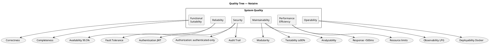

### 10.2 Quality Scenarios

| ID | Quality Attribute | Scenario | Metric |
|----|------------------|----------|--------|
| QS-01 | Performance | API response for single-entity CRUD | < 500ms avg |
| QS-02 | Performance | Report generation with complex queries | < 3s |
| QS-03 | Availability | System uptime during business hours | 99.5% |
| QS-04 | Security | All create/update/delete operations (and logins) logged in audit trail; read-only GETs excluded | 100% coverage of mutating operations |
| QS-05 | Security | Failed login attempts trigger a per-username lockout (`LoginAttemptService`, single-instance, not a general API rate limiter) | 5 failed attempts → 15 min lockout |
| QS-06 | Testability | Code coverage across backend | ≥ 80% |
| QS-07 | Maintainability | New feature development time | < 6 months |
| QS-08 | Maintainability | Developer onboarding time | < 2 weeks |
| QS-09 | Scalability | Backend horizontal scaling | Stateless containers |
| QS-10 | Deployability | Full stack startup time | < 3 minutes |

---

## 11. Risks and Technical Debt

### 11.1 Current Risks

| Risk | Impact | Probability | Mitigation |
|------|--------|-------------|------------|
| Legacy `jpa` package coexists with modern `repository` | High — code duplication, inconsistent patterns | Certain | Incremental migration per entity; new code uses only `repository` |
| `ControllerNegocio.java` (5,337 lines, ~193 KB) — God class in `negocio` | High — unmaintainable, untestable | Certain | Extract to service classes; scheduled for refactoring |
| `deprecated-frontend-swing` still referenced but excluded from build | Low — confusion for new developers | Low | Document deprecation; remove after Next.js frontend is complete |
| No production deployment target defined | Medium — no deployment pipeline to production | Medium | Define production Docker Compose or Kubernetes manifests |
| Default credentials in `.env` | Critical — security risk if deployed as-is | Medium | `ProductionCredentialsGuard` blocks startup with defaults |

### 11.2 Technical Debt Inventory

| Item | Location | Severity | Effort |
|------|----------|----------|--------|
| 26 legacy JPA controllers | `com.licensis.notaire.jpa` | High | Large — one per entity |
| `ControllerNegocio.java` God class (5,337 lines, ~193 KB) | `negocio/ControllerNegocio.java` | Critical | Large |
| `AdministradorJpa` in service layer | `service/AdministradorJpa.java` | Medium | Medium |
| `AdministradorValidaciones` mixed concerns | `service/AdministradorValidaciones.java` | Medium | Medium |
| Missing service classes for some entities | `service/` | Medium | Medium |
| `deprecated-frontend-swing` module deprecated but present | `deprecated-frontend-swing/` | Low | Small |
| `ConstantesGui.java` in audit package | `audit/ConstantesGui.java` | Low | Small |

### 11.3 Evolution Roadmap

1. **Short term** — Complete Next.js frontend pages for all 73 use cases.
2. **Short term** — Extract `ControllerNegocio` logic into dedicated service classes.
3. **Medium term** — Replace all `jpa` package controllers with `repository` + `service`.
4. **Medium term** — Remove `deprecated-frontend-swing` module.
5. **Long term** — Add Kubernetes deployment manifests for production.
6. **Long term** — Implement WebSocket support for real-time workflow updates.
7. **Long term** — Add batch processing for report generation.

---

## 12. Glossary

| Term | Definition |
|------|-----------|
| **Escribanía** | Argentine notary office |
| **Escribano** | Licensed notary public (primary system user) |
| **Gestor** | Clerk/assistant who manages daily procedures |
| **Gestión de Escritura** | Notarial deed management case — the core business entity |
| **Escritura** | Notarial deed (legal document) |
| **Folio** | Numbered page in the notarial protocol book |
| **Testimonio** | Certified copy of a notarial deed |
| **Copia** | Copy of a folio or deed |
| **Presupuesto** | Budget/quote for notarial services |
| **Trámite** | Administrative procedure linked to a gestión |
| **Persona** | Individual or legal entity involved in notarial acts |
| **Inmueble** | Real estate property involved in notarial acts |
| **API REST** | HTTP/JSON interface between frontend and backend |
| **DTO** | Data Transfer Object — API contract between layers |
| **JPA** | Java Persistence API (Hibernate implementation) |
| **JWT** | JSON Web Token for stateless authentication |
| **RBAC** | Role-Based Access Control |
| **Flyway** | Database schema migration tool |
| **LPG Stack** | Loki + Prometheus + Grafana observability stack |
| **TDD** | Test-Driven Development |
| **ADR** | Architecture Decision Record |
| **OpenSpec** | Specification tool for SDLC workflow |

---

## References

### Project Documents
- [CONSTITUTION.md](../../../CONSTITUTION.md) — Engineering process
- [AGENTS.md](../../../AGENTS.md) — Agent configuration
- [CHANGELOG.md](../../../CHANGELOG.md) — Version history
- [ADR Index](../202-ADR/README.md) — All architectural decisions
- [Design System](../203-design/FRONTEND-DESIGN-SYSTEM.md) — Frontend design guide
- [ADR-007](../202-ADR/ADR-007-database-schema-versioning-flyway.md) — Flyway implementation details

### External References
- [arc42 Template](https://docs.arc42.org/home/)
- [Spring Boot 4.1 Documentation](https://docs.spring.io/spring-boot/docs/current/reference/htmlsingle/)
- [Next.js Documentation](https://nextjs.org/docs)
- [Flyway Documentation](https://flywaydb.org/documentation/)
- [PostgreSQL 16 Documentation](https://www.postgresql.org/docs/16/)

### Diagram Sources
All PlantUML diagram sources are in `docs/200-architecture/204-diagrams/`:
- `architecture-legacy.puml` — Legacy monolithic architecture
- `architecture-target.puml` — Target three-tier architecture
- `deployment-docker.puml` — Docker Compose deployment
- `backend-package-structure.puml` — Backend internal structure
- `data-model-core.puml` — Core entity relationships
- `migration-phases.puml` — Migration phases overview
- [`Casos de Uso/`](../204-diagrams/Casos%20de%20Uso/) — Use-case diagrams grouped by module (gestiones, administración, clientes, pagos, protocolos, presupuestos)
