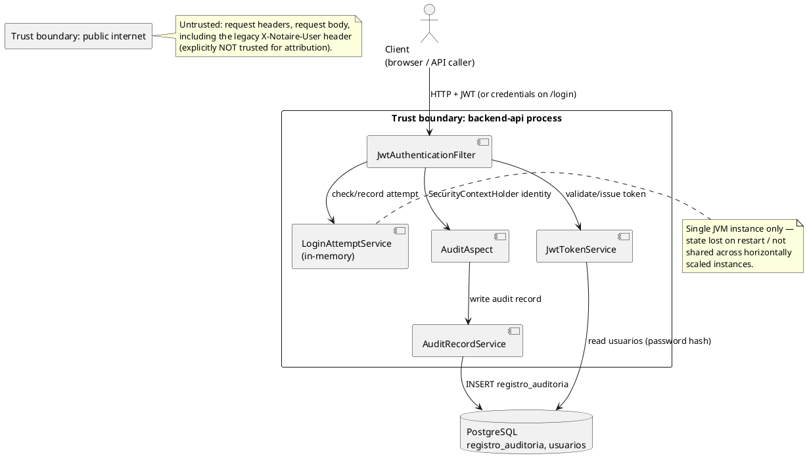

# Threat Model — Authentication & Audit Trail

> Scope: `LoginAttemptService`, `JwtTokenService`, `JwtAuthenticationFilter`
> (login/auth flow) and `AuditAspect`, `AuditRecordService`, `AuditRecord`
> (audit-trail flow). STRIDE-based. Produced under issue #1028 as the
> repo's first formal threat model, replacing the informal risk register in
> [`README.md`](README.md#data-classification--threat-model) for these two
> subsystems. Related: CU84 (Login), CU73 (Registro de Auditoría),
> [ADR-018](../202-ADR/ADR-018-rate-limiting-policy.md),
> [ADR-019](../202-ADR/ADR-019-secrets-management.md).

Security requirements below are numbered `SR-01`..`SR-08` for future PRs to
reference (e.g. "implements SR-03"). Status: **Mitigated** (control exists
and is adequate for current threat exposure), **Partial** (a control
exists but has a known limitation), **Open** (no control yet).

## Trust boundaries

Two trust boundaries matter here:
1. **Public internet → `backend-api` process**: anything in a request
   (headers, body, query params) is untrusted until validated/authenticated.
2. **`backend-api` process → PostgreSQL**: the database trusts whatever the
   backend writes; JPA/Hibernate parameterization is the boundary control
   against injection (see [SQL-INJECTION-PREVENTION.md](SQL-INJECTION-PREVENTION.md)).

## STRIDE — Login / Authentication flow

| # | STRIDE | Threat | Mitigation | Status |
|---|--------|--------|------------|--------|
| SR-01 | Spoofing | Attacker guesses/brute-forces a user's password | `LoginAttemptService` locks an account after `security.login.max-attempts` (default 5) failures for `security.login.lockout-duration-ms` (default 15 min) | Partial — in-memory `ConcurrentHashMap`, single-instance only; a horizontally scaled deployment or process restart resets the counter (see [ADR-018](../202-ADR/ADR-018-rate-limiting-policy.md)) |
| SR-02 | Spoofing | Attacker forges a JWT to impersonate a user | `JwtTokenService` signs tokens with a server-held secret; `JwtAuthenticationFilter` validates signature + expiry on every `/api/**` request | Mitigated |
| SR-03 | Tampering | Attacker modifies a JWT payload (e.g. escalate role claim) | Signature validation rejects any payload change | Mitigated |
| SR-04 | Information Disclosure | Credentials or JWT secret leak via logs, error responses, or default `.env` values | `ProductionCredentialsGuard` blocks startup on the literal default password/secret in production; secrets never committed (`.env` is git-ignored, see [ADR-019](../202-ADR/ADR-019-secrets-management.md)) | Partial — only catches the literal known-default value, not other weak-but-non-default secrets |
| SR-05 | Denial of Service | Attacker floods `/login` to exhaust resources or lock out legitimate users via `LoginAttemptService` (an attacker locking a *victim* out by deliberately failing their login) | None dedicated — `LoginAttemptService` mitigates brute force but is itself abusable as a lockout-griefing vector against a known username | **Open** — general API rate limiting is not implemented (README already flags this); tracked as follow-up in issue #1028 |
| SR-06 | Elevation of Privilege | Authenticated low-privilege user accesses another user's or an admin's data/endpoints | JWT is required on all `/api/**` endpoints, but authorization is coarse-grained (any valid JWT, not per-role) | **Open** — no per-role authorization yet, consistent with SAD §8.1 / ADR-008 gap already on record |

## STRIDE — Audit-trail flow

| # | STRIDE | Threat | Mitigation | Status |
|---|--------|--------|------------|--------|
| SR-07 | Repudiation | A user denies performing an action, or an attacker forges the acting-user attribution on an audit record | `AuditAspect` reads the acting user exclusively from `SecurityContextHolder` (the authenticated JWT identity); the legacy `X-Notaire-User` client header is explicitly ignored for attribution (issue #555). HTTP forge via `POST`/`PUT`/`DELETE` on `/api/v1/audit-log` is closed (405; issues #1124 / #1060) — rows are server-authored only | Mitigated |
| SR-08 | Information Disclosure / Repudiation | Read (GET) access to sensitive `Persona`/`Escritura` data is not logged, so unauthorized *reading* of PII leaves no trail | Create/update/delete operations are audited; GETs are intentionally excluded (by design, for volume reasons) | **Open** (by design, documented trade-off) — acceptable today because access is already gated by JWT + the coarse-grained authorization of SR-06, but becomes a bigger gap once per-role authorization (SR-06) exists and read access itself needs accountability; tracked as follow-up |
| SR-09 | Tampering | Attacker or malicious insider directly modifies `registro_auditoria` rows in the database to cover tracks | Standard PostgreSQL access controls (only the backend service account has write access); no append-only/immutable log mechanism (e.g. no DB-level trigger preventing UPDATE/DELETE on the table) | **Open** — no dedicated tamper-evidence control beyond normal DB permissions; tracked as follow-up |
| SR-10 | Denial of Service | `AuditAspect` failures cascade and break functional flows | Aspect is intentionally tolerant: any audit-write failure is caught, logged at WARN, and swallowed rather than propagated | Mitigated |

## Summary

- **Mitigated**: SR-02, SR-03, SR-07, SR-10 (4)
- **Partial**: SR-01, SR-04 (2)
- **Open**: SR-05, SR-06, SR-08, SR-09 (4)

The four Open items are exactly the gaps already named informally in
`README.md`'s risk register plus one newly surfaced item (SR-09, audit-log
tamper-evidence) that the informal register did not previously call out.
None are fixed by this change — see issue #1028's follow-up
recommendations for how each should be triaged into its own issue.
