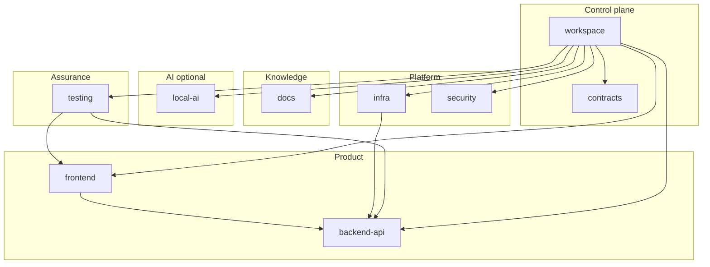

# Module Ownership Map (Monorepo — #1197 Phase 0)

> **Status:** Authoritative for in-repo boundaries.  
> **Source of truth:** [`workspace/modules.yaml`](../../workspace/modules.yaml) (ADR-026).  
> **Topology parent:** [#1197](https://github.com/matiaspakua/notaire/issues/1197) / [ADR-024](../200-architecture/202-ADR/ADR-024-repository-topology.md) — **no sibling repositories yet**.  
> **Use Case:** CU76.

Each top-level module has one responsibility, one fleet, a `MODULE.md` contract, and a
`verify.sh` that checks that module only. The Foreman discovers modules with:

```bash
python3 workspace/modules.py list
python3 workspace/modules.py affected <changed-path>
python3 workspace/modules.py verify <module>|--all
```

## Dependency map



## Modules

| Module | Path | Fleet | Responsibility | Verify | Depends on |
|--------|------|-------|----------------|--------|------------|
| backend-api | `backend-api/` | backend | REST API, business rules, persistence, Flyway | `bash backend-api/verify.sh` | — |
| frontend | `frontend/` | frontend | Next.js web client (HTTP to API only) | `bash frontend/verify.sh` | backend-api |
| infra | `infra/` | infrastructure | Observability, quality stack, K8s, k6 | `bash infra/verify.sh` | backend-api |
| testing | `testing/` | qa | Black-box E2E, smoke, database V&V | `bash testing/verify.sh` | backend-api, frontend |
| local-ai | `local-ai/` | ai | Local AI SDLC engine (not Cursor Cloud fleet) | `bash local-ai/verify.sh` | — |
| docs | `docs/` | knowledge | Business + architecture knowledge; OpenSpec root | `bash docs/verify.sh` | — |
| security | `security/` | security | Rulesets-as-code and security control map | `bash security/verify.sh` | — |
| contracts | `contracts/` | foreman | Seams between modules and contract guards | `bash contracts/verify.sh` | — |
| workspace | `workspace/` | foreman | Unifier, manifest, cross-module guards (+ `.github`) | `bash workspace/verify.sh` | all others |

Retired (not a live module): `notaire-shared` — ADR-025 / #1255. DTOs live in `backend-api`.

## Contracts

Every module’s `MODULE.md` states purpose, what others may rely on, seams it reads, and what it
must not do. A module may read another **only** through `contracts/` seams; only `workspace`
reads all modules.

## Relationship to extraction

ADR-024 Phase 0 stays inside this map. Satellites (`notaire-infra`, then `local-ai`, then
`testing`) extract only behind the seven gates in [REPO-SPLIT-PLAN.md](REPO-SPLIT-PLAN.md).
`notaire-docs`, `notaire-security`, and `notaire-workspace` are **not now**.

## Public rendering

GitHub Pages Docs tab: `/docs/modules/` (site basePath `/notaire` in production).

## Related

- [REPO-METRICS-BASELINE.md](REPO-METRICS-BASELINE.md)
- [REPO-SPLIT-PLAN.md](REPO-SPLIT-PLAN.md)
- [ADR-026](../200-architecture/202-ADR/ADR-026-module-separation.md)
- [ADR-027 Mermaid diagrams](../200-architecture/202-ADR/ADR-027-mermaid-diagrams.md)
