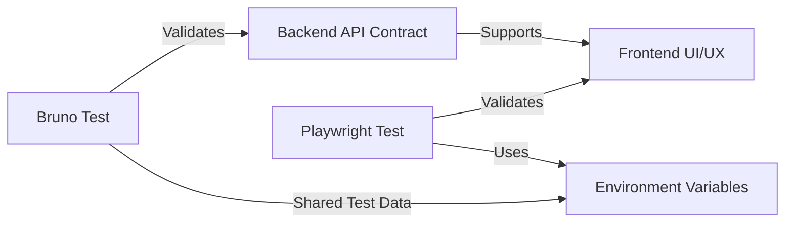

# Notaire E2E Test Plan — Playwright + Bruno

> **Issue:** [#400](https://github.com/matiaspakua/notaire/issues/400)
> **Branch:** `test/400_playwright-e2e-suite`
> **Date:** 2026-05-21
> **Status:** Active

---

## Table of Contents

1. [Executive Summary](#1-executive-summary)
2. [Architecture & Environment](#2-architecture--environment)
3. [Test Infrastructure](#3-test-infrastructure)
4. [Test Data Strategy](#4-test-data-strategy)
5. [Test Suite Organization](#5-test-suite-organization)
   - 5.1 [Business Coverage Matrix](#51-business-coverage-matrix)
   - 5.2 [Module Test Suites](#52-module-test-suites)
6. [Sync Strategy: Bruno ↔ Playwright](#6-sync-strategy-bruno--playwright)
7. [Given-When-Then Scenario Catalog](#7-given-when-then-scenario-catalog)
8. [CI/CD Integration](#8-cicd-integration)
9. [Reporting & Evidence](#9-reporting--evidence)
10. [Quality Gates](#10-quality-gates)

---

## 1. Executive Summary

### Objective
Validate all 68 business use cases (CU) of the Notaire system end-to-end, from the React frontend through the REST API to PostgreSQL, using Playwright automated browser tests synchronized with the existing Bruno API test collection.

### Scope
| Dimension | Count | Notes |
|-----------|-------|-------|
| Business Use Cases (CU) | 68 | Mapped in CU-API-MATRIX.csv |
| REST API Endpoints | 155 | 26 controllers |
| Bruno API Tests | 85+ | `.bru` files in `backend-api/api-test/` |
| Playwright E2E Tests | ~200 scenarios | 19 existing + ~180 new Gherkin scenarios |
| Frontend Modules | 16 | Dashboard sub-routes |
| Cross-browser | 1 | Chromium (Headless) |

### Key Design Principles
1. **Bijection with Bruno**: Every Bruno API test has a corresponding E2E scenario that validates the UI reaction to that API response
2. **Given-When-Then**: All scenarios use BDD-style Gherkin syntax for traceability to CUs
3. **Self-healing Data**: Tests create their own test data and clean up after execution
4. **CI-first**: All tests run unattended in Docker containers
5. **Business Coverage**: Coverage report maps test results back to the 68 CU matrix

---

## 2. Architecture & Environment

### Runtime Topology
```
┌─────────────────┐     ┌──────────────────┐     ┌──────────────┐
│  Playwright      │     │  Next.js (Next)  │     │  Spring Boot  │
│  (Test Runner)   │────▶│  localhost:3000  │────▶│  localhost:8080│
│  Chromium        │     │  (SSR + Proxy)   │     │  (REST API)    │
└─────────────────┘     └──────────────────┘     └───────┬──────┘
                                                          │
                                                   ┌──────▼──────┐
                                                   │  PostgreSQL  │
                                                   │  localhost:5432│
                                                   └─────────────┘
```

### Service Configuration
| Service | Port | Image | Startup |
|---------|------|-------|---------|
| PostgreSQL | 5432 | postgres:16-alpine | `docker compose up -d db` |
| Backend API | 8080 | `backend-api` (JAR) | `mvn spring-boot:run` or Docker |
| Frontend | 3000 | `frontend` (Next.js) | `npm run dev` or Docker |
| Playwright | - | `mcr.microsoft.com/playwright:v1.49` | `npx playwright test` |

### Environment Variables
```bash
# Frontend (.env.local)
NEXT_PUBLIC_API_URL=http://localhost:8080/api/v1

# Test (.env)
BASE_URL=http://localhost:3000
API_URL=http://localhost:8080/api/v1
TEST_ADMIN_USER=admin
TEST_ADMIN_PASS=admin
SEED_DATA=true
CLEANUP_DATA=true
RETRY_FAILED=2
```

---

## 3. Test Infrastructure

### Directory Structure
```
frontend/tests/e2e/
├── playwright.config.ts           # Enhanced configuration
├── setup/
│   ├── global-setup.ts            # Seed data + auth token
│   ├── global-teardown.ts         # Cleanup test data
│   └── api-helpers.ts             # Shared API helpers (Bruno-synced)
├── fixtures/
│   ├── test-data.ts               # Seed data factories
│   └── auth-fixtures.ts           # Auth state fixtures
├── reporters/
│   └── coverage-report.ts         # Business coverage reporter
├── gherkin-helpers.ts             # Enhanced Gherkin step definitions
├── login.spec.ts                  # CU: Auth (existing)
├── dashboard.spec.ts              # CU: Navigation (existing, enhanced)
├── api-cycle.spec.ts             # CU: API health (existing, enhanced)
├── cu01-presupuesto.spec.ts      # CU01, CU45, CU60
├── cu02-gestiones.spec.ts         # CU02, CU13, CU14, CU16, CU53, CU56
├── cu03-04-documentos.spec.ts    # CU03, CU04, CU09, CU42, CU43
├── cu05-escrituras.spec.ts        # CU05, CU06, CU52, CU63
├── cu07-testimonios.spec.ts       # CU07, CU08, CU10, CU11, CU12, CU44
├── cu15-pagos.spec.ts            # CU15, CU47
├── cu17-18-personas-clientes.spec.ts # CU17, CU18, CU41, CU46, CU54, CU61
├── cu20-21-usuarios.spec.ts      # CU20, CU21, CU23, CU48, CU51
├── cu22-suplencias.spec.ts       # CU22, CU59
├── cu24-40-reportes.spec.ts      # CU24-CU40, CU57-CU68
├── cu-matrix.spec.ts             # Health check coverage matrix
├── admin.spec.ts                 # Administration module (existing, enhanced)
├── icons-ux.spec.ts              # UI/UX icon tests (existing)
├── personas.spec.ts              # Personas CRUD (existing)
├── presupuestos.spec.ts          # Presupuestos CRUD (existing)
└── suplencias.spec.ts            # Suplencias CRUD (existing)
```

### Test Tags Convention
```typescript
// @smoke        — Critical path, runs on every push
// @regression   — Full suite, runs nightly
// @cu-XX        — Maps to specific business use case
// @module-XXX   — Groups by frontend module
// @flaky        — Known flaky, auto-retry
// @bruno-sync   — Directly synced with a Bruno test
// @data-heavy   — Requires significant test data
```

### Execution Profiles
| Profile | Tags | CI Trigger | Estimated Duration |
|---------|------|------------|-------------------|
| Smoke | `@smoke` | Every push | ~3 min |
| Regression | `@regression` | Nightly | ~20 min |
| Module | `@module-XXX` | On module change | ~5 min |
| Full | All | Manual / Release | ~30 min |

---

## 4. Test Data Strategy

### Data Lifecycle
```
┌─────────────────────────────────────────────────────┐
│                  Test Data Lifecycle                  │
├─────────────────────────────────────────────────────┤
│  1. Global Setup: Seed base data (catalogs, admin)   │
│  2. Per-Suite: Create module-specific test entities  │
│  3. Per-Test: Create/read/update/delete test records │
│  4. Per-Suite Cleanup: Remove created entities       │
│  5. Global Teardown: Remove seed data (optional)     │
└─────────────────────────────────────────────────────┘
```

### Fixed Test Data (Seeded Once)
```json
{
  "adminUser": { "nombre": "admin", "contrasenia": "admin" },
  "tipoIdentificacion": { "idTipoIdentificacion": 1, "nombre": "DNI" },
  "tipoTramiteBase": { "nombre": "Escritura de Venta", "descripcion": "Test" },
  "conceptosBase": [
    { "nombre": "Arancel Fijo", "valor": 1000 },
    { "nombre": "Tasa Municipal", "valor": 500 }
  ],
  "estadosGestionBase": ["Iniciado", "En Proceso", "Finalizado", "Archivado"]
}
```

### Dynamic Test Data (Factories)
```typescript
// Unique per test run to avoid collisions
const testId = Date.now();
const personas = {
  common: {
    nombre: `Test-${testId}`,
    apellido: `Persona-${testId}`,
    numeroIdentificacion: `${testId}`,
    email: `test-${testId}@notaire.test`,
    esCliente: true,
  },
};
```

### Bruno Sync Data
Shared IDs between Bruno and Playwright are stored in environment variables:
```bash
# Shared between Bruno (Developmen.bru) and Playwright (.env)
TEST_PERSONA_ID=    # Set by Bruno test, read by Playwright
TEST_GESTION_ID=    # Set by Bruno test, read by Playwright
TEST_PRESUPUESTO_ID= # Set by Playwright, read by Bruno
```

---

## 5. Test Suite Organization

### 5.1 Business Coverage Matrix

| Module | Use Cases | Bruno Tests | E2E Specs | Scenarios | Status |
|--------|-----------|-------------|-----------|-----------|--------|
| **Auth** | Login | `auth/login.bru` | `login.spec.ts` | 4 | ✅ |
| **Dashboard** | Navigation | - | `dashboard.spec.ts` | 6 | ✅ |
| **Presupuestos** | CU01, CU45, CU60 | `presupuestos/*.bru` | `cu01-presupuesto.spec.ts` | 8 | 🔄 |
| **Gestiones** | CU02, CU13, CU14, CU16, CU53, CU56 | `gestiones/*.bru` | `cu02-gestiones.spec.ts` | 10 | 🔄 |
| **Personas/Clientes** | CU17, CU18, CU41, CU46, CU54, CU61 | `personas/*.bru` | `cu17-18-personas-clientes.spec.ts` | 12 | ✅ |
| **Escrituras** | CU05, CU06, CU52, CU63 | `escrituras/*.bru` | `cu05-escrituras.spec.ts` | 8 | 🔄 |
| **Documentos** | CU03, CU04, CU09, CU42, CU43 | - | `cu03-04-documentos.spec.ts` | 8 | 🔄 |
| **Testimonios** | CU07, CU08, CU10, CU11, CU12, CU44 | - | `cu07-testimonios.spec.ts` | 10 | 🔄 |
| **Pagos** | CU15, CU47 | `pagos/*.bru` | `cu15-pagos.spec.ts` | 6 | 🔄 |
| **Usuarios** | CU20, CU21, CU23, CU48, CU51 | `usuarios/*.bru` | `cu20-21-usuarios.spec.ts` | 8 | 🔄 |
| **Catálogos** | CU26-CU40, CU57-CU68 | `catalogos/*.bru`, `conceptos/*.bru` | `admin.spec.ts` + `cu24-40-reportes.spec.ts` | 20 | 🔄 |
| **Suplencias** | CU22, CU59 | - | `cu22-suplencias.spec.ts` | 6 | 🔄 |
| **Protocolos** | CU28, CU33, CU40, CU58, CU63, CU68 | `catalogos/*.bru` | `admin.spec.ts` | 8 | 🔄 |
| **Reportes** | CU24, CU25, CU50 | `reportes/*.bru` | `cu24-40-reportes.spec.ts` | 6 | 🔄 |
| **Auditoría** | CU23 | `auditoria/*.bru` | `admin.spec.ts` | 4 | 🔄 |
| **Health Check** | ALL | ALL | `api-cycle.spec.ts` | 25 | ✅ |
| **Coverage Matrix** | ALL | ALL | `cu-matrix.spec.ts` | 68 | 🔄 |
| **UI/UX** | - | - | `icons-ux.spec.ts` | 5 | ✅ |

**Legend:** ✅ Complete | 🔄 In Progress | ❌ Missing

### 5.2 Module Test Suites

#### Auth (login.spec.ts)
```
CU: Authentication
Bruno sync: auth/login.bru
Scenarios:
  │ CU-AUTH-01: Display login form
  │ CU-AUTH-02: Show error for empty submission
  │ CU-AUTH-03: Show error for wrong credentials
  │ CU-AUTH-04: Redirect to dashboard on success
```

#### Presupuestos (cu01-presupuesto.spec.ts)
```
CU: CU01 (Preparar Presupuesto), CU45 (Modificar), CU60 (Buscar)
Bruno sync: presupuestos/post-presupuesto.bru, presupuestos/put-presupuesto.bru
Scenarios:
  │ CU01-GW01: Open create presupuesto modal [@smoke @cu-01]
  │ CU01-GW02: Create presupuesto with valid data [@smoke @cu-01]
  │ CU01-GW03: Cancel creation closes modal [@cu-01]
  │ CU01-GW04: Search presupuesto by number [@cu-60]
  │ CU45-GW01: Edit existing presupuesto [@cu-45]
  │ CU45-GW02: Modify presupuesto items [@cu-45]
  │ CU60-GW01: Filter presupuestos by client [@cu-60]
  │ CU60-GW02: Search with no results shows empty state [@cu-60]
```

#### Gestiones (cu02-gestiones.spec.ts)
```
CU: CU02 (Iniciar), CU13 (Historial), CU14 (Estado), CU16 (Archivar), CU53 (Modificar)
Bruno sync: gestiones/post-gestion.bru, gestiones/put-gestion.bru
Scenarios:
  │ CU02-GW01: Open create gestion modal [@smoke @cu-02]
  │ CU02-GW02: Create gestion with valid data [@smoke @cu-02]
  │ CU02-GW03: View gestion details [@cu-02]
  │ CU13-GW01: View gestion historial [@cu-13]
  │ CU14-GW01: Consult estado actual [@cu-14]
  │ CU16-GW01: Archivar gestion [@cu-16]
  │ CU53-GW01: Modificar gestion data [@cu-53]
```

#### Personas/Clientes (cu17-18-personas-clientes.spec.ts)
```
CU: CU17 (Alta Persona), CU18 (Alta Cliente), CU41 (Modificar Cliente),
    CU46 (Ver detalle), CU54 (Modificar Persona), CU61 (Buscar)
Bruno sync: personas/*.bru
Scenarios:
  │ CU17-GW01: Open create persona modal [@smoke @cu-17]
  │ CU17-GW02: Create persona with all fields [@smoke @cu-17]
  │ CU17-GW03: Search persona by name [@cu-61]
  │ CU18-GW01: Dar de alta cliente from persona [@cu-18]
  │ CU18-GW02: Fill client details and submit [@cu-18]
  │ CU41-GW01: Modify existing client [@cu-41]
  │ CU46-GW01: View client detail page [@cu-46]
  │ CU54-GW01: Modify persona data [@cu-54]
  │ CU61-GW01: Search by apellido [@cu-61]
  │ CU61-GW02: Search by DNI [@cu-61]
  │ CU61-GW03: Search with no results [@cu-61]
```

#### Escrituras (cu05-escrituras.spec.ts)
```
CU: CU05 (Preparar), CU06 (Firmar), CU52 (Modificar), CU63 (Buscar)
Bruno sync: escrituras/*.bru
Scenarios:
  │ CU05-GW01: Open create escritura modal [@smoke @cu-05]
  │ CU05-GW02: Create escritura with valid data [@smoke @cu-05]
  │ CU06-GW01: Firmar escritura [@cu-06]
  │ CU52-GW01: Edit escritura data [@cu-52]
  │ CU52-GW02: Successful modification [@cu-52]
  │ CU63-GW01: Search escritura by number [@cu-63]
```

#### Documentos (cu03-04-documentos.spec.ts)
```
CU: CU03 (Listar documentos), CU04 (Registrar documentación),
    CU09 (Deudas), CU42 (Vencimientos), CU43 (Reingresar)
Scenarios:
  │ CU03-GW01: View required documents for tramite [@cu-03]
  │ CU04-GW01: Open document registration modal [@cu-04]
  │ CU09-GW01: Register document with deuda flag [@cu-09]
  │ CU42-GW01: View próximos vencimientos [@cu-42]
  │ CU43-GW01: Reingresar documentación [@cu-43]
```

#### Testimonios (cu07-testimonios.spec.ts)
```
CU: CU07 (Generar), CU08 (Verificar), CU10 (Movimientos),
    CU11 (Inscripción), CU12 (Retirar), CU44 (Reingresar)
Scenarios:
  │ CU07-GW01: Generate testimonio from escritura [@cu-07]
  │ CU08-GW01: View testimonio details [@cu-08]
  │ CU10-GW01: Register movimiento testimonio [@cu-10]
  │ CU11-GW01: Ingresar para inscripción [@cu-11]
  │ CU12-GW01: Retirar testimonio [@cu-12]
  │ CU44-GW01: Reingresar testimonio [@cu-44]
```

#### Pagos (cu15-pagos.spec.ts)
```
CU: CU15 (Procesar Pago), CU47 (Consultar Pago)
Bruno sync: pagos/*.bru
Scenarios:
  │ CU15-GW01: Open register pago modal [@smoke @cu-15]
  │ CU15-GW02: Process pago with valid data [@smoke @cu-15]
  │ CU15-GW03: View pago details [@cu-15]
  │ CU47-GW01: Filter pagos by date range [@cu-47]
```

#### Usuarios (cu20-21-usuarios.spec.ts)
```
CU: CU20 (Alta Usuario), CU21 (Modificar), CU23 (Actividades),
    CU48 (Alta Escribano), CU51 (Modificar Escribano)
Bruno sync: usuarios/*.bru
Scenarios:
  │ CU20-GW01: Open create usuario modal [@smoke @cu-20]
  │ CU20-GW02: Create usuario with all fields [@smoke @cu-20]
  │ CU21-GW01: Edit existing usuario [@cu-21]
  │ CU21-GW02: Successful modification [@cu-21]
  │ CU23-GW01: View user activity log [@cu-23]
  │ CU48-GW01: Create escribano [@cu-48]
  │ CU51-GW01: Modify escribano [@cu-51]
```

#### Suplencias (cu22-suplencias.spec.ts)
```
CU: CU22 (Registrar Suplencia), CU59 (Consultar Suplencias)
Scenarios:
  │ CU22-GW01: Open create suplencia modal [@cu-22]
  │ CU22-GW02: Create suplencia with valid data [@cu-22]
  │ CU59-GW01: Filter suplencias by escribano [@cu-59]
  │ CU59-GW02: View suplencia details [@cu-59]
```

#### Admin / Catálogos (cu24-40-reportes.spec.ts + admin.spec.ts)
```
CU: CU26-CU40, CU57-CU68
Bruno sync: catalogos/*.bru, conceptos/*.bru
Scenarios:
  │ CU24-GW01: Generate libro de índices [@cu-24]
  │ CU25-GW01: Generate declaración jurada [@cu-25]
  │ CU26-GW01: Create tipo de trámite [@smoke @cu-26]
  │ CU27-GW01: Create tipo de documento [@cu-27]
  │ CU28-GW01: Create folio [@cu-28]
  │ CU29-GW01: Create concepto [@smoke @cu-29]
  │ CU30-GW01: Create estado de gestión [@cu-30]
  │ CU31-GW01: Modify tipo de trámite [@cu-31]
  │ CU34-GW01: Modify concepto [@cu-34]
  │ CU37-GW01: Delete concepto [@cu-37]
  │ CU39-GW01: Create plantilla presupuesto [@cu-39]
  │ CU50-GW01: Generate declaración jurada rentas [@cu-50]
  │ CU57-GW01: Delete tipo de trámite [@cu-57]
  │ CU64-GW01: Buscar tipo de trámite [@cu-64]
  │ CU65-GW01: Buscar tipo de documento [@cu-65]
  │ CU66-GW01: Buscar concepto [@cu-66]
  │ CU67-GW01: Buscar estado de gestión [@cu-67]
```

#### Coverage Matrix (cu-matrix.spec.ts)
```
Health check that validates every CU endpoint responds correctly.
Iterates all 68 CU entries and verifies:
  - HTTP 200/201 for GET/POST on each endpoint
  - Response body has expected structure
  - Frontend route renders without error
```

---

## 6. Sync Strategy: Bruno ↔ Playwright

### Bijection Mapping
Each Bruno `.bru` test maps to one or more Playwright scenarios:



### Concrete Examples
| Bruno Test | Playwright Scenario | What Each Validates |
|-----------|-------------------|-------------------|
| `personas/post-persona.bru` | CU17-GW02 | Bruno: HTTP 201 + JSON schema. PW: Form fields → API call → table update |
| `presupuestos/post-presupuesto.bru` | CU01-GW02 | Bruno: HTTP 201. PW: Modal interaction → success toast → list refresh |
| `usuarios/login.bru` | CU-AUTH-04 | Bruno: HTTP 200 + user object. PW: Form → redirect → dashboard |
| `gestiones/put-gestion.bru` | CU53-GW01 | Bruno: HTTP 200. PW: Edit button → modal → update → success |

### Validation Level Comparison
| Aspect | Bruno Tests | Playwright E2E |
|--------|-------------|----------------|
| **Scope** | API contract only | Full user journey |
| **Validates** | HTTP status, headers, JSON schema, business logic | UI rendering, form interaction, navigation, data display, error states |
| **Environment** | Direct HTTP to backend | Headless browser through proxy |
| **Execution Speed** | ~10s for all | ~20-30min for all |
| **Data Setup** | Static/fixture-based | Dynamic create/cleanup |
| **Report** | JSON + JUnit + HTML | HTML + Traces + Screenshots + Video |
| **CI Integration** | `bru run` step | `npx playwright test` step |

---

## 7. Given-When-Then Scenario Catalog

### Pattern Definitions

All 68 CU scenarios follow this template. Here is the complete catalog by module:

#### AUTH
| ID | Given | When | Then |
|----|-------|------|------|
| AUTH-01 | User is on login page | Views the form | Username and password inputs visible |
| AUTH-02 | User is on login page | Clicks ingresar with empty fields | Error "Complete usuario y contraseña" |
| AUTH-03 | User is on login page | Submits invalid credentials | Error message shown |
| AUTH-04 | User is on login page | Enters valid admin credentials | Redirected to /dashboard |

#### CU01 — Presupuesto
| ID | Given | When | Then |
|----|-------|------|------|
| CU01-01 | User on presupuestos page | Clicks "Nuevo Presupuesto" | Create modal opens with form fields |
| CU01-02 | Create modal open | Fills required fields and submits | Success toast, table refreshes |
| CU01-03 | Create modal open | Clicks cancel | Modal closes |
| CU01-04 | Presupuesto exists | Clicks edit | Edit modal with pre-filled data |

#### CU02 — Gestión
| ID | Given | When | Then |
|----|-------|------|------|
| CU02-01 | User on gestiones page | Clicks "Nueva Gestión" | Create modal opens |
| CU02-02 | Create modal open | Fills fields, selects escribano, submits | Success toast, table update |
| CU02-03 | Gestión row visible | Clicks "Ver" | Detail view shows |

#### CU17 — Persona
| ID | Given | When | Then |
|----|-------|------|------|
| CU17-01 | User on personas page | Clicks "Nueva Persona" | Modal with nombre, apellido, tipo ID fields |
| CU17-02 | Modal open | Fills all required fields | Persona created, success toast |
| CU17-03 | Persona in table | Clicks "Editar" | Edit modal with data |

#### API Health (cu-matrix.spec.ts)
| ID | Given | When | Then |
|----|-------|------|------|
| MATRIX-01 | Test suite starts | Iterates 68 CU entries | Each returns valid HTTP status |
| MATRIX-02 | CU has Bruno test | Checks sync status | Bruno test exists and matches schema |

### Full 68-CU Mapping
See `docs/testing/CU-API-MATRIX.csv` for the complete traceability matrix of CU ↔ Endpoint ↔ Bruno ↔ Playwright.

---

## 8. CI/CD Integration

### GitHub Actions Workflow

```yaml
name: E2E Tests
on:
  push:
    branches: [main, 'feat/**', 'fix/**']
    paths:
      - 'frontend/**'
      - 'backend-api/**'
      - 'docker-compose.yml'
  pull_request:
    branches: [main]
  schedule:
    - cron: '0 6 * * 1-5'  # Weekdays 6am UTC
  workflow_dispatch:

jobs:
  e2e:
    timeout-minutes: 45
    runs-on: ubuntu-latest
    services:
      postgres:
        image: postgres:16-alpine
        env:
          POSTGRES_DB: notaire
          POSTGRES_USER: notaire
          POSTGRES_PASSWORD: notaire
        options: >-
          --health-cmd pg_isready
          --health-interval 10s
          --health-timeout 5s
          --health-retries 5
        ports:
          - 5432:5432
    steps:
      - uses: actions/checkout@v4
      - uses: actions/setup-java@v4
        with: { java-version: '21', distribution: 'temurin' }
      - uses: actions/setup-node@v4
        with: { node-version: '22' }

      # Start backend
      - run: mvn clean package -pl backend-api -am -DskipTests
      - run: java -jar backend-api/target/*.jar &
        env:
          SPRING_DATASOURCE_URL: jdbc:postgresql://localhost:5432/notaire
          SPRING_DATASOURCE_USERNAME: notaire
          SPRING_DATASOURCE_PASSWORD: notaire

      # Start frontend
      - run: |
          cd frontend
          npm ci
          npm run build &
          npm run start &

      # Bruno API tests (contract validation)
      - name: Run Bruno API tests
        run: |
          cd backend-api/api-test
          npx @usebruno/cli run --env Developmen \
            --reporter-junit bruno-results.xml \
            --reporter-json bruno-results.json

      # Playwright E2E tests (UI validation)
      - name: Run Playwright E2E
        run: |
          cd frontend
          npx playwright install chromium
          npx playwright test --reporter=html,json,junit
        env:
          BASE_URL: http://localhost:3000
          CI: true

      # Merge reports
      - uses: dorny/test-reporter@v1
        if: always()
        with:
          name: E2E Test Results
          path: 'frontend/test-results/**/*.xml'
          reporter: java-junit

      - uses: actions/upload-artifact@v4
        if: always()
        with:
          name: playwright-report
          path: |
            frontend/playwright-report/
            frontend/test-results/
            backend-api/api-test/bruno-results.*
```

### CI Strategy
1. **Push to branch**: Smoke tests (`@smoke`) only (~3 min)
2. **PR to main**: Smoke + affected modules (~10 min)
3. **Merge to main**: Full regression (`@regression`) (~20 min)
4. **Nightly**: Full suite including Bruno API sync (~30 min)

---

## 9. Reporting & Evidence

### Artifacts
| Artifact | Format | Location | Retention |
|----------|--------|----------|-----------|
| Playwright HTML Report | HTML | `frontend/playwright-report/` | 30 days |
| JUnit Results | XML | `frontend/test-results/results.xml` | 90 days |
| JSON Results | JSON | `frontend/test-results/results.json` | 90 days |
| Trace Files | ZIP | `frontend/test-results/traces/` | 14 days |
| Screenshots | PNG | `frontend/test-results/screenshots/` | 14 days |
| Videos | WebM | `frontend/test-results/videos/` | 14 days |
| Bruno Results | JSON/XML | `backend-api/api-test/bruno-results.*` | 90 days |
| Business Coverage | HTML | `frontend/test-results/coverage-report.html` | 90 days |

### Evidence Capture Strategy
```typescript
// playwright.config.ts
export default defineConfig({
  use: {
    screenshot: 'only-on-failure',    // Captures UI state at failure
    trace: 'on-first-retry',          // Full trace on retry
    video: 'retain-on-failure',       // Video of failing tests
  },
});
```

### Business Coverage Report
A custom Playwright reporter (`reporters/coverage-report.ts`) generates an HTML report that maps test results to the 68 CU matrix:

```html
<!-- Coverage Report (auto-generated) -->
<h1>Notaire E2E Business Coverage Report</h1>
<table>
  <tr><th>CU</th><th>Name</th><th>Module</th><th>Status</th><th>Duration</th></tr>
  <tr><td>CU01</td><td>Preparar Presupuesto</td><td>Presupuestos</td>
      <td class="pass">✅ PASS</td><td>2.3s</td></tr>
  <tr><td>CU02</td><td>Iniciar Gestión</td><td>Gestiones</td>
      <td class="pass">✅ PASS</td><td>1.8s</td></tr>
  <!-- ... all 68 CU rows ... -->
  <tr class="summary">
    <td colspan="2">Total: 68 CU</td>
    <td>Pass: 65</td>
    <td>Fail: 2</td>
    <td>Skip: 1</td>
  </tr>
</table>
```

---

## 10. Quality Gates

### Exit Criteria
| Gate | Condition | Enforcement |
|------|-----------|-------------|
| Smoke Tests | 100% pass rate | CI blocks merge |
| Regression Tests | >90% pass rate | PR comment on failure |
| Business Coverage | >95% CU covered | Weekly report |
| API Contracts (Bruno) | 100% pass on critical endpoints | CI step |
| Test Data Cleanup | Zero leaked records | Post-suite verification |
| Performance | Suite completes <45 min | CI timeout |


### Known Gaps (Phase 2)
| Gap | Impact | Workaround |
|-----|--------|------------|
| CU07, CU08, CU10: Testimonio endpoints return 500 | Backend bug blocks full E2E | Skip @smoke, tag @known-bug |
| CU24, CU25, CU50: Report endpoints untested | No PDF validation | Verify HTTP 200 only, validate file type |
| CU39, CU49, CU55: Plantilla concurrency errors | Intermittent failures | Retry 2x with backoff |
| Bruno tests with hardcoded IDs | Flaky PUT/DELETE tests | Use dynamic ID chaining |

### Risk Register
| Risk | Probability | Impact | Mitigation |
|------|-------------|--------|------------|
| Backend 500 errors | High | Blocks E2E flows | Tag as @known-bug, track in GH issues |
| Test data collisions | Medium | Flaky tests | Use Date.now() + random suffix |
| Environment flakiness | Medium | False positives | Retry 2x, trace capture |
| Long execution time | Low | CI timeout | Parallel modules, smoke/regression split |
| Bruno-Playwright drift | Low | False negatives | Weekly sync check, shared env vars |

---

## Appendix A: Quick Start

```bash
# 1. Start services
cd ~/workspace
docker compose up -d db
cd backend-api && mvn spring-boot:run &
cd frontend && npm run dev &

# 2. Run Bruno API tests (contract validation)
cd backend-api/api-test
npx @usebruno/cli run --env Developmen

# 3. Run Playwright E2E tests (full UI validation)
cd frontend
npx playwright install chromium
npx playwright test --grep @smoke    # Quick smoke tests
npx playwright test                   # Full suite

# 4. View reports
open frontend/playwright-report/index.html
open backend-api/api-test/results.html
```

## Appendix B: References
| Document | Location |
|----------|----------|
| CU ↔ API Matrix | `docs/testing/CU-API-MATRIX.csv` |
| Gap Analysis | `docs/testing/GAP-ANALYSIS.md` |
| API Reference | `docs/05-api/REST-API-REFERENCE.md` |
| Bruno Tests | `backend-api/api-test/` |
| Frontend Docs | `docs/FRONTEND-QUICK-REFERENCE.md` |
| Design System | `docs/02-architecture/03-design/DESIGN-SYSTEM.md` |
