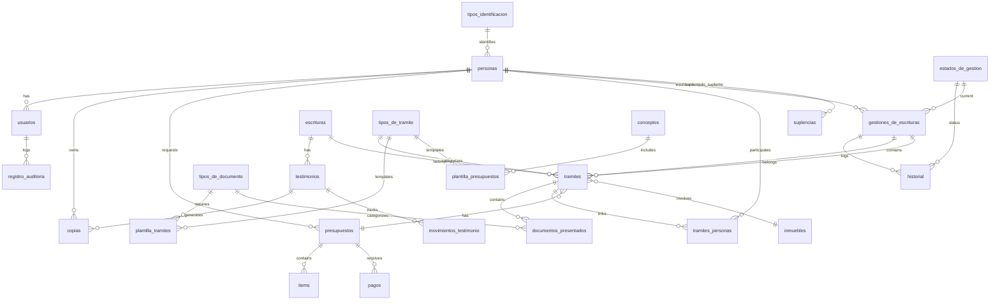

# Proyecto Notaire


## 2. Stack Tecnológico

| Componente | Versión | Notas |
|------------|---------|-------|
| **Java** | 1.8 | Configurado en pom.xml (source/target) |
| **Framework UI** | Swing | Aplicación de escritorio, NO web |
| **Build** | Maven | maven-compiler-plugin 2.3.2 |
| **ORM** | Hibernate 4.3.4.Final | hibernate-core + hibernate-entitymanager |
| **JPA** | 2.1 | EclipseLink 2.5.1 + hibernate-jpa-2.1-api |
| **DB Driver** | mysql-connector-java 5.1.29 | Driver MySQL JDBC |
| **Reports** | JasperReports 3.5.3 | 6 templates .jrxml |
| **Logging** | Log4j 1.2.17 | |
| **Calendar UI** | JCalendar 1.4 | |
| **Testing** | JUnit 4.11 | |

### Dependencias Críticas (pom.xml)
```xml
<dependency>
    <groupId>mysql</groupId>
    <artifactId>mysql-connector-java</artifactId>
    <version>5.1.29</version>
</dependency>

<dependency>
    <groupId>org.hibernate</groupId>
    <artifactId>hibernate-core</artifactId>
    <version>4.3.4.Final</version>
</dependency>

<dependency>
    <groupId>jasperreports</groupId>
    <artifactId>jasperreports</artifactId>
    <version>3.5.3</version>
</dependency>
```

---

## 3. Configuración de Base de Datos

### persistence.xml
```xml
<persistence-unit name="notairePU" transaction-type="RESOURCE_LOCAL">
  <provider>org.hibernate.ejb.HibernatePersistence</provider>
  <!-- 27 entity classes mapped -->
  <properties>
    <property name="javax.persistence.jdbc.url" 
              value="jdbc:mysql://localhost:3306/notaire?zeroDateTimeBehavior=convertToNull"/>
    <property name="javax.persistence.jdbc.user" value="root"/>
    <property name="javax.persistence.jdbc.driver" value="com.mysql.jdbc.Driver"/>
    <property name="javax.persistence.jdbc.password" value="admin"/>
  </properties>
</persistence-unit>
```

### config.properties
```properties
protocolo=jdbc:mysql://
host=localhost/notaire
puerto=3306
usuario_db=matias
contrasenia_db=admin
```

---

## 4. Estructura de Base de Datos

### Tablas (27 total)

| Tabla | Descripción |
|-------|-------------|
| `conceptos` | Conceptos/items para presupuestos |
| `copias` | Copias de testimonios |
| `documentos_presentados` | Movimiento de documentos |
| `escrituras` | Escrituras notariales |
| `estados_de_gestion` | Estados de gestión |
| `folios` | Folios de escrituras |
| `folios_copias` | Relación folios-copias |
| `gestiones_de_escrituras` | Gestiones de escrituras |
| `historial` | Historial de gestiones |
| `inmuebles` | Datos de inmuebles |
| `items` | Items de presupuestos |
| `movimientos_testimonio` | Movimientos de testimonios |
| `pagos` | Pagos de presupuestos |
| `personas` | Clientes y escribanos |
| `plantilla_presupuestos` | Plantillas de presupuestos |
| `plantilla_tramites` | Plantillas de trámites |
| `presupuestos` | Presupuestos |
| `registro_auditoria` | Auditoría de usuarios |
| `suplencias` | Suplencias de escribanos |
| `testimonios` | Testimonios |
| `tipos_de_documento` | Tipos de documentos |
| `tipos_de_folio` | Tipos de folios |
| `tipos_de_tramite` | Tipos de trámites |
| `tipos_identificacion` | Tipos de identificación |
| `tramites` | Trámites |
| `tramites_personas` | Relación trámites-personas |
| `usuarios` | Usuarios del sistema |

### Diagrama de Relaciones (Foreign Keys)



---

## 5. Reportes JasperReports

### Templates (.jrxml)
| Archivo | Ubicación | Función |
|---------|-----------|---------|
| `reporteConsultarDeudaDocumentos.jrxml` | gui/reportes/ | Consulta deudas |
| `reporteConsultarVencimientosDocumentos.jrxml` | gui/reportes/ | Vencimientos |
| `reporteHistorialGestion.jrxml` | gui/reportes/ | Historial gestiones |
| `reporteListaDocumetosTramite.jrxml` | gui/reportes/ | Lista documentos |
| `reportePresupuestoInmuebles.jrxml` | gui/reportes/ | Presupuesto con inmueble |
| `reportePresupuestoSinInmueble.jrxml` | gui/reportes/ | Presupuesto sin inmueble |

### Compilados (.jasper)
Los 6 reportes están precompilados en `/reportes/` como archivos `.jasper`.

---

## 6. Cambios Mínimos Requeridos

> [!IMPORTANT]
> Esta es una **aplicación de escritorio Swing**, NO una aplicación web. La containerización requiere enfoque diferente.

### 6.1 Archivos a Modificar

| Archivo | Cambio Requerido |
|---------|------------------|
| `pom.xml` | Cambiar `mysql-connector-java` → `postgresql` |
| `persistence.xml` | Actualizar driver, URL, dialect |
| `config.properties` | Cambiar protocolo y credenciales |

### 6.2 pom.xml - Dependencias
```diff
- <dependency>
-     <groupId>mysql</groupId>
-     <artifactId>mysql-connector-java</artifactId>
-     <version>5.1.29</version>
- </dependency>
+ <dependency>
+     <groupId>org.postgresql</groupId>
+     <artifactId>postgresql</artifactId>
+     <version>42.7.4</version>
+ </dependency>
```

### 6.3 persistence.xml - Propiedades
```diff
- <property name="javax.persistence.jdbc.url" 
-           value="jdbc:mysql://localhost:3306/notaire?zeroDateTimeBehavior=convertToNull"/>
- <property name="javax.persistence.jdbc.driver" value="com.mysql.jdbc.Driver"/>
+ <property name="javax.persistence.jdbc.url" 
+           value="jdbc:postgresql://localhost:5432/notaire"/>
+ <property name="javax.persistence.jdbc.driver" value="org.postgresql.Driver"/>
+ <property name="hibernate.dialect" value="org.hibernate.dialect.PostgreSQLDialect"/>
```

### 6.4 config.properties
```diff
- protocolo=jdbc:mysql://
+ protocolo=jdbc:postgresql://
- host=localhost/notaire
+ host=localhost:5432/notaire
```

---

## 7. Riesgos de Migración MySQL → PostgreSQL

### 7.1 Tipos de Datos

| MySQL | PostgreSQL | Riesgo | Mitigación |
|-------|------------|--------|------------|
| `INT AUTO_INCREMENT` | `SERIAL` | **Bajo** | pgloader lo convierte automáticamente |
| `TINYINT(1)` | `BOOLEAN` | **Bajo** | pgloader maneja conversión |
| `TEXT` | `TEXT` | **Ninguno** | Compatible |
| `FLOAT` | `REAL` | **Bajo** | Precisión similar |
| `DATE` | `DATE` | **Ninguno** | Compatible |
| `datetime NULL` | `TIMESTAMP` | **Bajo** | Verificar valores NULL |

### 7.2 No se Detectaron ENUMs
El dump MySQL no contiene tipos ENUM, eliminando ese riesgo.

### 7.3 Sintaxis SQL
- Las consultas en JasperReports pueden usar sintaxis específica de MySQL
- Hibernate genera SQL a través del dialecto, minimizando riesgos

### 7.4 Funciones Específicas
- Verificar uso de `NOW()`, `CURDATE()` (compatibles en PostgreSQL)
- `IFNULL()` → `COALESCE()` (si se usa en queries manuales)

---

## 8. Consideraciones Especiales

### 8.1 Aplicación de Escritorio
> [!WARNING]
> Esta aplicación es **Java Swing**, no una aplicación web. La containerización típica con Docker no aplica directamente para GUI de escritorio.

**Opciones de containerización:**
1. **DB en Docker + App local**: PostgreSQL en contenedor, app Swing corre localmente
2. **Full Docker + VNC/X11**: Requiere configuración de display
3. **Solo migración DB**: Migrar a PostgreSQL sin containerizar la app

### 8.2 Recomendación
Para un proyecto universitario, la opción más práctica es:
- PostgreSQL en Docker para la base de datos
- Aplicación Java ejecutada localmente conectándose al contenedor

---

## 9. Resumen Ejecutivo

| Aspecto | Estado |
|---------|--------|
| Complejidad de migración | **Media** |
| Archivos a modificar | **3** (pom.xml, persistence.xml, config.properties) |
| Tablas a migrar | **27** |
| Reportes JasperReports | **6** (no requieren cambios) |
| Riesgo de pérdida de datos | **Bajo** |
| Lógica de negocio afectada | **Ninguna** |
